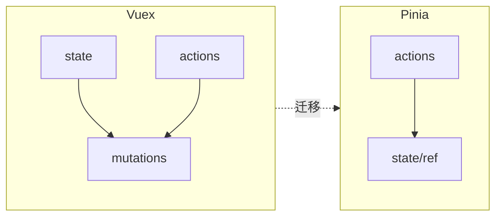

# Vuex 迁移 Pinia

迁移核心：**去掉 mutations**，模块变独立 store；`commit/dispatch` 改 **`useXxxStore()` 直接调 action**。可共存期冻结 Vuex、按域渐进替换，避免大爆炸式重写。

---

## 概念对照



| Vuex | Pinia |
|------|-------|
| `new Vuex.Store` / `createStore` | `createPinia()` + `defineStore` |
| `state` | `state()` 或 `ref` |
| `getters` | `getters` 或 `computed` |
| `mutations` | **删除**，逻辑并入 actions |
| `actions` | `actions` 或普通函数 |
| `modules/user` | `stores/user.ts` 独立 store |
| `namespaced: true` | 每个 store 天然隔离 |
| `commit('user/SET_X')` | `userStore.x = ...` |
| `dispatch('user/login')` | `userStore.login()` |
| `useStore()` + 字符串 | `useUserStore()` 类型安全 |

---

## 单模块迁移示例

### Vuex module

```ts
// store/modules/counter.js
export default {
  namespaced: true,
  state: () => ({ count: 0 }),
  getters: { double: (s) => s.count * 2 },
  mutations: {
    INCREMENT(state, n) { state.count += n; },
  },
  actions: {
    incrementAsync({ commit }, n) {
      setTimeout(() => commit('INCREMENT', n), 300);
    },
  },
};
```

### Pinia 等价

```ts
// stores/counter.ts
import { defineStore } from 'pinia';

export const useCounterStore = defineStore('counter', {
  state: () => ({ count: 0 }),
  getters: { double: (s) => s.count * 2 },
  actions: {
    increment(n: number) {
      this.count += n;
    },
    incrementAsync(n: number) {
      setTimeout(() => { this.count += n; }, 300);
    },
  },
});
```

---

## 组件调用迁移

```diff
- import { mapState, mapActions } from 'vuex';
- ...mapState('user', ['token'])
- ...mapActions('user', ['login'])
- this.$store.dispatch('user/login', creds)

+ import { storeToRefs } from 'pinia';
+ import { useUserStore } from '@/stores/user';
+ const userStore = useUserStore();
+ const { token } = storeToRefs(userStore);
+ userStore.login(creds);
```

---

## 渐进迁移策略

| 阶段 | 做法 |
|------|------|
| 1. 共存 | Vue 3 项目同时 `app.use(store)` 与 `app.use(pinia)` |
| 2. 冻结 Vuex | 新功能只用 Pinia |
| 3. 按模块迁 | 从叶子 module 开始，如 settings |
| 4. 路由/守卫 | `useUserStore` 替换 `store.getters['user/token']` |
| 5. 删除 Vuex | 移除 dependency 与 `store/` 目录 |

```ts
// 过渡期：composable 封装双读
export function useAuthToken() {
  const piniaUser = useUserStore();
  if (piniaUser.token) return piniaUser.token;
  return legacyStore.getters['user/token']; // 逐步删除
}
```

---

## Root state 与跨 store

Vuex `rootState` → Pinia 在 action 内 `useOtherStore()`：

```ts
export const useOrderStore = defineStore('order', () => {
  const userStore = useUserStore();

  async function placeOrder(items: CartItem[]) {
    if (!userStore.token) throw new Error('未登录');
    await orderApi.create({ items, userId: userStore.profile!.id });
  }

  return { placeOrder };
});
```

---

## 插件迁移

| Vuex 插件 | Pinia 替代 |
|-----------|------------|
| vuex-persistedstate | pinia-plugin-persistedstate |
| 自定义 subscribe | `$subscribe` |
| logger | Pinia 插件 `$subscribe` |

```ts
// Vuex plugin 逻辑 → Pinia
export function persistedStatePlugin({ store }) {
  const saved = localStorage.getItem(store.$id);
  if (saved) store.$patch(JSON.parse(saved));
  store.$subscribe((_, state) => {
    localStorage.setItem(store.$id, JSON.stringify(state));
  });
}
```

---

## TypeScript 升级收益

```ts
// Vuex：getter 名易 typo
store.getters['user/isLogedIn']; // undefined 静默

// Pinia
const userStore = useUserStore();
userStore.isLoggedIn; // IDE 自动完成
```

迁移时顺便补全 interface，减少 `any`。

---

## 测试迁移

```diff
- import Vuex from 'vuex';
- const store = new Vuex.Store({ modules: { user } });

+ import { setActivePinia, createPinia } from 'pinia';
+ setActivePinia(createPinia());
+ const userStore = useUserStore();
```

Pinia 测试 API 更简单，无需组装 module tree。

---

## 迁移回归要点

| 检查项 | 说明 |
|--------|------|
| modules 与 mutations 清单 | 逐项映射到 Pinia store |
| 新 store + 单测 | 迁一个测一个 |
| 组件 mapXxx / $store | 改 storeToRefs + useXxxStore |
| 路由守卫、axios 拦截器 | 常藏 Vuex 引用 |
| 持久化插件 | vuex-persistedstate → pinia-plugin-persistedstate |
| 删 vuex 依赖 | 确认无残留 import |
| E2E | 登录/购物车等关键流回归 |

---

## 小结

**本质变化**：Vuex module 树 → 独立 Pinia store；mutations 逻辑并入 actions，直接改 state。

**渐进策略**：Vuex 与 Pinia 共存 → 冻结 Vuex 新功能 → 按域从叶子 module 迁移 → 守卫/拦截器替换 → 删 vuex 依赖。

**组件层**：`mapState`/`dispatch` → `useUserStore()` + `storeToRefs` + 直接调 action。

**跨 store**：action 内 `useOtherStore()` 替代 `rootState` / `{ root: true }` dispatch。

**插件**：持久化用 `pinia-plugin-persistedstate`；订阅用 `$subscribe` / `$onAction`。

**TS 收益**：`useUserStore()` 类型安全，告别字符串 getter 名 typo。

核对：守卫和拦截器里的 store 换了吗？同一数据有没有 Vuex 和 Pinia 双份？
