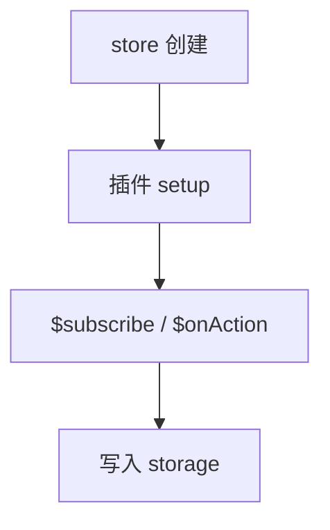

# 持久化与插件

Pinia 通过 `pinia.use` 扩展每个 store 实例。持久化常用 **pinia-plugin-persistedstate**，配合 **`paths` 白名单**只存必要字段；敏感 Token 慎存 localStorage，登出时要清 storage。

---

## Pinia 插件机制

```ts
import { createPinia } from 'pinia';

const pinia = createPinia();

pinia.use(({ store }) => {
  store.$subscribe((mutation, state) => {
    console.log(`[${store.$id}]`, mutation.type);
  });
});

export default pinia;
```



插件函数接收 `{ pinia, app, store, options }`，可对**每个** store 实例注册副作用。

---

## pinia-plugin-persistedstate

```bash
pnpm add pinia-plugin-persistedstate
```

```ts
import { createPinia } from 'pinia';
import piniaPluginPersistedstate from 'pinia-plugin-persistedstate';

const pinia = createPinia();
pinia.use(piniaPluginPersistedstate);
```

### Store 级配置

```ts
export const useSettingsStore = defineStore('settings', {
  state: () => ({
    theme: 'light' as 'light' | 'dark',
    locale: 'zh-CN',
  }),
  persist: true, // 默认 localStorage，key = store.$id
});
```

### 细粒度配置

```ts
export const useUserStore = defineStore('user', {
  state: () => ({
    token: null as string | null,
    profile: null as UserProfile | null,
  }),
  persist: {
    key: 'app-user',
    storage: sessionStorage,
    paths: ['token'], // 仅持久化 token，profile 每次拉取
  },
});
```

| 选项 | 说明 |
|------|------|
| `key` | storage 键名 |
| `storage` | localStorage / sessionStorage |
| `paths` | 白名单字段 |
| `pick` / `omit` | 4.x 字段过滤 |
| `beforeRestore` / `afterRestore` | 钩子 |

---

## Setup Store 持久化

```ts
export const useCartStore = defineStore('cart', () => {
  const items = ref<CartItem[]>([]);
  return { items };
}, {
  persist: {
    paths: ['items'],
  },
});
```

Options 与 Setup store 均通过第三个参数或内联 `persist` 配置。

---

## 自定义持久化插件（理解原理）

```ts
function createPersistPlugin(options: { key?: string } = {}) {
  return ({ store }: PiniaPluginContext) => {
    const storageKey = options.key ?? `pinia-${store.$id}`;
    const saved = localStorage.getItem(storageKey);
    if (saved) {
      try {
        store.$patch(JSON.parse(saved));
      } catch { /* ignore corrupt data */ }
    }

    store.$subscribe(
      (_, state) => {
        localStorage.setItem(storageKey, JSON.stringify(state));
      },
      { detached: true },
    );
  };
}

pinia.use(createPersistPlugin());
```

| 要点 | 说明 |
|------|------|
| `$patch` 恢复 | 合并而非替换整个 store |
| `detached: true` | store 卸载后仍订阅（通常需要） |
| JSON 序列化 | 不支持 Date、Map 除非自定义 serializer |

---

## 多 tab 同步

```ts
window.addEventListener('storage', (e) => {
  if (e.key === 'pinia-settings' && e.newValue) {
    settingsStore.$patch(JSON.parse(e.newValue));
  }
});
```

`storage` 事件仅在**其他 tab** 修改时触发；同 tab 写入不触发。

---

## 安全与敏感数据

| 数据 | 建议 |
|------|------|
| Access Token | sessionStorage 或 httpOnly Cookie（更安全） |
| Refresh Token | 勿放 localStorage（XSS 风险） |
| 用户信息 | 可持久化非敏感字段 |
| 购物车 | localStorage 常见 |

```ts
persist: {
  paths: ['theme', 'locale'], // 不持久化 token
}
```

Token 放 Cookie 需后端配合；纯 SPA 常折中用 sessionStorage + 短过期。

---

## 其他常用插件模式

### 重置所有 store（登出）

```ts
pinia.use(({ store }) => {
  const initial = JSON.parse(JSON.stringify(store.$state));
  store.$resetAll = () => store.$patch(initial);
});
```

### Action 日志

```ts
store.$onAction(({ name, args, after, onError }) => {
  const start = Date.now();
  after(() => console.log(`${name} took ${Date.now() - start}ms`));
  onError((err) => console.error(name, err));
});
```

### 与 vue-router 同步

登出时 `resetRouter()` + 清除 persist key：

```ts
function logout() {
  userStore.$reset();
  localStorage.removeItem('app-user');
  resetRouter();
  router.push('/login');
}
```

---

## SSR / Nuxt 注意

服务端无 `localStorage`，持久化仅客户端：

```ts
persist: {
  storage: import.meta.client ? localStorage : undefined,
}
```

Nuxt 可用 `@pinia/nuxt` 与模块封装。

---

## 调试 persisted state

DevTools Application → Local Storage 查看键值；损坏 JSON 会导致白屏，应 try/catch + 版本号迁移：

```ts
const STORAGE_VERSION = 2;
if (parsed.v !== STORAGE_VERSION) {
  localStorage.removeItem(key);
}
```

---

## 小结

**插件入口**：`pinia.use(fn)` 对每个 store 注册；常用 `$subscribe` 监听变更、`$onAction` 监听 action。

**持久化**：`pinia-plugin-persistedstate`；`persist: true` 或 `paths` 白名单；Setup store 用第三参数 `{ persist: { ... } }`。

**原理**：启动 `$patch` 恢复 JSON；变更时 `$subscribe` 写 storage；`detached: true` 保持订阅。

**安全**：Token 优先 sessionStorage 或 httpOnly Cookie；Refresh Token 勿放 localStorage；`paths` 只白名单非敏感字段。

**登出**：`$reset` + 删 storage key + `resetRouter()`，防下一用户读到上一用户数据。

**SSR**：服务端无 localStorage，persist 仅客户端启用。

核对：persist 白名单够窄吗？损坏 JSON 有版本迁移吗？登出清 storage 了吗？
