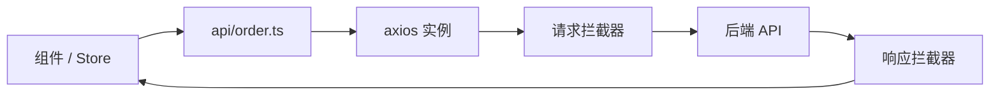

# axios 封装与拦截器

生产环境 axios 标配 **单例 + 拦截器 + 业务 API 层**：请求侧统一 baseURL、超时、Token 注入；响应侧归一业务错误码，401 触发登出。组件和 store 只 import `api/*`，不直接接触 axios 实例。

---

## 为什么封装 axios



| 不封装 | 封装后 |
|--------|--------|
| 每处写 baseURL | 单例配置 |
| 401 各自处理 | 统一跳转登录 |
| 错误格式不一 | 归一化 `ApiError` |

---

## 创建实例

```ts
// utils/request.ts
import axios, { type AxiosInstance, type AxiosRequestConfig } from 'axios';

const instance: AxiosInstance = axios.create({
  baseURL: import.meta.env.VITE_API_BASE_URL,
  timeout: 15_000,
  headers: { 'Content-Type': 'application/json' },
});

export default instance;
```

环境变量：

```env
# .env.development
VITE_API_BASE_URL=/api

# vite.config.ts proxy
server: { proxy: { '/api': { target: 'http://localhost:8080', changeOrigin: true } } }
```

---

## 请求拦截器

```ts
import { useUserStore } from '@/stores/user';

instance.interceptors.request.use(
  (config) => {
    const userStore = useUserStore();
    if (userStore.token) {
      config.headers.Authorization = `Bearer ${userStore.token}`;
    }
    // 可选：trace id
    config.headers['X-Request-Id'] = crypto.randomUUID();
    return config;
  },
  (error) => Promise.reject(error),
);
```

| 常见注入 | 位置 |
|----------|------|
| Authorization | header |
| 租户 ID | header / query |
| 语言 | Accept-Language |

---

## 响应拦截器与错误归一

```ts
export class ApiError extends Error {
  constructor(
    public code: number,
    message: string,
    public data?: unknown,
  ) {
    super(message);
    this.name = 'ApiError';
  }
}

instance.interceptors.response.use(
  (response) => {
    const body = response.data;
    // 假设后端 { code: 0, data, message }
    if (body.code !== 0) {
      return Promise.reject(new ApiError(body.code, body.message, body.data));
    }
    return body.data; // 直接返回业务 data
  },
  (error) => {
    if (error.response?.status === 401) {
      const userStore = useUserStore();
      userStore.logout();
      router.push({ name: 'Login' });
    }
    const msg = error.response?.data?.message ?? error.message ?? '网络异常';
    return Promise.reject(new ApiError(error.response?.status ?? -1, msg));
  },
);
```

---

## 类型安全的 API 层

```ts
// api/user.ts
import request from '@/utils/request';

export interface UserProfile {
  id: number;
  name: string;
}

export function fetchProfile() {
  return request.get<UserProfile, UserProfile>('/user/profile');
}

export function updateProfile(data: Partial<UserProfile>) {
  return request.patch<UserProfile, UserProfile>('/user/profile', data);
}
```

组件/Store 只 import `api/*`，不直接接触 axios。

---

## 封装泛型 request 方法（可选）

```ts
export function get<T>(url: string, config?: AxiosRequestConfig) {
  return instance.get<T, T>(url, config);
}

export function post<T, D = unknown>(url: string, data?: D, config?: AxiosRequestConfig) {
  return instance.post<T, T>(url, data, config);
}
```

---

## 上传与下载

```ts
export function upload(file: File, onProgress?: (p: number) => void) {
  const form = new FormData();
  form.append('file', file);
  return instance.post<{ url: string }>('/upload', form, {
    headers: { 'Content-Type': 'multipart/form-data' },
    onUploadProgress: (e) => {
      if (e.total) onProgress?.(Math.round((e.loaded / e.total) * 100));
    },
  });
}

export async function download(url: string, filename: string) {
  const blob = await instance.get<Blob>(url, { responseType: 'blob' });
  const link = document.createElement('a');
  link.href = URL.createObjectURL(blob);
  link.download = filename;
  link.click();
  URL.revokeObjectURL(link.href);
}
```

---

## 多实例场景

| 实例 | baseURL | 用途 |
|------|---------|------|
| `request` | 主 API | 业务 |
| `authRequest` | 认证中心 | OAuth |
| `thirdParty` | 外部域名 | 无 Token 拦截 |

```ts
const thirdParty = axios.create({ baseURL: 'https://api.external.com' });
// 不挂 Token 拦截器
```

---

## 与 fetch 对比

| 维度 | axios | fetch |
|------|-------|-------|
| 拦截器 | 内置 | 需封装 |
| 超时 | config | AbortSignal |
| JSON | 自动 transform | 手动 `.json()` |
| 取消 | AbortController | AbortController |
| 浏览器 IE | 需 polyfill | 现代浏览器 |

Vue/Nuxt 项目 axios 仍占多数；Edge Runtime 等场景可考虑 fetch。

---

## 常见坑

| 现象 | 原因 | 处理 |
|------|------|------|
| Pinia 未定义 | 拦截器在 pinia 前执行 | 确保 `app.use(pinia)` 先于请求 |
| 重复 401 跳转 | 并发请求 | 单例 Promise 刷新 Token |
| blob 当 JSON 解析 | responseType 未设 | 下载设 `blob` |
| 跨域 Cookie | withCredentials | 前后端 CORS 配置 |

---

## 小结

**三层结构**：axios 单例（baseURL/timeout）→ 请求/响应拦截器 → 类型化 `api/*` 模块。组件不直接碰 axios。

**请求侧**：拦截器注入 Token、租户 ID、trace id；`app.use(pinia)` 须在首请求前完成。

**响应侧**：归一 `{ code, data, message }` 为 `ApiError`；401 统一 logout + 跳转登录；业务层直接拿到 `data`。

**API 层**：按域分文件 export 函数，便于 mock 和单测；上传/下载注意 `FormData` 和 `responseType: 'blob'`。

**多实例**：主 API 挂 Token；第三方域名单独实例，避免误带 Authorization。

核对：401 并发会重复跳转吗？下载设 blob 了吗？pinia 注册顺序对吗？
