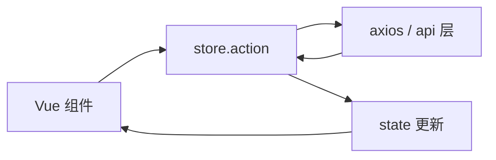

# Pinia action 中的请求

Pinia action 适合封装 **loading/error + 跨组件共享的异步逻辑**；组件用 **storeToRefs** 绑定状态，直接调 `store.loadXxx()`。与 vue-query 划清边界：API 列表/详情缓存优先 query，Pinia 管客户端态和需全局同步的提交逻辑。

---

## 数据流位置



| 层级 | 职责 |
|------|------|
| 组件 | 触发 action、展示 UI |
| action | 异步、改 state、协调多步 |
| api/* | 纯 HTTP，无 UI 状态 |

---

## 基础 action 请求

```ts
// stores/order.ts
import { defineStore } from 'pinia';
import { fetchOrders, type Order } from '@/api/order';

export const useOrderStore = defineStore('order', () => {
  const list = ref<Order[]>([]);
  const loading = ref(false);
  const error = ref<string | null>(null);

  async function loadOrders() {
    loading.value = true;
    error.value = null;
    try {
      list.value = await fetchOrders();
    } catch (e) {
      error.value = e instanceof Error ? e.message : '加载失败';
    } finally {
      loading.value = false;
    }
  }

  return { list, loading, error, loadOrders };
});
```

```vue
<script setup lang="ts">
import { onMounted } from 'vue';
import { storeToRefs } from 'pinia';
import { useOrderStore } from '@/stores/order';

const orderStore = useOrderStore();
const { list, loading, error } = storeToRefs(orderStore);

onMounted(() => orderStore.loadOrders());
</script>

<template>
  <div v-if="loading">加载中...</div>
  <div v-else-if="error">{{ error }}</div>
  <OrderTable v-else :data="list" />
</template>
```

---

## 状态建模模式

### 分字段 loading（简单页）

```ts
const loading = ref(false);
const saving = ref(false);
```

### 按资源 ID loading（详情/行内操作）

```ts
const loadingIds = ref(new Set<number>());

async function deleteOrder(id: number) {
  loadingIds.value.add(id);
  try {
    await deleteOrderApi(id);
    list.value = list.value.filter(o => o.id !== id);
  } finally {
    loadingIds.value.delete(id);
  }
}
```

### 统一 async 状态机

```ts
type AsyncStatus = 'idle' | 'loading' | 'success' | 'error';

const status = ref<AsyncStatus>('idle');
const errorMessage = ref<string | null>(null);
```

| 模式 | 适用 |
|------|------|
| 布尔 loading | 单列表页 |
| Set/Map id | 表格行操作 |
| 状态机 | 复杂 wizard |

---

## 提交类 action（防重复）

```ts
const submitting = ref(false);

async function createOrder(payload: CreateOrderDto) {
  if (submitting.value) return;
  submitting.value = true;
  try {
    const order = await createOrderApi(payload);
    list.value.unshift(order);
    return order;
  } finally {
    submitting.value = false;
  }
}
```

组件侧：

```vue
<button :disabled="submitting" @click="handleSubmit">
  {{ submitting ? '提交中...' : '提交' }}
</button>
```

---

## action 内组合多个请求

```ts
async function loadDashboard() {
  loading.value = true;
  try {
    const [stats, notices] = await Promise.all([
      fetchStats(),
      fetchNotices(),
    ]);
    statsData.value = stats;
    noticeList.value = notices;
  } catch (e) {
    error.value = normalizeError(e);
  } finally {
    loading.value = false;
  }
}
```

串行依赖时用 async/await 链：

```ts
const detail = await fetchOrder(id);
const logs = await fetchOrderLogs(detail.id);
```

---

## 与组件本地请求的分工

| 放 Pinia action | 放组件 / composable |
|-----------------|---------------------|
| 多页共享同一列表 | 仅当前页展示 |
| 提交后多处需同步 | 一次性搜索 |
| 与 WebSocket 联动更新 | 无共享需求 |

若只有单个列表页使用数据，**vue-query** 往往更省事。

---

## 错误处理与 UI 反馈

```ts
import { ElMessage } from 'element-plus';

async function saveSettings(data: Settings) {
  try {
    await updateSettingsApi(data);
    ElMessage.success('保存成功');
  } catch (e) {
    ElMessage.error(getErrorMessage(e));
    throw e; // 允许调用方 catch
  }
}
```

| 策略 | 场景 |
|------|------|
| action 内 toast | 统一体验 |
| 抛出给组件 | 表单需 field 级错误 |
| 写入 error ref | 全页错误条 |

---

## 测试 action

```ts
import { vi } from 'vitest';
import * as orderApi from '@/api/order';

vi.spyOn(orderApi, 'fetchOrders').mockResolvedValue([{ id: 1 }]);

const store = useOrderStore();
await store.loadOrders();
expect(store.list).toHaveLength(1);
expect(store.loading).toBe(false);
```

Mock api 层而非 axios，保持 action 逻辑真实。

---

## 与 vue-query 共存

```ts
// 客户端偏好放 store
const theme = ref('light');

// 服务端列表用 query
const { data: orders } = useQuery({
  queryKey: ['orders'],
  queryFn: fetchOrders,
});

// mutation 成功后 invalidate
const queryClient = useQueryClient();
async function createOrder(dto: CreateOrderDto) {
  await createOrderApi(dto);
  queryClient.invalidateQueries({ queryKey: ['orders'] });
}
```

避免同一列表既在 store 又在 query 缓存两份。

---

## 小结

**适用场景**：跨组件/跨路由共享 loading、error、列表；提交后多处需同步；与 WebSocket 联动更新。

**组件用法**：`storeToRefs` 绑定 state；`onMounted` 或事件里调 `store.loadXxx()`；模板按 loading/error 分支渲染。

**状态建模**：单页用布尔 loading；表格行操作用 Set/Map 按 id；复杂流程用 idle/loading/success/error 状态机。

**防重复提交**：`submitting` flag 或 debounce 锁；按钮 `:disabled="submitting"`。

**错误策略**：action 内统一 toast，或 throw 给组件做字段级错误，或写 error ref 做全页提示。

**边界**：API 列表/详情缓存优先 vue-query；Pinia 管 Token、主题等客户端态；勿同一数据双份缓存。

**测试**：mock `api/*` 层，测 action 改 state 和 loading 终态。

核对：这份列表真的跨页共享吗？和 query 有没有重复缓存？
