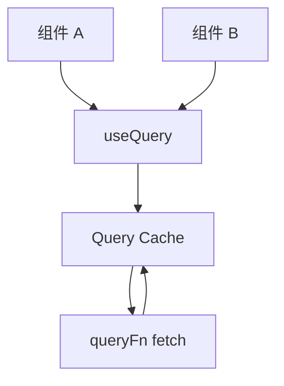
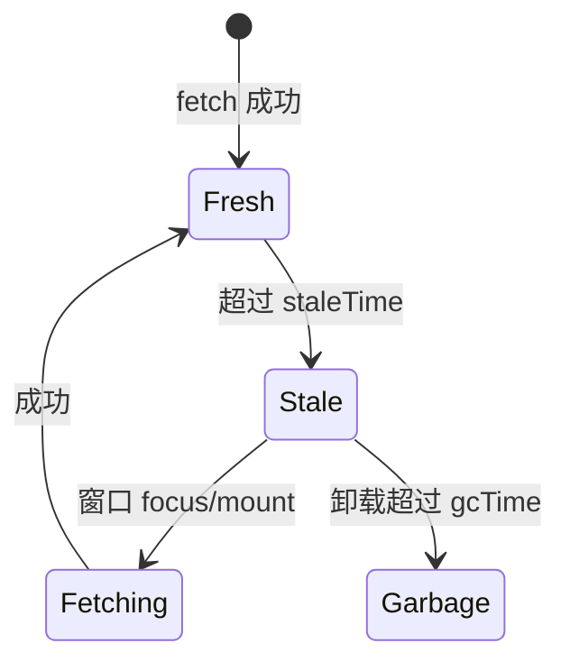

# vue-query 缓存策略

服务端状态（来自 API、可过期、可重拉）适合交给 **vue-query**（TanStack Query）。核心：**queryKey + queryFn** 管缓存；**staleTime / gcTime** 控新鲜度与回收；mutation 后 **invalidateQueries** 同步列表与详情。

---

## 为什么引入 vue-query



| 手写 fetch | vue-query |
|------------|-----------|
| 重复请求 | 同 key 去重 |
| 手动 loading | 内置 isLoading/isFetching |
| 缓存难统一 | 全局 QueryClient |
| 刷新逻辑分散 | invalidate/refetch |

---

## 安装与 Provider

```bash
pnpm add @tanstack/vue-query
```

```ts
// main.ts
import { VueQueryPlugin, QueryClient } from '@tanstack/vue-query';

const queryClient = new QueryClient({
  defaultOptions: {
    queries: {
      staleTime: 60_000,
      retry: 1,
    },
  },
});

app.use(VueQueryPlugin, { queryClient });
```

---

## useQuery 基础

```vue
<script setup lang="ts">
import { useQuery } from '@tanstack/vue-query';
import { fetchUserList, type User } from '@/api/user';

const { data, isLoading, isError, error, refetch } = useQuery({
  queryKey: ['users'],
  queryFn: fetchUserList,
});
</script>

<template>
  <div v-if="isLoading">加载中</div>
  <div v-else-if="isError">错误：{{ error?.message }}</div>
  <UserTable v-else :users="data ?? []" />
</template>
```

| 返回值 | 含义 |
|--------|------|
| `data` | 成功数据（Ref） |
| `isLoading` | 首次无缓存且 loading |
| `isFetching` | 任意 fetch 进行中 |
| `isStale` | 数据已过期 |
| `refetch` | 手动刷新 |

---

## queryKey 设计

```ts
// 列表
['orders']

// 带筛选
['orders', { status, page }]

// 详情
['orders', orderId]

// 嵌套资源
['orders', orderId, 'items']
```

**规则**：key 必须唯一标识请求参数；参数变则 key 变，自动新缓存条目。

```ts
const page = ref(1);
const { data } = useQuery({
  queryKey: ['orders', page],
  queryFn: () => fetchOrders({ page: page.value }),
});
```

---

## staleTime 与 gcTime

| 选项 | 默认 | 含义 |
|------|------|------|
| `staleTime` | 0 | 多久内视为新鲜，不自动 refetch |
| `gcTime`（原 cacheTime） | 5min | 未使用后缓存保留时间 |

```ts
useQuery({
  queryKey: ['dict', 'regions'],
  queryFn: fetchRegions,
  staleTime: Infinity, // 字典几乎不变
});

useQuery({
  queryKey: ['notifications'],
  queryFn: fetchNotifications,
  staleTime: 10_000,
  refetchInterval: 30_000, // 轮询
});
```



---

## useMutation 与 invalidate

```ts
import { useMutation, useQueryClient } from '@tanstack/vue-query';

const queryClient = useQueryClient();

const { mutate, isPending } = useMutation({
  mutationFn: createUser,
  onSuccess: () => {
    queryClient.invalidateQueries({ queryKey: ['users'] });
  },
});
```

| 方法 | 作用 |
|------|------|
| `invalidateQueries` | 标记 stale，触发 refetch |
| `setQueryData` | 乐观更新缓存 |
| `removeQueries` | 删除缓存 |
| `prefetchQuery` | 预取 |

---

## enabled 条件查询

```ts
const userId = computed(() => route.params.id as string);

const { data: profile } = useQuery({
  queryKey: ['user', userId],
  queryFn: () => fetchUser(userId.value),
  enabled: computed(() => !!userId.value),
});
```

`enabled: false` 时不发起请求，适合依赖 props 就绪后再查。

---

## 与 Pinia 协作

| Pinia | vue-query |
|-------|-----------|
| Token、主题 | 列表、详情 API |
| 登录 logout 清 query | `queryClient.clear()` |

```ts
function logout() {
  userStore.$reset();
  queryClient.clear();
  router.push('/login');
}
```

---

## DevTools

```ts
import { VueQueryPlugin } from '@tanstack/vue-query';
import { VueQueryDevtools } from '@tanstack/vue-query-devtools';

app.component('VueQueryDevtools', VueQueryDevtools);
```

开发环境可视化 cache 条目与 stale 状态。

---

## SSR / Nuxt

Nuxt 3 可用对应模块或 `useFetch`（基于 ofetch）；纯 Vue SSR 需 `dehydrate`/`hydrate` QueryClient，避免服务端客户端双 fetch。

---

## 小结

**核心模型**：`queryKey` 唯一标识缓存；`queryFn` 拉数据；同 key 多组件共享缓存并去重请求。

**新鲜度**：`staleTime` 内视为 fresh 不自动 refetch；`gcTime` 控制卸载后缓存保留多久。

**写操作**：`useMutation` + `onSuccess` 里 `invalidateQueries` 保持列表/详情与服务器一致；也可用 `setQueryData` 乐观更新。

**条件查询**：`enabled` 依赖路由 params 或其他 query 就绪后再 fetch。

**分工**：Pinia 管 Token、主题等客户端态；API 列表/详情优先 query；logout 时 `queryClient.clear()`。

**DevTools**：开发环境可视化 cache 与 stale 状态，排查重复请求和过期策略。

核对：queryKey 含全参数了吗？logout 清 cache 了吗？同一列表有没有又在 Pinia 里存一份？
