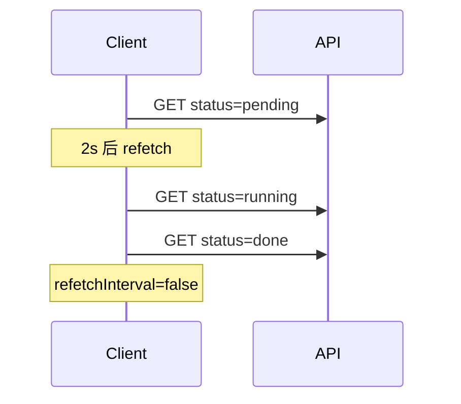

# 分页、轮询与乐观更新

vue-query 在分页、轮询、乐观更新三类场景有成熟模式：分页 **queryKey 含 page + keepPreviousData**；轮询 **refetchInterval** 动态停止；乐观更新 **onMutate / setQueryData / 回滚**。快速切换参数时注意 **AbortSignal** 防竞态。

---

## 分页

### URL 驱动分页（推荐）

```vue
<script setup lang="ts">
import { computed } from 'vue';
import { useRoute, useRouter } from 'vue-router';
import { useQuery, keepPreviousData } from '@tanstack/vue-query';
import { fetchOrders } from '@/api/order';

const route = useRoute();
const router = useRouter();

const page = computed(() => Number(route.query.page ?? 1));
const pageSize = 20;

const { data, isPlaceholderData, isFetching } = useQuery({
  queryKey: ['orders', { page: page.value }],
  queryFn: () => fetchOrders({ page: page.value, pageSize }),
  placeholderData: keepPreviousData,
});

function goPage(p: number) {
  router.push({ query: { ...route.query, page: String(p) } });
}
</script>
```

| API | 作用 |
|-----|------|
| `keepPreviousData` | 翻页时保留上一页数据，减少闪烁 |
| `isPlaceholderData` | 当前展示的是占位旧数据 |

### 无限滚动

```ts
import { useInfiniteQuery } from '@tanstack/vue-query';

const { data, fetchNextPage, hasNextPage, isFetchingNextPage } = useInfiniteQuery({
  queryKey: ['orders', 'infinite'],
  queryFn: ({ pageParam = 1 }) => fetchOrders({ page: pageParam }),
  getNextPageParam: (lastPage) =>
    lastPage.hasMore ? lastPage.page + 1 : undefined,
  initialPageParam: 1,
});
```

---

## 轮询

```ts
const { data } = useQuery({
  queryKey: ['job-status', jobId],
  queryFn: () => fetchJobStatus(jobId.value),
  refetchInterval: (query) => {
    const status = query.state.data?.status;
    // 完成后停止轮询
    return status === 'done' ? false : 2000;
  },
  refetchIntervalInBackground: false,
});
```

| 选项 | 说明 |
|------|------|
| `refetchInterval` | 毫秒；返回 `false` 停止 |
| `refetchIntervalInBackground` | 标签页隐藏时是否继续 |
| `refetchOnWindowFocus` | 默认 true，回焦刷新 |

长轮询任务注意服务端压力；完成态务必停止 interval。



---

## 乐观更新（Optimistic Update）

用户点击「点赞」后立即 +1，请求失败再回滚。

```ts
const queryClient = useQueryClient();

const likeMutation = useMutation({
  mutationFn: (postId: number) => likePost(postId),
  onMutate: async (postId) => {
    await queryClient.cancelQueries({ queryKey: ['posts'] });
    const previous = queryClient.getQueryData<Post[]>(['posts']);
    queryClient.setQueryData<Post[]>(['posts'], (old) =>
      old?.map(p => p.id === postId ? { ...p, likes: p.likes + 1 } : p),
    );
    return { previous };
  },
  onError: (_err, _id, context) => {
    queryClient.setQueryData(['posts'], context?.previous);
  },
  onSettled: () => {
    queryClient.invalidateQueries({ queryKey: ['posts'] });
  },
});
```

| 步骤 | 作用 |
|------|------|
| `cancelQueries` | 避免飞行中 refetch 覆盖 |
| `getQueryData` | 快照用于回滚 |
| `setQueryData` | 立即改 UI |
| `onSettled` + invalidate | 与服务器对齐 |

---

## Pinia 中的分页（无 query 时）

```ts
const page = ref(1);
const total = ref(0);
const list = ref<Item[]>([]);

async function loadPage(p: number) {
  page.value = p;
  loading.value = true;
  const res = await fetchList({ page: p, pageSize: 20 });
  list.value = res.items;
  total.value = res.total;
  loading.value = false;
}
```

与 URL 同步时 `watch(route.query.page, loadPage)`。

---

## 模式选型

| 模式 | 推荐方案 |
|------|----------|
| 标准表格分页 | query + URL query |
| 瀑布流 | useInfiniteQuery |
| 任务进度 | refetchInterval 动态停止 |
| 点赞/收藏 | 乐观更新 |
| 表单创建 | mutation + invalidate |

---

## 并发与竞态

快速切换页码时，旧请求可能后返回覆盖新页：

```ts
queryFn: ({ signal }) => fetchOrders({ page: page.value }, { signal }),
```

axios 传入 `signal: config.signal` 取消过时请求。

---

## UI 细节

```vue
<template>
  <Table :data="data?.items" :class="{ opacity-60: isPlaceholderData }" />
  <Pagination :total="data?.total" :page="page" @change="goPage" />
</template>
```

`isFetching && !isLoading` 可显示顶部细进度条而非全屏 loading。

---

## 小结

**分页**：`queryKey` 含 page 和筛选参数；URL query 驱动可分享可刷新；`keepPreviousData` 减少翻页闪烁；瀑布流用 `useInfiniteQuery`。

**轮询**：`refetchInterval` 定时拉取；回调里根据终态返回 `false` 停止；`refetchIntervalInBackground: false` 省后台流量。

**乐观更新**：`onMutate` 先 `cancelQueries`、快照、`setQueryData`；`onError` 回滚；`onSettled` invalidate 与服务器对齐。

**竞态**：`queryFn({ signal })` 传给 axios，快切页码/搜索词时取消过时请求。

**无 query 时**：Pinia action + `watch(route.query.page)` 也可分页，但缺内置缓存与去重。

**UI**：`isPlaceholderData` 做半透明占位；`isFetching && !isLoading` 做顶部细进度条。

核对：轮询终态停了吗？乐观更新有回滚吗？翻页 signal 传了吗？
