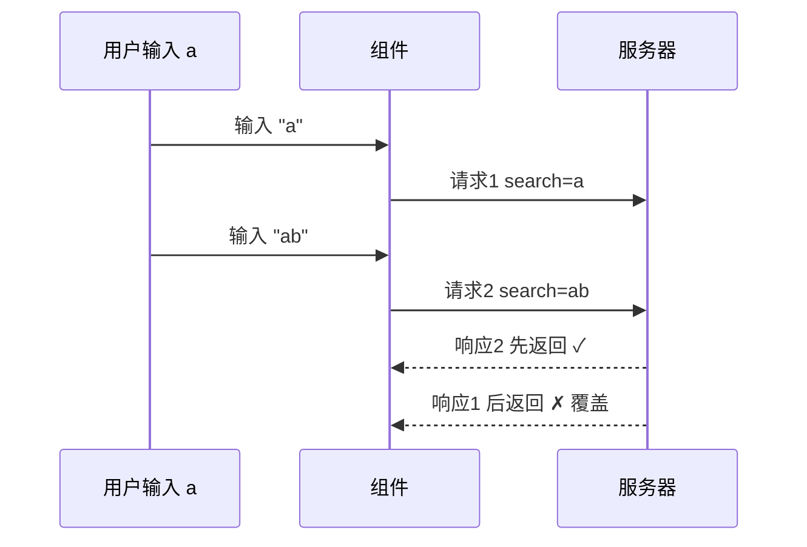

# 取消请求与重试

搜索、翻页、路由快切时，旧请求可能后返回覆盖新结果。用 **AbortController + signal** 或 vue-query 内置取消；重试默认交给 query 的 `retry`/`retryDelay`，axios 层仅对 **幂等 GET** 谨慎重试。

---

## 为什么需要取消



| 场景 | 风险 |
|------|------|
| 搜索 debounce 不足 | 旧结果覆盖新结果 |
| 路由快速切换 | 卸载组件仍 setState |
| Tab 关闭 | 无意义请求 |

---

## AbortController 基础

```ts
const controller = new AbortController();

fetch('/api/data', { signal: controller.signal });

// 取消
controller.abort();
```

axios：

```ts
const controller = new AbortController();

await axios.get('/api/users', { signal: controller.signal });

controller.abort(); // 抛出 CanceledError
```

---

## axios 封装支持 signal

```ts
// api/search.ts
export function searchUsers(q: string, config?: AxiosRequestConfig) {
  return request.get<User[]>('/users/search', { params: { q }, ...config });
}
```

```vue
<script setup lang="ts">
import { watch } from 'vue';

const keyword = ref('');
const results = ref<User[]>([]);

watch(keyword, async (q, _, onCleanup) => {
  const controller = new AbortController();
  onCleanup(() => controller.abort());

  if (!q) {
    results.value = [];
    return;
  }
  try {
    results.value = await searchUsers(q, { signal: controller.signal });
  } catch (e) {
    if (!axios.isCancel(e)) throw e;
  }
});
</script>
```

Vue 3.5+ `watch` 的 `onCleanup` 在下次执行或卸载时调用，适合挂 abort。

---

## vue-query 内置取消

```ts
useQuery({
  queryKey: ['search', keyword],
  queryFn: ({ signal }) => searchUsers(keyword.value, { signal }),
});
```

query 失效或 key 变化时，query 会自动 abort 上一次 signal。

```ts
useMutation({
  mutationFn: (data, { signal }) => createItem(data, { signal }),
});
```

---

## 路由离开时取消

```vue
<script setup lang="ts">
import { onBeforeRouteLeave } from 'vue-router';

let controller: AbortController | null = null;

async function load() {
  controller?.abort();
  controller = new AbortController();
  await fetchDetail(id, { signal: controller.signal });
}

onBeforeRouteLeave(() => {
  controller?.abort();
});
</script>
```

或用 vue-query 的 `enabled` + 自动 signal，减少手写。

---

## 重试策略

### vue-query retry

```ts
useQuery({
  queryKey: ['config'],
  queryFn: fetchConfig,
  retry: 3,
  retryDelay: (attempt) => Math.min(1000 * 2 ** attempt, 30_000),
});
```

| 选项 | 说明 |
|------|------|
| `retry` | 次数，或 `(failureCount, error) => boolean` |
| `retryDelay` | 指数退避 |

### axios 拦截器重试（慎用）

仅适合**幂等 GET** 或明确 idempotent 的接口：

```ts
instance.interceptors.response.use(undefined, async (error) => {
  const config = error.config;
  if (!config || config.__retryCount >= 2) return Promise.reject(error);
  if (error.response?.status >= 500 && config.method === 'get') {
    config.__retryCount = (config.__retryCount ?? 0) + 1;
    await delay(1000 * config.__retryCount);
    return instance(config);
  }
  return Promise.reject(error);
});
```

**POST 创建订单** 不应盲目重试，除非有 **Idempotency-Key**。

---

## 幂等与 Idempotency-Key

```ts
export function createPayment(data: PaymentDto, idempotencyKey: string) {
  return request.post('/payments', data, {
    headers: { 'Idempotency-Key': idempotencyKey },
  });
}
```

```ts
const key = crypto.randomUUID();
await createPayment(dto, key); // 安全重试同一 key
```

---

## 错误分类处理

```ts
function isAbortError(e: unknown) {
  return axios.isCancel(e) || (e instanceof DOMException && e.name === 'AbortError');
}

try {
  await fetchData({ signal });
} catch (e) {
  if (isAbortError(e)) return; // 静默
  showError(e);
}
```

| 错误 | UI |
|------|-----|
| Abort | 不提示 |
| 401 | 跳转登录 |
| 5xx | toast + 可选重试按钮 |
| 422 | 表单字段错误 |

---

## 并发控制（补充）

除 cancel 外，可用 **debounce** 减少请求数：

```ts
import { useDebouncedRef } from '@vueuse/core';

const keyword = ref('');
const debouncedKeyword = debouncedRef(keyword, 300);

useQuery({
  queryKey: ['search', debouncedKeyword],
  queryFn: () => search(debouncedKeyword.value),
});
```

debounce + abort 组合效果最佳。

---

## 小结

**取消机制**：`AbortController` + axios `signal`；vue-query 的 `queryFn({ signal })` 在 key 变化时自动 abort 上一次。

**清理时机**：`watch` 的 `onCleanup`；路由 `onBeforeRouteLeave`；搜索 debounce 前 cancel 旧请求。

**重试**：vue-query 用 `retry` + 指数退避 `retryDelay`；axios 拦截器仅对幂等 GET 谨慎重试。

**写操作**：POST 勿盲目重试；配合 `Idempotency-Key` 防重复提交。

**错误 UI**：Abort 静默；401 跳转；5xx toast；422 字段错误。

**组合策略**：debounce 减请求数 + abort 防竞态，搜索场景效果最佳。

核对：Abort 错误有没有误 toast？POST 重试有幂等键吗？query 传 signal 了吗？
