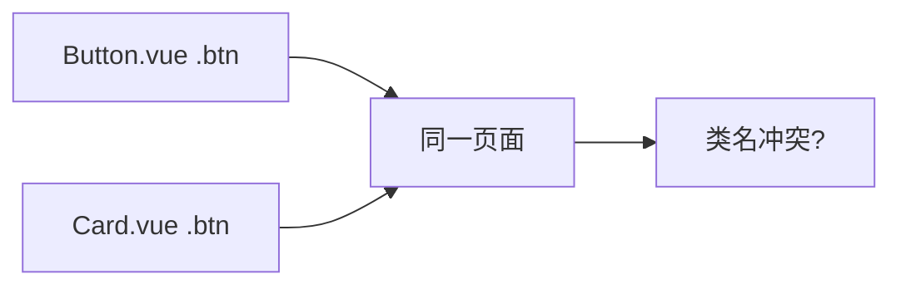

# Scoped 与 CSS Modules

大型项目里类名冲突是常态。**scoped** 是 SFC 默认隔离手段，编译加属性选择器；穿透子组件或 UI 库内部用 **`:deep()`**。需要更严格的类名隔离时用 **CSS Modules**；Vue 3.2+ 还可用 **v-bind in CSS** 绑响应式变量。

---

## 为什么需要样式隔离



全局 CSS 在大型项目中易互相污染；组件化要求样式默认**局部生效**。

---

## Scoped CSS

```vue
<template>
  <button class="primary">提交</button>
</template>

<style scoped>
.primary {
  background: var(--color-brand);
  color: #fff;
}
</style>
```

编译后类似：

```css
.primary[data-v-7ba5bd90] {
  background: var(--color-brand);
}
```

模板根节点及子元素自动带 `data-v-xxxxx`；**同一 SFC 内**选择器被改写。

| 优点 | 缺点 |
|------|------|
| 零配置 | 难覆盖子组件内部 |
| 可读类名 | 动态内容需注意 |
| 与 SFC 一体 | 深度选择需 :deep |

---

## 深度选择器 :deep()

修改子组件或 UI 库内部样式：

```vue
<style scoped>
.card :deep(.el-input__inner) {
  border-radius: 8px;
}
</style>
```

Vue 3 语法 `:deep(.selector)`；Vue 2 遗留 `>>>` 或 `/deep/`。

| 伪类 | 作用 |
|------|------|
| `:deep()` | 穿透 scoped 作用到子树 |
| `:slotted()` | 作用域插槽内容 |
| `:global()` | 该规则不 scoped |

```vue
<style scoped>
:slotted(.item-title) {
  font-weight: bold;
}
</style>
```

---

## CSS Modules

```vue
<template>
  <button :class="$style.primary">提交</button>
</template>

<style module>
.primary {
  composes: base from './shared.module.css';
  background: blue;
}
</style>
```

```vue
<script setup lang="ts">
import { useCssModule } from 'vue';
const style = useCssModule(); // 默认 module
</script>

<template>
  <div :class="style.wrapper">...</div>
</template>
```

编译类名：`_primary_abc123`。

| scoped | CSS Modules |
|--------|-------------|
| 属性选择器 | 类名哈希 |
| 模板写字符串 class | 绑定 `$style.xxx` |
| 全局穿透用 :deep | composes 组合 |

---

## 多 module 命名

```vue
<style module="a">
.a { color: red; }
</style>
<style module="b">
.b { color: blue; }
</style>

<script setup>
const stylesA = useCssModule('a');
</script>
```

---

## 与预处理器

```vue
<style scoped lang="scss">
$gap: 16px;
.list {
  display: flex;
  gap: $gap;
  :deep(.item) { flex: 1; }
}
</style>
```

Vite 默认支持 scss；变量可逐步迁移到 CSS Variables。

---

## v-bind in CSS（Vue 3.2+）

```vue
<script setup>
const themeColor = ref('#409eff');
</script>

<style scoped>
.title {
  color: v-bind(themeColor);
}
</style>
```

响应式 props/state 驱动样式，无需 inline style 堆砌。

---

## 选型建议

| 场景 | 推荐 |
|------|------|
| 业务组件默认 | scoped |
| 设计系统、多主题 token | CSS Variables + scoped |
| 强隔离 + TS 类名 | CSS Modules |
| 原子化 Tailwind | class 工具类，少写 scoped |
| 覆盖 Element Plus | scoped + :deep |

避免在同一组件混用过多方案，增加认知负担。

---

## 常见坑

| 问题 | 原因 | 解决 |
|------|------|------|
| 子组件根不生效 | scoped 仅当前 SFC | :deep 或子组件自管样式 |
| 动画类名丢失 | 第三方全局类 | 第二段非 scoped style |
| Modules 类 undefined | 未 module 或拼写错 | useCssModule 检查 |
| 优先级打不过 UI 库 | 特异性不足 | 提高选择器或 CSS 层 |

```vue
<!-- 仅全局动画 -->
<style>
@keyframes fade-in { from { opacity: 0; } to { opacity: 1; } }
</style>
```

---

## 小结

**scoped**：`<style scoped>` 编译为 `[data-v-xxx]` 属性选择器，默认组件级隔离，业务组件首选。

**:deep()**：改子组件或 UI 库内部 DOM（如 `.el-input__inner`）；Vue 2 的 `>>>`/`/deep/` 迁移时统一到 `:deep()`。

**:slotted() / :global()**：插槽内容样式、单条全局规则的特殊出口。

**CSS Modules**：`<style module>` + `$style` / `useCssModule()`，类名哈希，隔离更严格。

**v-bind in CSS**：`<style>` 内 `v-bind(themeColor)` 绑 script 响应式变量。

**选型**：默认 scoped；强隔离用 Modules；布局可用 Tailwind；改 UI 库用 scoped + deep。

核对：改 Element 内部 class 用了 deep 吗？动画要不要单独非 scoped 块？Modules 绑定拼对了吗？
