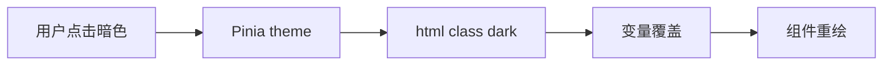

# CSS 变量与主题切换

主题切换本质是 **CSS 变量 + 根节点 class/data 属性**：`:root` 定义 token，`html.dark` 或 `data-theme` 覆盖变量值。用户偏好可 Pinia 持久化；首屏用 **inline script** 同步 class，防 FOUC 闪屏。

---

## CSS 变量基础

```css
:root {
  --color-bg: #ffffff;
  --color-text: #1a1a1a;
  --color-brand: #409eff;
  --radius-md: 8px;
}

body {
  background: var(--color-bg);
  color: var(--color-text);
}
```

```css
.dark {
  --color-bg: #141414;
  --color-text: #e5e5e5;
  --color-brand: #66b1ff;
}
```

| 特性 | 说明 |
|------|------|
| 继承 | 子元素可读父级变量 |
| 运行时改 | JS 改 `--x` 即时生效 |
| 作用域 | 任意选择器上定义 |

---

## 主题切换流程



```ts
// stores/settings.ts
export const useSettingsStore = defineStore('settings', () => {
  const theme = ref<'light' | 'dark' | 'system'>('system');

  const resolved = computed(() => {
    if (theme.value === 'system') {
      return matchMedia('(prefers-color-scheme: dark)').matches ? 'dark' : 'light';
    }
    return theme.value;
  });

  watch(resolved, (mode) => {
    document.documentElement.classList.toggle('dark', mode === 'dark');
    document.documentElement.dataset.theme = mode;
  }, { immediate: true });

  return { theme, resolved };
}, { persist: { paths: ['theme'] } });
```

---

## 与 scoped / v-bind 结合

```vue
<script setup>
const settings = useSettingsStore();
</script>

<style scoped>
.card {
  background: var(--color-bg-elevated);
  border-radius: var(--radius-md);
  box-shadow: var(--shadow-sm);
}
</style>
```

设计 token 集中 `styles/tokens.css`：

```css
:root {
  --color-bg-elevated: #fff;
  --shadow-sm: 0 1px 3px rgb(0 0 0 / 8%);
}
.dark {
  --color-bg-elevated: #1f1f1f;
  --shadow-sm: 0 1px 3px rgb(0 0 0 / 40%);
}
```

---

## Element Plus 暗色

```ts
// main.ts
import 'element-plus/theme-chalk/dark/css-vars.css';
```

```html
<html class="dark">
```

Element Plus 2.x 通过 CSS 变量与 `html.dark` 联动；自定义主色：

```css
:root {
  --el-color-primary: #409eff;
}
.dark {
  --el-color-primary: #66b1ff;
}
```

---

## Ant Design Vue 主题

Ant Design Vue 4+ ConfigProvider：

```vue
<template>
  <ConfigProvider :theme="{ algorithm: isDark ? theme.darkAlgorithm : theme.defaultAlgorithm }">
    <App />
  </ConfigProvider>
</template>

<script setup lang="ts">
import { theme, ConfigProvider } from 'ant-design-vue';
const isDark = computed(() => settings.resolved === 'dark');
</script>
```

| 库 | 机制 |
|----|------|
| Element Plus | CSS vars + dark 类 |
| Ant Design Vue | ConfigProvider algorithm |
| Naive UI | NConfigProvider themeOverrides |

---

## 防止 FOUC（闪烁）

SSR 或首屏脚本前应同步主题：

```html
<!-- index.html -->
<script>
  (function () {
    const t = localStorage.getItem('settings')?.theme;
    const dark = t === 'dark' || (t === 'system' && matchMedia('(prefers-color-scheme: dark)').matches);
    if (dark) document.documentElement.classList.add('dark');
  })();
</script>
```

避免先亮后暗的闪屏。

---

## 多主题（非仅明暗）

```css
[data-theme="blue"] {
  --color-brand: #0052d9;
}
[data-theme="green"] {
  --color-brand: #00a870;
}
```

```ts
document.documentElement.dataset.theme = 'blue';
```

品牌换肤与暗色正交：可同时 `class="dark" data-theme="blue"`。

---

## Tailwind dark 模式

```js
// tailwind.config.js
module.exports = {
  darkMode: 'class',
};
```

```vue
<div class="bg-white dark:bg-gray-900 text-gray-900 dark:text-gray-100">
```

与 CSS 变量方案二选一或混用：Tailwind 负责布局间距，token 用 variables。

---

## 可访问性

| 检查 | 说明 |
|------|------|
| 对比度 | WCAG AA 4.5:1 |
| prefers-reduced-motion | 减少动画 |
| 焦点环 | 暗色下仍可见 |

```css
@media (prefers-reduced-motion: reduce) {
  * { transition: none !important; }
}
```

---

## 小结

**机制**：`:root` / `.dark` 定义 design token；组件 scoped 样式引用 `var(，color-*)`，切换只改根节点 class。

**流程**：Pinia 存用户偏好 → `watch` 同步 `html.classList` / `dataset.theme` → CSS 变量即时生效。

**UI 库**：Element Plus 引入 `dark/css-vars.css` + `html.dark`；Ant Design Vue 用 ConfigProvider `algorithm`；Naive UI 用 NConfigProvider。

**FOUC**：`index.html` inline script 在首屏前读 localStorage / prefers-color-scheme，提前加 `dark` class。

**多主题**：`data-theme="blue"` 与 `class="dark"` 可正交组合。

**Tailwind**：`darkMode: 'class'` 与 CSS 变量可混用，布局 atomic，颜色走 variables。

核对：暗色对比度够吗？首屏 inline script 加了吗？Element dark css 引入了没？
