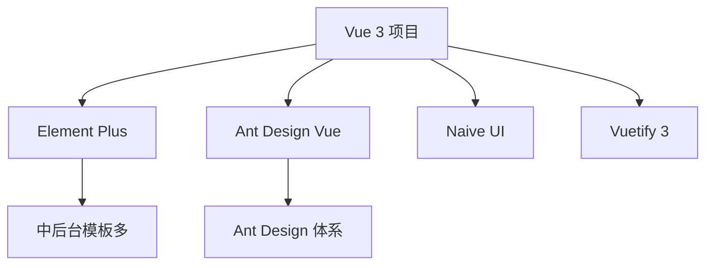

# Element Plus、Ant Design Vue 选型与接入

国内中后台主流 **Element Plus / Ant Design Vue**，均支持 **unplugin-vue-components 按需导入**。同一项目切忌混用两套，选一套跟设计体系和团队习惯对齐。

---

## 生态概览



| 维度 | Element Plus | Ant Design Vue |
|------|--------------|----------------|
| 起源 | Element UI 迁移 | Ant Design React 同源 |
| 风格 | 紧凑、偏传统后台 | 企业级、规范强 |
| 文档 | 中文友好 | 中文友好 |
| 表单/表格 | 成熟 | 成熟（Pro 生态在 React 更强） |
| 体积 | 全量较大 | 全量较大 |
| TS | 良好 | 4.x 良好 |

---

## Element Plus 接入

```bash
pnpm add element-plus
```

### 全量（不推荐生产）

```ts
import ElementPlus from 'element-plus';
import 'element-plus/dist/index.css';
app.use(ElementPlus);
```

### 按需自动导入（推荐）

```bash
pnpm add -D unplugin-vue-components unplugin-auto-import
```

```ts
// vite.config.ts
import Components from 'unplugin-vue-components/vite';
import { ElementPlusResolver } from 'unplugin-vue-components/resolvers';

export default defineConfig({
  plugins: [
    vue(),
    Components({
      resolvers: [ElementPlusResolver()],
    }),
  ],
});
```

模板中直接使用 `<ElButton>` 无需手动 import。

### 图标

```bash
pnpm add @element-plus/icons-vue
```

```vue
<script setup>
import { Edit } from '@element-plus/icons-vue';
</script>
<template>
  <ElButton :icon="Edit">编辑</ElButton>
</template>
```

---

## Ant Design Vue 接入

```bash
pnpm add ant-design-vue@4
```

```ts
import Antd from 'ant-design-vue';
import 'ant-design-vue/dist/reset.css';
app.use(Antd);
```

按需 + Resolver：

```ts
import { AntDesignVueResolver } from 'unplugin-vue-components/resolvers';

Components({
  resolvers: [AntDesignVueResolver({ importStyle: false })],
}),
```

---

## 主题定制对比

| Element Plus | Ant Design Vue |
|--------------|----------------|
| SCSS 变量（旧） | less modifyVariables（3.x） |
| CSS 变量 + 暗色 css | ConfigProvider theme token |
| 在线主题生成器 | Design Token 算法 |

```vue
<!-- Ant Design Vue 4 -->
<ConfigProvider :theme="{ token: { colorPrimary: '#00b96b' } }">
  <RouterView />
</ConfigProvider>
```

```css
/* Element Plus */
:root {
  --el-color-primary: #00b96b;
}
```

---

## 表单与表格选型提示

| 场景 | Element Plus | Ant Design Vue |
|------|--------------|----------------|
| 快速 CRUD | ElTable + ElForm 上手快 | Table + Form 文档细 |
| 复杂校验 | async-validator | 同 schema 思路 |
| 虚拟滚动大表 | ElTableV2 | 需第三方或自定义 |

两者均可配合 vee-validate + zod。

---

## 国际化

```ts
// Element Plus
import zhCn from 'element-plus/dist/locale/zh-cn.mjs';
app.use(ElementPlus, { locale: zhCn });

// Ant Design Vue
import zhCN from 'ant-design-vue/es/locale/zh_CN';
<ConfigProvider :locale="zhCN">
```

应用文案走 vue-i18n，组件库 locale 单独配置。

---

## 与 UnoCSS / Tailwind 共存

```ts
// 避免 preflight 冲突
// tailwind preflight 与 ant reset 二选一
```

常见做法：布局用 Tailwind，组件用 UI 库，不在 UI 组件上叠过多 utility 类。

---

## 选型决策

| 选 Element Plus | 选 Ant Design Vue |
|-----------------|-------------------|
| 从 Element UI 升级 | 团队熟悉 Ant Design |
| 需要大量现成 admin 模板 | 与设计规范强绑定 Ant |
| 偏轻量页面 | 复杂 ConfigProvider 主题 |

新项目按设计稿与团队经验定一套，避免混用。

---

## 版本与 Vue 兼容

| 库 | Vue 版本 |
|----|----------|
| Element Plus | 3.x |
| Element UI | 2.x only |
| Ant Design Vue 4 | 3.x |
| Ant Design Vue 1.x | 2.x |

升级 Vue 3 时必须换对应 3.x 组件库。

---

## 小结

**接入**：`unplugin-vue-components` + Resolver 按需加载；全量 `app.use` 仅适合原型。

**Element Plus**：`ElementPlusResolver`；图标 `@element-plus/icons-vue`；暗色 `dark/css-vars.css` + `html.dark`。

**Ant Design Vue 4**：`AntDesignVueResolver`；主题 ConfigProvider `token` / `algorithm`；locale 单独 ConfigProvider。

**主题**：Element 用 CSS 变量 `--el-color-primary`；Ant 用 ConfigProvider theme 对象。

**选型**：Element 模板多、Element UI 升级路径顺；Ant 设计规范强；**勿混用两套**。

**共存 Tailwind**：布局 atomic + UI 库组件；preflight 与 reset 只保留一份。

核对：按需 Resolver 配了吗？Vue 2 的 Element UI 换 Plus 了吗？两套库有没有混用？
