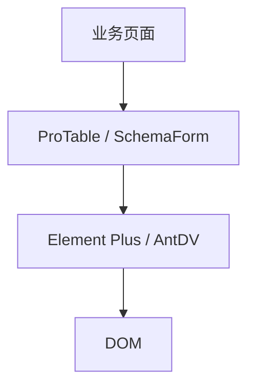

# 组件库二次封装

直接在 Element Plus / Ant Design Vue 上写业务页，每页重复 columns、分页、错误提示。二次封装建 **ProTable、SchemaForm** 等业务层，统一分页/表单/反馈，保留 slot 扩展，升级 UI 库时只改封装层。

---

## 为什么要二次封装



| 仅直接用 UI 库 | 二次封装 |
|----------------|----------|
| 每页重复 columns 配置 | 统一列定义 DSL |
| 分页参数各异 | 标准 page/pageSize |
| 错误提示风格不一 | 内置 message 策略 |
| 升级库改 N 处 | 改封装层一处 |

---

## 封装原则

| 原则 | 说明 |
|------|------|
| 薄封装 | 透传必要 props，不过度包 |
| 业务无关进 composable | 请求逻辑可复用 |
| 保留 escape hatch | 暴露 `#default` 或 `slots` |
| 类型导出 | 导出 Props / Column 类型 |

---

## ProTable 示例

```vue
<!-- components/ProTable/ProTable.vue -->
<script setup lang="ts" generic="T extends Record<string, unknown>">
import type { TableColumnCtx } from 'element-plus';

const props = defineProps<{
  columns: ProColumn<T>[];
  request: (params: PageParams) => Promise<PageResult<T>>;
}>();

const loading = ref(false);
const data = ref<T[]>([]);
const total = ref(0);
const page = ref(1);
const pageSize = ref(20);

async function load() {
  loading.value = true;
  try {
    const res = await props.request({ page: page.value, pageSize: pageSize.value });
    data.value = res.list;
    total.value = res.total;
  } finally {
    loading.value = false;
  }
}

onMounted(load);
defineExpose({ reload: load });
</script>

<template>
  <ElTable v-loading="loading" :data="data">
    <ElTableColumn
      v-for="col in columns"
      :key="String(col.prop)"
      v-bind="col"
    >
      <template v-if="col.slot" #default="scope">
        <slot :name="col.slot" v-bind="scope" />
      </template>
    </ElTableColumn>
  </ElTable>
  <ElPagination
    v-model:current-page="page"
    v-model:page-size="pageSize"
    :total="total"
    @change="load"
  />
</template>
```

```vue
<!-- 使用 -->
<ProTable
  :columns="userColumns"
  :request="fetchUsers"
>
  <template #status="{ row }">
    <StatusTag :value="row.status" />
  </template>
</ProTable>
```

---

## SchemaForm 示例

```ts
// types/form.ts
export interface FormSchemaItem {
  field: string;
  label: string;
  component: 'Input' | 'Select' | 'DatePicker';
  props?: Record<string, unknown>;
  rules?: FormItemRule[];
}
```

```vue
<script setup lang="ts">
const props = defineProps<{
  schema: FormSchemaItem[];
  modelValue: Record<string, unknown>;
}>();
const emit = defineEmits<{ 'update:modelValue': [v: Record<string, unknown>] }>();

const componentMap = {
  Input: ElInput,
  Select: ElSelect,
  DatePicker: ElDatePicker,
};
</script>

<template>
  <ElForm :model="modelValue">
    <ElFormItem
      v-for="item in schema"
      :key="item.field"
      :label="item.label"
      :prop="item.field"
      :rules="item.rules"
    >
      <component
        :is="componentMap[item.component]"
        v-model="modelValue[item.field]"
        v-bind="item.props"
      />
    </ElFormItem>
  </ElForm>
</template>
```

配合 zod/vee-validate 做 schema 校验。

---

## Modal / Drawer 命令式封装

```ts
// composables/useDialog.ts
import { createVNode, render } from 'vue';

export function openDialog(options: DialogOptions) {
  const container = document.createElement('div');
  const vnode = createVNode(DialogHost, {
    ...options,
    onClose: () => {
      render(null, container);
      container.remove();
    },
  });
  render(vnode, container);
  document.body.appendChild(container);
}
```

或使用 UI 库官方 `ElMessageBox`、`Modal.confirm`；统一封装确认文案与 loading。

---

## 目录结构

```
src/components/
  ProTable/
    ProTable.vue
    types.ts
    index.ts          # export
  SchemaForm/
  StatusTag/          # 小业务原子
  index.ts            # 统一导出
```

```ts
// components/index.ts
export { default as ProTable } from './ProTable/ProTable.vue';
export type { ProColumn } from './ProTable/types';
```

---

## 与权限、空态

```vue
<ProTable v-if="can('user:list')" :request="fetchUsers" />
<EmptyState v-else description="无权限" />
```

封装层内置 `v-loading`、空数据插图、错误重试按钮，页面只关心 `request` 函数。

---

## 升级 UI 库

二次封装吸收 API 差异：

```ts
// 适配层
function normalizePagination(res: BackendPage) {
  return { list: res.records, total: res.totalCount };
}
```

库大版本升级时优先改 `ProTable` 内部，业务页稳定。

---

## 反模式

| 反模式 | 问题 |
|--------|------|
| 封装过厚，props 50+ | 不如直接用原组件 |
| 复制粘贴 ElTable 源码 | 维护地狱 |
| 业务逻辑写进 ProTable | 应用 composable 分离 |
| 无 slot 扩展 | 特殊列无法定制 |

---

## 小结

**价值**：ProTable / SchemaForm 统一分页、校验、loading、空态与错误反馈，减少每页重复配置。

**原则**：薄封装、透传必要 props；保留 slot 扩展；请求逻辑放 composable；导出 Props/Column 类型。

**ProTable**：columns DSL + `request` 函数 + 内置分页；特殊列用具名 slot；`defineExpose({ reload })` 供外部刷新。

**SchemaForm**：schema 驱动表单项 + componentMap；配合 zod/vee-validate 校验。

**目录**：按组件分文件夹 + `index.ts` 统一导出，业务层与 UI 库分离。

**升级**：封装层做分页字段 normalize 等适配，UI 库大版本只改一层。

**反模式**：props 过厚、无 slot、业务逻辑塞进 ProTable、复制 UI 库源码。

核对：特殊列能 slot 扩展吗？request 和 UI 分离了吗？升级库只改封装层够吗？
