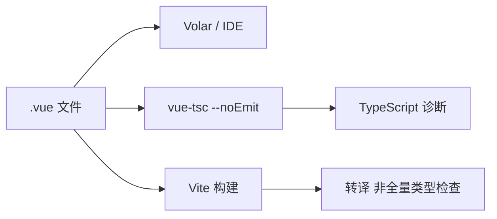

# vue-tsc 与项目配置

Vue + TypeScript 的基线是 **vue-tsc + strict tsconfig + env.d.ts**。Vite 负责构建和转译，**不替代类型检查**，CI 必须跑 `vue-tsc`；路径别名要在 tsconfig 与 vite 双端一致。

---

## 工具链角色



| 工具 | 作用 |
|------|------|
| Volar | 编辑器智能提示 |
| vue-tsc | CI 类型检查 |
| Vite | 开发/打包，esbuild 快但不做完整 TS 检查 |

**生产 CI 必须跑 vue-tsc**，不能仅依赖 `vite build`。

---

## create-vue 基线

```bash
pnpm create vue@latest my-app
# ✓ TypeScript ✓ ESLint
cd my-app && pnpm install
```

```json
// package.json
{
  "scripts": {
    "build": "vue-tsc -b && vite build",
    "type-check": "vue-tsc --build --force"
  }
}
```

Vue 3.5+ 可能用 `vue-tsc -b` 项目引用模式。

---

## tsconfig 结构

```json
// tsconfig.json
{
  "files": [],
  "references": [
    { "path": "./tsconfig.app.json" },
    { "path": "./tsconfig.node.json" }
  ]
}
```

```json
// tsconfig.app.json
{
  "compilerOptions": {
    "target": "ES2020",
    "module": "ESNext",
    "moduleResolution": "bundler",
    "strict": true,
    "jsx": "preserve",
    "resolveJsonModule": true,
    "isolatedModules": true,
    "noEmit": true,
    "skipLibCheck": true,
    "paths": { "@/*": ["./src/*"] },
    "types": ["vite/client"]
  },
  "include": ["src/**/*.ts", "src/**/*.tsx", "src/**/*.vue"]
}
```

| 选项 | 建议 |
|------|------|
| `strict` | 新项目 true |
| `noUncheckedIndexedAccess` | 可选更严 |
| `paths` | 与 vite alias 一致 |

---

## env.d.ts

```ts
/// <reference types="vite/client" />

declare module '*.vue' {
  import type { DefineComponent } from 'vue';
  const component: DefineComponent<object, object, unknown>;
  export default component;
}

interface ImportMetaEnv {
  readonly VITE_API_BASE_URL: string;
}

interface ImportMeta {
  readonly env: ImportMetaEnv;
}
```

为 `.vue` 模块与环境变量提供类型。

---

## Vite alias 对齐

```ts
// vite.config.ts
import { fileURLToPath, URL } from 'node:url';

export default defineConfig({
  resolve: {
    alias: {
      '@': fileURLToPath(new URL('./src', import.meta.url)),
    },
  },
});
```

`tsconfig paths` 与 `vite alias` 不一致会导致 IDE 通过但构建路径错误。

---

## 严格模式常见报错

| 报错 | 处理 |
|------|------|
| `Object is possibly undefined` | 可选链或窄化 |
| `noImplicitAny` | 补参数类型 |
| 模板内 prop typo | vue-tsc 会报 |
| `ref` 自动解包 | script 内 `.value` |

```vue
<script setup lang="ts">
const count = ref(0);
// 模板 {{ count }} 自动解包；script 用 count.value
</script>
```

---

## Volar Takeover Mode

VS Code / Cursor 禁用内置 TS 扩展，仅用 Vue - Official（Volar）接管 TS，避免与 Vetur 冲突。Vue 3 项目勿用 Vetur。

---

## CI 集成

```yaml
# .github/workflows/ci.yml
- run: pnpm type-check
- run: pnpm build
```

`type-check` 与 `lint` 并行，缩短反馈时间。

---

## Monorepo

包内 `vue-tsc ，declaration` 生成 `.d.ts` 供消费方；根 `tsconfig references` 串联 packages/ui。

---

## 与 JavaScript 混用

渐进迁移可 `"allowJs": true`，逐步将 `.js` 改 `.ts`；新文件一律 `<script setup lang="ts">`。

---

## 小结

**工具分工**：Volar 做 IDE 提示；vue-tsc 做 SFC template 类型检查；Vite/esbuild 只做转译，**不能替代 typecheck**。

**基线配置**：strict tsconfig + `env.d.ts`（`*.vue` shim + `ImportMetaEnv`）；`paths` 与 vite alias 对齐。

**脚本**：`vue-tsc -b && vite build`；CI 单独跑 `type-check` 与 lint 并行。

**严格模式**：模板 prop typo、possibly undefined、script 里 ref 要 `.value` 等，vue-tsc 都会报。

**IDE**：Vue 3 用 Volar Takeover Mode，禁用 Vetur 和内置 TS 服务冲突。

**渐进 TS**：`allowJs` + 新文件一律 TS；Monorepo 用 project references 和 `--declaration`。

核对：CI 跑 vue-tsc 了吗？alias 双端一致吗？还在用 Vetur 吗？
