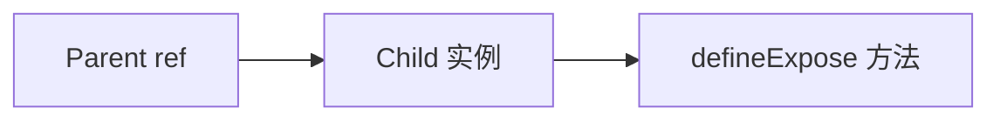

# 模板 ref 与组件实例类型

模板 ref 分两类：DOM 元素标 **HTMLElement** 具体类型；子组件 ref 配 **defineExpose** + **InstanceType** 或显式 Expose 接口。Vue 3.5 **useTemplateRef** 进一步简化类型推断。

---

## DOM ref

```vue
<script setup lang="ts">
import { ref, onMounted } from 'vue';

const inputRef = ref<HTMLInputElement | null>(null);

onMounted(() => {
  inputRef.value?.focus();
});
</script>

<template>
  <input ref="inputRef" type="text" />
</template>
```

| 元素 | 类型 |
|------|------|
| input | `HTMLInputElement` |
| div | `HTMLDivElement` |
| canvas | `HTMLCanvasElement` |

挂载前 ref 为 `null`；DOM 操作宜在 `onMounted` 后。

---

## 组件 ref + defineExpose

```vue
<!-- ChildForm.vue -->
<script setup lang="ts">
const name = ref('');

function validate() {
  return name.value.length > 0;
}

defineExpose({ validate, name });
</script>
```

```vue
<!-- Parent.vue -->
<script setup lang="ts">
import ChildForm from './ChildForm.vue';

const formRef = ref<InstanceType<typeof ChildForm> | null>(null);

async function submit() {
  if (!formRef.value?.validate()) return;
  // ...
}
</script>

<template>
  <ChildForm ref="formRef" />
</template>
```



---

## 显式 Expose 接口（库推荐）

```ts
// ChildForm.vue
export interface ChildFormExpose {
  validate: () => boolean;
  reset: () => void;
}

defineExpose<ChildFormExpose>({
  validate: () => true,
  reset: () => {},
});
```

```ts
const formRef = ref<ChildFormExpose | null>(null);
```

避免 `InstanceType` 推断不到 script setup 内部未导出类型。

---

## 泛型组件 ref

```vue
<script setup lang="ts" generic="T">
defineProps<{ model: T }>();
defineExpose<{ getModel: () => T }>({
  getModel: () => props.model,
});
</script>
```

父组件按具体 T 使用 InstanceType 或 Expose 接口。

---

## v-for 中的 ref

```vue
<script setup lang="ts">
const itemRefs = ref<HTMLElement[]>([]);

function setRef(el: Element | ComponentPublicInstance | null) {
  if (el instanceof HTMLElement) itemRefs.value.push(el);
}
</script>

<template>
  <li v-for="item in list" :key="item.id" :ref="setRef">{{ item.name }}</li>
</template>
```

Vue 3.5+ 函数 ref 在更新时会重复调用，注意去重或改用 Map。

---

## useTemplateRef（Vue 3.5+）

```vue
<script setup lang="ts">
const inputRef = useTemplateRef<HTMLInputElement>('inputRef');
</script>

<template>
  <input ref="inputRef" />
</template>
```

字符串 key 与模板 ref 名一致，类型推断更清晰。

---

## 组件实例 vs 元素

```ts
import type { ComponentPublicInstance } from 'vue';

const compRef = ref<ComponentPublicInstance | null>(null);
```

优先 **defineExpose 接口** 而非依赖 `$el` 内部结构。

---

## 第三方组件 ref

Element Plus 等导出实例类型：

```vue
<script setup lang="ts">
import type { FormInstance } from 'element-plus';

const formRef = ref<FormInstance>();
</script>

<template>
  <ElForm ref="formRef">...</ElForm>
</template>
```

查阅库文档的 Instance 类型名。

---

## 小结

**DOM ref**：`ref<HTMLInputElement | null>(null)` 标注具体元素；访问用可选链；`onMounted` 后 DOM 才可靠。

**组件 ref**：子组件 `defineExpose` 暴露方法；父组件 `ref<InstanceType<typeof Child> | null>` 或显式 `ChildExpose` 接口。

**库组件**：用官方 `FormInstance` 等类型，勿猜 `$el` 结构。

**useTemplateRef**（3.5+）：`useTemplateRef<HTMLInputElement>('inputRef')` 与模板 ref 名对应，推断更清晰。

**v-for ref**：函数 ref 或数组；注意重复调用去重；元素 vs 组件实例用 `instanceof` 区分。

**readonly / null**：挂载前 null 正常；勿在 setup 同步阶段读 DOM ref。

核对：子组件 expose 了吗？第三方 ref 用官方 Instance 类型了吗？DOM 操作在 onMounted 吗？
