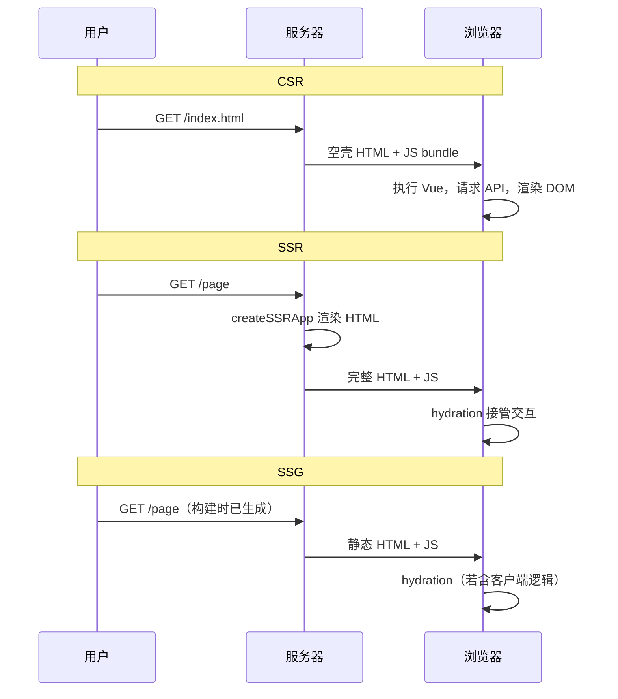
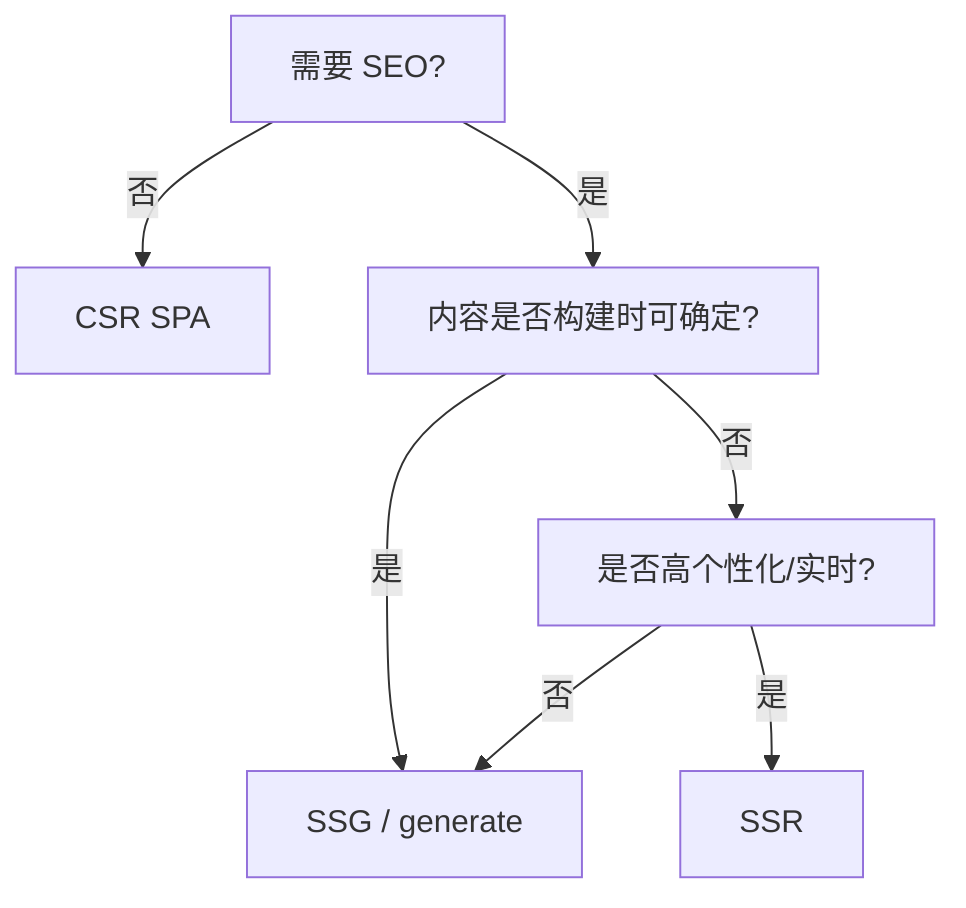

# CSR、SSR 与 SSG 概念

CSR、SSR、SSG 的差别在首屏 HTML 由谁、在何时生成。先想清楚 SEO 和首屏要求，再权衡运维成本；工程上 Nuxt 3 能统一路由和部署。

## 三种渲染模式一览

| 模式 | 英文 | HTML 生成时机 | 典型场景 |
|------|------|---------------|----------|
| 客户端渲染 | CSR | 浏览器执行 JS 后 | 后台管理、强交互 SPA |
| 服务端渲染 | SSR | 每次请求在 Node 生成 | 内容站、需 SEO 的 C 端 |
| 静态站点生成 | SSG | 构建时预生成 HTML | 文档、博客、营销页 |



---

## CSR：纯客户端渲染

传统 Vite + Vue SPA 即 CSR：服务器只返回 `index.html` 和静态资源，页面内容由 `createApp` 在浏览器挂载后生成。

```ts
// main.ts — 典型 CSR 入口
import { createApp } from 'vue';
import App from './App.vue';

createApp(App).mount('#app');
```

| 优点 | 缺点 |
|------|------|
| 架构简单，部署静态文件即可 | 首屏白屏时间长（需下载+解析 JS） |
| 服务器无状态，易水平扩展 | 搜索引擎对纯 CSR 抓取能力有限 |
| 页面切换快（无整页刷新） | 敏感数据若写在客户端 bundle 会暴露 |

**适用**：登录后的后台系统、工具型应用、对 SEO 要求低的 B 端产品。

---

## SSR：服务端渲染

SSR 在 Node（或 Edge）上运行同一套 Vue 组件，将初始 HTML 字符串插入响应，浏览器再执行客户端 bundle 完成 **hydration**（注水），把静态 HTML「激活」为可交互应用。

```ts
// entry-server.ts（概念示意）
import { createSSRApp } from 'vue';
import { renderToString } from 'vue/server-renderer';
import App from './App.vue';

export async function render(url: string) {
  const app = createSSRApp(App);
  const html = await renderToString(app);
  return html;
}
```

| 优点 | 缺点 |
|------|------|
| 首屏 HTML 含内容，LCP 通常更好 | 需要 Node 运行时或 Serverless |
| SEO 友好（爬虫直接读 HTML） | 同构代码需注意环境差异（window、localStorage） |
| 可与 CSR 共用组件逻辑 | TTFB 受服务器渲染耗时影响 |

---

## SSG：静态站点生成

SSG 在 **构建阶段** 为每个路由生成独立 HTML 文件，部署到 CDN。运行时无 Node 进程，成本极低。

```bash
# Nuxt 静态生成示意
nuxt generate
# 输出 .output/public/ 下各路由的 index.html
```

| 变体 | 说明 |
|------|------|
| 纯静态 | 构建后数据固定，适合文档站 |
| 增量静态再生（ISR） | 定时或按需重建部分页面（Nuxt/Nitro 支持） |
| 混合 | 部分路由 SSG，部分 SSR/CSR |

**适用**：博客、官网、帮助中心；数据变更频率低、页面数量有限。

---

## 选型决策表

| 需求 | 推荐 | 理由 |
|------|------|------|
| 强 SEO + 内容频繁更新 | SSR | 每次请求拿到最新 HTML |
| 强 SEO + 内容相对固定 | SSG | CDN 分发，成本低 |
| 纯内部系统 | CSR | 最简单，无同构负担 |
| 首屏性能敏感 + 可接受运维 | SSR 或 SSG | 减少客户端渲染工作量 |
| 千万级页面、个性化强 | SSR + 边缘缓存 | 避免构建爆炸 |



---

## 与 Vue 生态的对应关系

| 方案 | 工具 |
|------|------|
| CSR | Vite + `createApp` |
| 手写 SSR | `createSSRApp` + `@vue/server-renderer` + 自建 Express |
| 一体化 SSR/SSG | **Nuxt 3**（推荐） |
| 元框架替代 | Quasar SSR、Vite SSR 插件 |

Nuxt 在 Nitro 引擎上统一了 SSR、SSG、Server Routes 与边缘部署，是 Vue 全栈场景的事实标准。

---

## 常见误解

| 误解 | 事实 |
|------|------|
| SSR 一定比 CSR 快 | 若 TTFB 高或 hydration 重，可能更慢 |
| SSG 不能做动态数据 | 可在客户端 hydration 后请求 API 补充 |
| 用了 Nuxt 就必须 SSR | `ssr: false` 或 `nuxt generate` 可退化为 CSR/SSG |
| SSR 不需要 SEO 优化 | 仍需 meta、结构化数据、sitemap |

---

## 性能指标对照

| 指标 | CSR | SSR/SSG |
|------|-----|---------|
| TTFB | 通常低（静态 HTML） | SSR 可能升高 |
| FCP / LCP | 依赖 JS 下载执行 | 通常更早（有内容 HTML） |
| TTI | JS 执行完即可交互 | 需等待 hydration |
| CLS | 注意骨架屏与字体 | hydration 不匹配会导致 CLS 飙升 |

---

## 小结

CSR、SSR、SSG 的区别在于首屏 HTML 由谁在何时生成。CSR 在浏览器执行 JS 后渲染，架构简单、适合登录后系统，但 SEO 和首屏性能较弱。SSR 在每次请求时于 Node 生成 HTML，首屏内容和 SEO 友好，但需要运行时并注意 hydration 一致性。SSG 在构建阶段预生成静态页，部署到 CDN 成本最低，适合博客、文档等内容相对固定的场景。选型时先问 SEO 与首屏要求：纯后台选 CSR；需 SEO 且内容可构建时确定选 SSG；需实时或高个性化选 SSR。Vue 生态中，Vite + createApp 对应 CSR，createSSRApp 对应手写 SSR，Nuxt 3 则统一 SSR、SSG 与 Server Routes，是全栈场景的事实标准。
