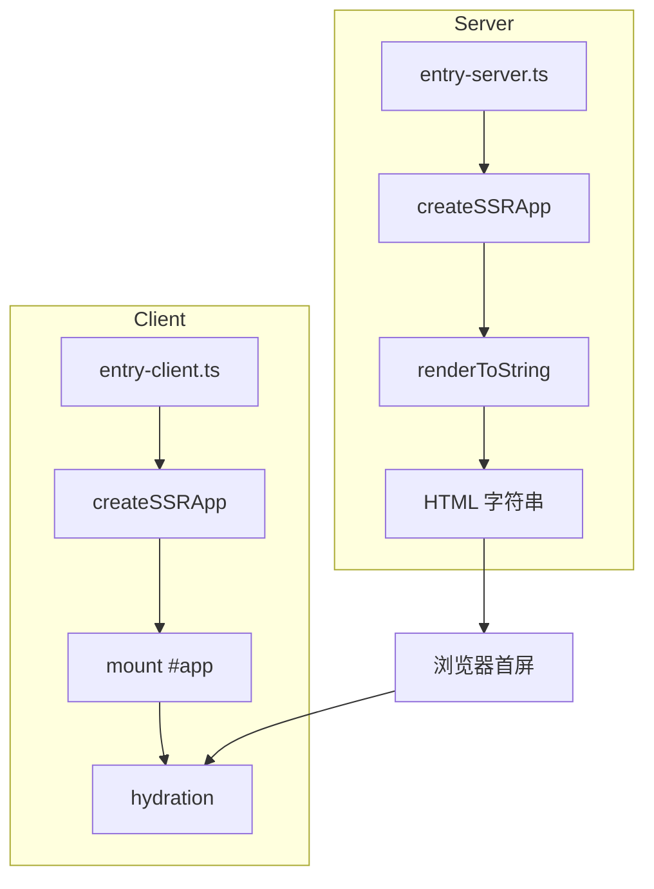
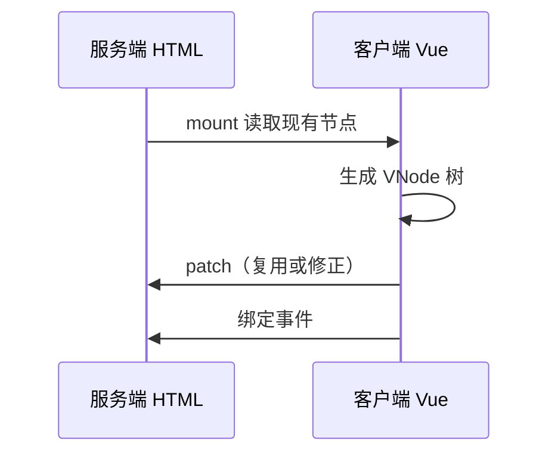

# createSSRApp 与 hydration

SSR 用 `createSSRApp`，服务端 `renderToString`，客户端 `mount` 做 hydration。关键是双端渲染结果一致；`setup` 里慎用仅客户端 API。

## SSR 双端架构



| 端 | 入口职责 |
|----|----------|
| Server | 创建 app、注入路由状态、拉取数据、渲染 HTML |
| Client | 复用相同组件树、挂载到已有 DOM、绑定事件 |

---

## createSSRApp 与 createApp 的差异

```ts
// 客户端 — 会清空 #app 再渲染（CSR）
import { createApp } from 'vue';
createApp(App).mount('#app');

// 客户端 — SSR hydration（保留服务端 HTML）
import { createSSRApp } from 'vue';
createSSRApp(App).mount('#app');
```

| API | 行为 |
|-----|------|
| `createApp` | `mount` 时替换容器内容 |
| `createSSRApp` | `mount` 时对比现有 DOM，尽量复用节点 |

服务端必须使用 `createSSRApp`，否则部分内置行为（如 Teleport SSR 处理）不正确。

---

## 最小同构示例

**entry-server.ts**

```ts
import { createSSRApp } from 'vue';
import { renderToString } from 'vue/server-renderer';
import App from './App.vue';

export async function render(url: string) {
  const app = createSSRApp(App);
  const html = await renderToString(app);
  return { html };
}
```

**entry-client.ts**

```ts
import { createSSRApp } from 'vue';
import App from './App.vue';

const app = createSSRApp(App);
app.mount('#app');
```

**HTML 模板**

```html
<!DOCTYPE html>
<html>
  <head><!--preload-links--></head>
  <body>
    <div id="app"><!--ssr-outlet--></div>
    <script type="module" src="/src/entry-client.ts"></script>
  </body>
</html>
```

---

## renderToString 与流式渲染

| API | 特点 |
|-----|------|
| `renderToString` | 简单，等待全部渲染完成 |
| `renderToNodeStream` | Node 流式输出，降低 TTFB |
| `renderToWebStream` | Web Streams API，适配 Edge |

```ts
import { renderToWebStream } from 'vue/server-renderer';

export async function renderStream(app) {
  return renderToWebStream(app);
}
```

Nuxt 3 / Nitro 在底层封装了流式 SSR，开发者通常不直接调用这些 API。

---

## hydration 过程

1. 浏览器收到含内容的 `#app` HTML
2. 下载并执行客户端 bundle
3. `createSSRApp(App).mount('#app')` 在已有 DOM 上创建 VNode 树
4. Vue 对比 VNode 与真实 DOM，匹配则 **复用**，不匹配则警告并可能替换节点
5. 绑定事件监听器，应用变为可交互



---

## hydration 不匹配常见原因

| 原因 | 示例 | 修复 |
|------|------|------|
| 服务端/客户端数据不一致 | 服务端无 cookie，客户端有 | 用 `useCookie`、统一数据预取 |
| 使用浏览器专有 API | `Date.now()`、`Math.random()` | 放 `onMounted` 或 `<ClientOnly>` |
| 无效 HTML 嵌套 | `<p>` 内嵌 `<div>` | 修正模板结构 |
| 文本插值含不可见字符 | 换行、空格差异 | 统一格式化 |
| 第三方组件不支持 SSR | 地图、富文本 | 动态 import + 仅客户端渲染 |

```vue
<!-- Nuxt 中仅客户端渲染 -->
<ClientOnly>
  <HeavyChart :data="chartData" />
  <template #fallback>加载图表中…</template>
</ClientOnly>
```

```ts
// 组合式：仅在客户端执行
import { onMounted, ref } from 'vue';

const now = ref('');
onMounted(() => {
  now.value = new Date().toLocaleString();
});
```

---

## 应用上下文与状态序列化

SSR 需在 HTML 中注入 **pinia / router 初始状态**，客户端 hydration 前恢复，避免闪烁。

```ts
// 服务端
const pinia = createPinia();
app.use(pinia);
const html = await renderToString(app);
const state = JSON.stringify(pinia.state.value);

// 注入 <script>window.__PINIA__ = ...</script>

// 客户端
if (typeof window !== 'undefined' && window.__PINIA__) {
  pinia.state.value = window.__PINIA__;
}
```

Nuxt 的 `useState`、`useFetch` 自动处理 payload 序列化与去重。

---

## 调试 hydration 警告

开发模式下控制台会出现 `[Vue warn]: Hydration ... mismatch`：

| 步骤 | 操作 |
|------|------|
| 1 | 阅读警告中「rendered on server」vs「expected on client」 |
| 2 | 定位组件与 DOM 路径 |
| 3 | 检查条件渲染是否依赖 `window` |
| 4 | 用 `data-testid` 临时标记对比双端输出 |
| 5 | 考虑 `suppressHydrationWarning`（仅根节点特殊场景） |

```vue
<div :suppressHydrationWarning="true">{{ dynamicTitle }}</div>
```

---

## 与 Nuxt 的关系

手写 `createSSRApp` 双入口适合理解原理；**Nuxt 3** 自动生成 server/client 入口、处理路由匹配、asyncData 与资源预加载。学习顺序建议：先理解本篇概念，再用 Nuxt 做工程实践。

---

## 小结

SSR 需要服务端与客户端各建一次应用：服务端用 `createSSRApp` 配合 `renderToString` 输出 HTML，客户端同样用 `createSSRApp` 在已有 DOM 上 `mount`，完成 hydration 复用节点而非整页重绘。双端渲染结果必须一致，常见 mismatch 来自 `Date.now()`、随机 ID、浏览器专有 API 或第三方不支持 SSR 的组件，可通过 `onMounted`、`ClientOnly` 规避。Pinia、Router 等状态需序列化进 HTML payload，客户端 hydration 前恢复。开发模式下 hydration 警告会对比服务端与客户端 DOM 差异，按提示定位即可。手写双入口适合理解原理；工程实践推荐 Nuxt 3 自动处理入口、路由与数据预取。
