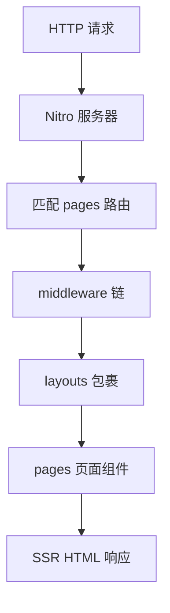

# Nuxt 3 目录与路由

Nuxt 3 靠约定式目录组织工程：`pages` 生成路由，`layouts` 套骨架，`middleware` 做守卫；`definePageMeta` 能写进高效 SSR 应用。

## Nuxt 3 项目骨架

```bash
npx nuxi@latest init my-nuxt-app
cd my-nuxt-app && pnpm install && pnpm dev
```

```
my-nuxt-app/
├── app.vue              # 根组件（可省略，有默认）
├── nuxt.config.ts       # 框架配置
├── pages/               # 文件系统路由
├── layouts/             # 布局
├── components/          # 自动导入组件
├── composables/         # 自动导入组合式函数
├── middleware/          # 路由中间件
├── plugins/             # 应用插件
├── server/              # Server Routes / API
├── public/              # 静态资源
└── assets/              # 需构建处理的资源
```



---

## pages 与文件系统路由

`pages/` 下每个 `.vue` 文件自动成为路由，无需手动 `createRouter`。

| 文件路径 | 路由 |
|----------|------|
| `pages/index.vue` | `/` |
| `pages/about.vue` | `/about` |
| `pages/users/index.vue` | `/users` |
| `pages/users/[id].vue` | `/users/:id` |
| `pages/[...slug].vue` | 捕获所有（放最后） |

```vue
<!-- pages/users/[id].vue -->
<script setup lang="ts">
const route = useRoute();
const userId = computed(() => route.params.id);
</script>

<template>
  <h1>用户 {{ userId }}</h1>
</template>
```

**动态路由命名**：`[id]` 必选参数；`[[slug]]` 可选；`[...slug]`  rest 参数。

---

## layouts 布局

布局包裹页面，通过 `definePageMeta` 指定。

```vue
<!-- layouts/default.vue -->
<template>
  <div class="layout">
    <AppHeader />
    <slot />
    <AppFooter />
  </div>
</template>
```

```vue
<!-- layouts/admin.vue -->
<template>
  <div class="admin-layout">
    <AdminSidebar />
    <main><slot /></main>
  </div>
</template>
```

```vue
<!-- pages/dashboard.vue -->
<script setup lang="ts">
definePageMeta({ layout: 'admin' });
</script>
```

| 场景 | 做法 |
|------|------|
| 默认布局 | 不设置或 `layout: 'default'` |
| 无布局 | `layout: false` |
| 动态切换 | `setPageLayout('admin')` |

---

## middleware 导航守卫

`middleware/` 下的文件可在路由进入前执行逻辑，分全局与命名中间件。

```ts
// middleware/auth.ts
export default defineNuxtRouteMiddleware((to, from) => {
  const user = useUser();
  if (!user.value && to.path !== '/login') {
    return navigateTo('/login');
  }
});
```

```vue
<!-- pages/profile.vue -->
<script setup lang="ts">
definePageMeta({ middleware: 'auth' });
// 或多个：middleware: ['auth', 'analytics']
</script>
```

| 类型 | 定义方式 |
|------|----------|
| 命名中间件 | `middleware/xxx.ts` + `definePageMeta` |
| 全局中间件 | `middleware/xxx.global.ts` |
| 内联 | `definePageMeta({ middleware: (to) => {...} })` |

与 Vue Router 的 `beforeEach` 类似，但可按文件拆分、支持 SSR 阶段执行。

---

## plugins 与 app 初始化

```ts
// plugins/api.client.ts — 后缀 .client 仅客户端执行
export default defineNuxtPlugin((nuxtApp) => {
  const api = $fetch.create({ baseURL: '/api' });
  return { provide: { api } };
});
```

| 后缀 | 执行环境 |
|------|----------|
| 无后缀 | 服务端 + 客户端 |
| `.client.ts` | 仅浏览器 |
| `.server.ts` | 仅 Nitro/SSR |

```vue
<script setup>
const { $api } = useNuxtApp();
</script>
```

---

## 自动导入约定

Nuxt 自动导入以下内容，无需手动 `import`：

| 目录/来源 | 示例 |
|-----------|------|
| `composables/` | `useCounter()` |
| `components/` | `<UserCard />` |
| `utils/` | `formatDate()` |
| Vue / Nuxt API | `ref`, `useRoute`, `useFetch` |

可在 `nuxt.config.ts` 关闭或扩展：

```ts
export default defineNuxtConfig({
  imports: { dirs: ['stores'] },
  components: [{ path: '~/components', pathPrefix: false }],
});
```

---

## app.vue 与 NuxtPage

默认 `app.vue` 使用 `<NuxtLayout>` + `<NuxtPage>` 渲染当前路由：

```vue
<!-- app.vue -->
<template>
  <NuxtLayout>
    <NuxtPage />
  </NuxtLayout>
</template>
```

自定义全局壳（如持久化侧边栏）可在此扩展，避免每个 layout 重复。

---

## 路由进阶

**嵌套路由**：`pages/parent.vue` + `pages/parent/child.vue`，父组件需 `<NuxtPage />`。

**路由元信息**：

```ts
definePageMeta({
  title: '仪表盘',
  requiresAuth: true,
  keepalive: true,
});
```

**编程式导航**：`navigateTo('/users')`、`useRouter().push()`。

---

## 与纯 Vue Router 项目对比

| 能力 | Vue Router 手写 | Nuxt 3 |
|------|-----------------|--------|
| 路由表 | 手动 `routes` 数组 | `pages/` 约定 |
| 代码分割 | 手动 `import()` | 默认按页分割 |
| 布局 | 组件嵌套或路由 meta | `layouts/` 一等公民 |
| SSR | 自建双入口 | 内置 |
| 类型 | 需配置 typed-router | 实验性 `typedPages` |

---

## nuxt.config 常用项

```ts
export default defineNuxtConfig({
  ssr: true,
  app: {
    head: { title: 'My App', meta: [{ name: 'description', content: '...' }] },
  },
  runtimeConfig: {
    apiSecret: '',
    public: { apiBase: '/api' },
  },
  routeRules: {
    '/admin/**': { ssr: false },
    '/blog/**': { prerender: true },
  },
});
```

---

## 小结

Nuxt 3 采用约定式目录：`pages/` 自动生成路由，`layouts/` 提供页面骨架，`middleware/` 实现导航守卫，`plugins/` 扩展应用实例，`composables/` 与 `components/` 自动导入。`definePageMeta` 可指定布局与中间件；插件后缀 `.client.ts` / `.server.ts` 控制执行环境。相比手写 Vue Router，Nuxt 默认按页 code splitting，布局与 SSR 为一等公民。`nuxt.config.ts` 中的 `routeRules` 可按路由混合 SSR、预渲染与 CSR，是部署策略的核心配置入口。
