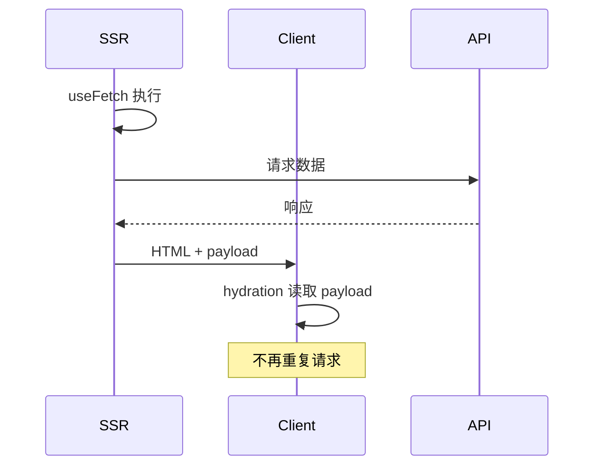

# useFetch 与 Server Routes

Nuxt SSR 数据层用 `useFetch` / `useAsyncData`，自动去重并避免双端重复请求；`server/` 目录当 BFF，`runtimeConfig` 管密钥。

## 为什么不用裸 axios？

在 SSR 中，若在 `setup` 里直接 `fetch`，服务端渲染一次、客户端 hydration 后再请求一次，造成 **瀑布重复** 与状态闪烁。



`useFetch` 将结果序列化进 HTML，客户端优先使用缓存 payload。

---

## useFetch 基础

```vue
<script setup lang="ts">
interface User {
  id: number;
  name: string;
}

const { data, pending, error, refresh } = await useFetch<User[]>('/api/users');
</script>

<template>
  <div v-if="pending">加载中…</div>
  <div v-else-if="error">{{ error.message }}</div>
  <ul v-else>
    <li v-for="u in data" :key="u.id">{{ u.name }}</li>
  </ul>
</template>
```

| 返回值 | 含义 |
|--------|------|
| `data` | 响应体（Ref） |
| `pending` | 是否请求中 |
| `error` | 错误对象 |
| `refresh` | 手动重新请求 |

**注意**：顶层 `await useFetch` 会阻塞路由渲染直到数据就绪（适合关键数据）；非关键数据可用 `lazy: true`。

---

## useFetch vs useAsyncData

| API | 场景 |
|-----|------|
| `useFetch(url)` | 直接请求 URL 的便捷封装 |
| `useAsyncData(key, fn)` | 任意异步逻辑（DB、多接口聚合） |

```ts
const { data: stats } = await useAsyncData('dashboard-stats', async () => {
  const [users, orders] = await Promise.all([
    $fetch('/api/users/count'),
    $fetch('/api/orders/count'),
  ]);
  return { users, orders };
});
```

`key` 用于跨组件去重与 payload 标识，应全局唯一。

---

## $fetch 与 ofetch

Nuxt 内置基于 [ofetch](https://github.com/unjs/ofetch) 的 `$fetch`：

```ts
// 任意 composable 或 server 中
const user = await $fetch('/api/users/1', {
  method: 'POST',
  body: { name: 'Alice' },
  headers: { Authorization: `Bearer ${token}` },
});
```

| 特性 | 说明 |
|------|------|
| 自动 JSON 解析 | `Content-Type: application/json` |
| 错误抛出 | 非 2xx 抛 `FetchError` |
| 拦截 | `onRequest` / `onResponse` 钩子（插件中配置） |

---

## Server Routes（BFF）

`server/api/` 与 `server/routes/` 下的文件自动映射为 Nitro API。

```ts
// server/api/users/[id].get.ts
export default defineEventHandler(async (event) => {
  const id = getRouterParam(event, 'id');
  const user = await db.user.findUnique({ where: { id: Number(id) } });
  if (!user) throw createError({ statusCode: 404, statusMessage: 'Not Found' });
  return user;
});
```

| 文件命名 | HTTP 方法 |
|----------|-----------|
| `users.get.ts` | GET `/api/users` |
| `users.post.ts` | POST `/api/users` |
| `users/[id].delete.ts` | DELETE `/api/users/:id` |

```ts
// server/routes/healthz.ts → GET /healthz（无 /api 前缀）
export default defineEventHandler(() => ({ ok: true }));
```

---

## 运行时配置与密钥

```ts
// nuxt.config.ts
export default defineNuxtConfig({
  runtimeConfig: {
    dbUrl: process.env.DATABASE_URL, // 仅服务端
    public: { apiBase: '/api' },
  },
});
```

```ts
// server/api/secret.get.ts
export default defineEventHandler(() => {
  const config = useRuntimeConfig();
  // config.dbUrl 可访问；客户端拿不到
  return { hasDb: !!config.dbUrl };
});
```

**切勿**把密钥放在 `public` 下。

---

## Cookie 与鉴权

```ts
// server/api/session.get.ts
export default defineEventHandler((event) => {
  const token = getCookie(event, 'auth-token');
  if (!token) throw createError({ statusCode: 401 });
  return verifyToken(token);
});
```

客户端 `useFetch` 默认同源携带 cookie；跨域需配置 `credentials` 与 CORS。

```ts
await useFetch('/api/me', { credentials: 'include' });
```

---

## 错误处理与类型

```vue
<script setup lang="ts">
const { data, error } = await useFetch('/api/users', {
  onResponseError({ response }) {
    console.error(response.status, response._data);
  },
});
</script>
```

Server Route 中用 `createError` 返回标准 HTTP 错误，客户端 `error.value` 可读取 `statusCode`。

---

## 与 Pinia / vue-query 协作

| 方案 | 适用 |
|------|------|
| `useFetch` | 页面级首屏数据、SEO 相关 |
| Pinia action | 用户操作后的突变、全局会话 |
| @tanstack/vue-query | 复杂缓存、乐观更新、无限滚动 |

避免同一数据在 `useFetch` 与 store 中重复维护；常以 `useFetch` 注水初始值，后续 mutation 走 Pinia。

---

## 常见坑

| 现象 | 原因 | 处理 |
|------|------|------|
| 客户端重复请求 | 未用 `useFetch`/`useAsyncData` | 改用 Nuxt 数据 API |
| hydration 后数据变空 | key 不一致 | 固定 `key` 字符串 |
| 401 无限循环 | middleware 与 fetch 互踢 | 排除 `/login` 路径 |
| 环境变量 undefined | 未在 build 时注入 | 使用 `runtimeConfig` |

---

## 小结

Nuxt 数据层核心在 `useFetch` 与 `useAsyncData`：SSR 阶段请求一次，结果序列化进 HTML payload，客户端 hydration 时复用，避免瀑布重复请求。`server/api/` 目录可建轻量 BFF，隐藏 API 密钥与聚合接口；密钥放在 `runtimeConfig` 私有字段，切勿写入 `public`。首屏 SEO 相关数据用 `useFetch`，用户交互后的突变可走 Pinia 或 vue-query，避免同一数据双处维护。常见坑包括未用 Nuxt 数据 API 导致客户端重复请求、key 不一致致 hydration 后数据变空、middleware 与 fetch 互踢造成 401 循环。
