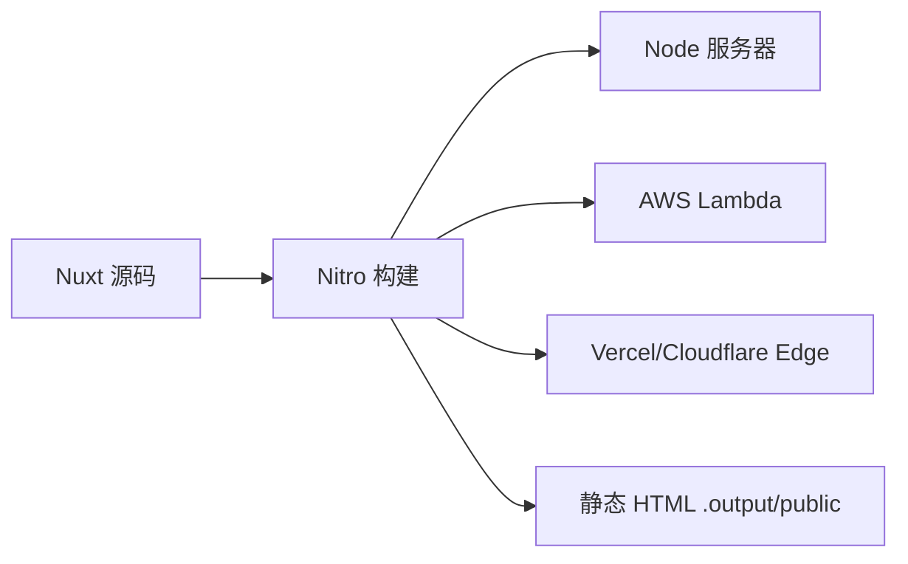
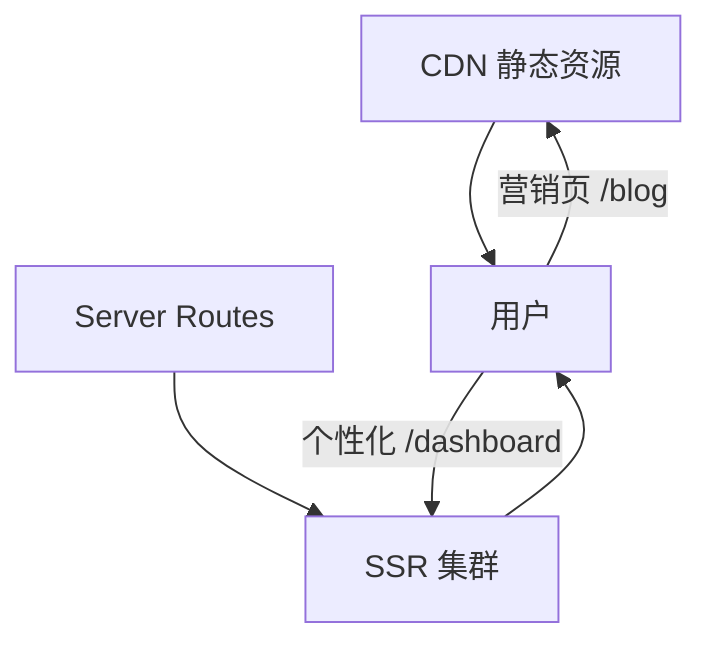

# 预渲染与部署

Nuxt 3 的 Nitro 把 SSR、SSG、API 打成 `.output` 产物；`routeRules` 可按路由混用渲染模式。部署前分清 `build` 和 `generate`，用 `preview` 验 hydration。

## Nitro 是什么？

Nitro 是 Nuxt 3 的服务引擎，将 `server/`、`pages` SSR 与中间件编译为可在 Node、Serverless、Edge 运行的产物。



| 命令 | 产物 | 用途 |
|------|------|------|
| `nuxt build` | `.output/` 含 server + public | SSR / hybrid |
| `nuxt generate` | 预渲染 HTML 到 public | 纯静态或混合 |
| `nuxt preview` | 本地预览生产构建 | 上线前验证 |

---

## 渲染模式配置

```ts
// nuxt.config.ts
export default defineNuxtConfig({
  ssr: true, // false 则退化为 SPA
  routeRules: {
  '/': { prerender: true },
    '/blog/**': { prerender: true },
    '/admin/**': { ssr: false }, // 客户端渲染
    '/api/**': { cors: true },
    '/old-page': { redirect: '/new-page' },
  },
});
```

| routeRule | 效果 |
|-----------|------|
| `prerender: true` | 构建时生成静态 HTML |
| `ssr: false` | 该路由仅 CSR |
| `swr: 60` | 缓存 60 秒后后台再验证 |
| `isr: 3600` | 增量静态再生（平台相关） |

---

## nuxt generate 工作流

```bash
pnpm nuxt generate
# 扫描可预渲染路由（crawlLinks 或 nitro.prerender.routes）
# 输出到 .output/public/
```

动态路由需显式声明：

```ts
export default defineNuxtConfig({
  nitro: {
    prerender: {
      routes: ['/users/1', '/users/2'],
      crawlLinks: true,
    },
  },
});
```

或通过 `server` 钩子 `prerender:routes` 从 CMS 拉取全量 slug 列表。

---

## 部署目标对照

| 平台 | 方式 | 说明 |
|------|------|------|
| Node VPS | `node .output/server/index.mjs` | 需 PM2 / Docker |
| Vercel | 零配置 Git 集成 | Serverless + Edge |
| Netlify | `@netlify/nuxt` 或 preset | 支持 ISR |
| Cloudflare Pages | `nitro.preset: 'cloudflare-pages'` | 全球边缘 |
| 静态 CDN | `generate` 后上传 `public/` | 无 Server Routes |

```ts
// nuxt.config.ts — 指定 preset
export default defineNuxtConfig({
  nitro: { preset: 'node-server' },
});
```

---

## 环境变量

| 类型 | 配置位置 | 客户端可见 |
|------|----------|------------|
| 构建时 | `.env` + `NUXT_*` | 仅 `NUXT_PUBLIC_*` |
| 运行时 | 托管平台环境变量 | 通过 `runtimeConfig` 映射 |

```bash
# .env
NUXT_PUBLIC_API_BASE=https://api.example.com
DATABASE_URL=postgresql://...
```

```ts
runtimeConfig: {
  dbUrl: '', // 由 NUXT_DB_URL 或环境覆盖
  public: { apiBase: '' },
},
```

生产环境在 CI/CD 或平台控制台注入，**不要**把 `.env` 提交仓库。

---

## Docker 部署示例

```dockerfile
FROM node:20-alpine AS builder
WORKDIR /app
COPY package.json pnpm-lock.yaml ./
RUN corepack enable && pnpm install --frozen-lockfile
COPY . .
RUN pnpm nuxt build

FROM node:20-alpine
WORKDIR /app
COPY --from=builder /app/.output ./.output
ENV HOST=0.0.0.0 PORT=3000
EXPOSE 3000
CMD ["node", ".output/server/index.mjs"]
```

配合反向代理（Nginx/Caddy）处理 HTTPS 与 gzip。

---

## 混合部署策略



- 公开内容：`prerender` + CDN，成本最低
- 登录后区域：`ssr: false` 或 CSR 子应用
- API：`server/api` 与主站同域，减少 CORS

---

## 构建优化

```ts
export default defineNuxtConfig({
  experimental: { payloadExtraction: true },
  vite: {
    build: { rollupOptions: { output: { manualChunks: { vendor: ['vue'] } } } },
  },
});
```

| 手段 | 作用 |
|------|------|
| 路由级 code splitting | Nuxt 默认按页 |
| 组件懒加载 | `Lazy` 前缀或 `defineAsyncComponent` |
| 图片 | `@nuxt/image` 自动优化 |
| 分析包体 | `nuxt build ，analyze` |

---

## 上线前验证要点

发布前应在本地执行 `nuxt preview`，确认无 hydration 警告；核对生产环境 `runtimeConfig` 注入是否正确；检查 `routeRules` 中静态/动态路由是否符合预期；Server Routes 需验证鉴权与 rate limit；robots 与 sitemap 可通过 `@nuxtjs/sitemap` 或手写配置；监控平台需上传 Sentry source map。

---

## 回滚与灰度

- 容器化：保留上一版镜像 tag，一键回滚
- Serverless：平台版本历史回退
- 静态站：CDN 指向上一构建产物目录
- 功能开关：用 `runtimeConfig` 或远程配置，避免紧急发版

---

## 小结

Nitro 将 SSR、预渲染与 Serverless API 统一编译为 `.output` 产物，支持 Node、Lambda 与 Edge 部署。`routeRules` 可按路由混合 `ssr`、`prerender`、`swr` 等策略；`nuxt build` 用于 SSR，`nuxt generate` 用于纯静态。环境变量通过 `runtimeConfig` 注入，`.env` 不应提交仓库。混合部署时公开内容走 CDN 预渲染，登录后区域可设 `ssr: false`，API 与主站同域减少 CORS。发布前用 `nuxt preview` 验证 hydration，容器化部署保留上一版镜像 tag 以便回滚。
