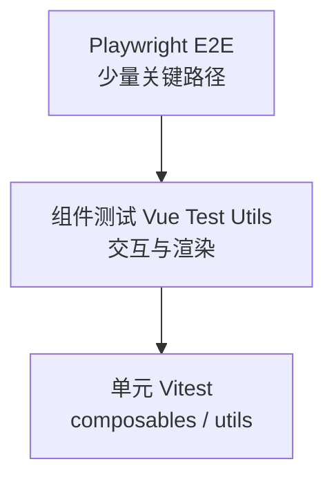

# Vitest 与测试分层

Vue 3 + Vite 项目默认用 Vitest 做单元和组件测试。常见分层：底层 composables/utils，中层 Vue Test Utils，上层 Playwright 守关键路径。

## 测试金字塔在 Vue 中的映射



| 层级 | 工具 | 速度 | 覆盖范围 |
|------|------|------|----------|
| 单元 | Vitest | 毫秒级 | 纯逻辑、工具函数 |
| 组件 | Vitest + @vue/test-utils | 较快 | 单组件 DOM/事件 |
| E2E | Playwright | 慢 | 真实浏览器全流程 |

**原则**：底层多写、顶层精写；避免用 E2E 覆盖每个边界条件。

---

## Vitest 快速接入

```bash
pnpm add -D vitest @vue/test-utils happy-dom @vitest/coverage-v8
```

```ts
// vitest.config.ts
import { defineConfig, mergeConfig } from 'vitest/config';
import viteConfig from './vite.config';

export default mergeConfig(viteConfig, defineConfig({
  test: {
    environment: 'happy-dom',
    globals: true,
    include: ['src/**/*.{test,spec}.{ts,tsx}'],
    coverage: { provider: 'v8', reporter: ['text', 'html'] },
  },
}));
```

```json
// package.json
{
  "scripts": {
    "test": "vitest",
    "test:run": "vitest run",
    "test:coverage": "vitest run --coverage"
  }
}
```

---

## 第一个单元测试

```ts
// src/utils/formatPrice.ts
export function formatPrice(cents: number, locale = 'zh-CN') {
  return new Intl.NumberFormat(locale, { style: 'currency', currency: 'CNY' })
    .format(cents / 100);
}
```

```ts
// src/utils/formatPrice.test.ts
import { describe, it, expect } from 'vitest';
import { formatPrice } from './formatPrice';

describe('formatPrice', () => {
  it('formats cents to CNY', () => {
    expect(formatPrice(1999)).toContain('19.99');
  });

  it('handles zero', () => {
    expect(formatPrice(0)).toMatch(/0/);
  });
});
```

---

## Vitest 与 Jest 差异

| 能力 | Jest | Vitest |
|------|------|--------|
| 配置 | 独立 | 复用 `vite.config` |
| ESM | 需额外配置 | 原生支持 |
| 监听模式 | `jest ，watch` | 内置 HMR 级反馈 |
| Mock | `jest.fn` | `vi.fn` |
| 快照 | `toMatchSnapshot` | 相同 API |

迁移时全局替换 `jest` → `vi`，多数 API 兼容。

---

## 测试文件组织

```
src/
├── components/
│   └── UserCard.vue
│   └── UserCard.spec.ts      # 同目录 colocate
├── composables/
│   └── useCounter.ts
│   └── useCounter.test.ts
└── utils/
    └── validate.ts
    └── validate.test.ts
```

| 约定 | 说明 |
|------|------|
| `*.test.ts` / `*.spec.ts` | 均被 Vitest 识别 |
| 与源文件同目录 | 便于重构时一起移动 |
| `__tests__/` | 可选集中目录 |

---

## 常用断言与异步

```ts
import { describe, it, expect, vi, beforeEach } from 'vitest';

describe('async fetch', () => {
  beforeEach(() => vi.restoreAllMocks());

  it('resolves data', async () => {
    const data = await Promise.resolve({ ok: true });
    expect(data).toEqual({ ok: true });
  });

  it('mocks module', async () => {
    vi.mock('./api', () => ({ fetchUser: vi.fn(() => ({ id: 1 })) }));
    const { fetchUser } = await import('./api');
    expect(fetchUser()).toEqual({ id: 1 });
  });
});
```

---

## 什么该测、什么不该测

| 建议测 | 不建议测 |
|--------|----------|
| 业务规则、边界条件 | 第三方库内部实现 |
| Composables 状态变迁 | Vue 框架自身行为 |
| 组件对外契约（props/emit） | 每个 CSS 像素 |
| 回归 bug 的复现用例 | 过度 mock 导致假绿 |

---

## CI 集成

```yaml
# .github/workflows/test.yml
jobs:
  test:
    runs-on: ubuntu-latest
    steps:
      - uses: actions/checkout@v4
      - uses: pnpm/action-setup@v4
      - run: pnpm install --frozen-lockfile
      - run: pnpm test:run
      - run: pnpm test:coverage
```

失败即阻断合并；覆盖率设阈值但勿为数字而测。

---

## 与 Vue 官方推荐栈

| 场景 | 推荐 |
|------|------|
| 单元 + 组件 | Vitest + @vue/test-utils |
| E2E | Playwright（或 Cypress） |
| 视觉回归 | Playwright screenshot / Chromatic |

Nuxt 项目可用 `@nuxt/test-utils` 测 SSR 与 Server Routes。

---

## 调试技巧

```bash
pnpm vitest --ui          # 可视化界面
pnpm vitest UserCard      # 过滤文件名
pnpm vitest -t "formats"  # 过滤用例名
```

VS Code 安装 Vitest 扩展可在编辑器内断点调试。

---

## 小结

Vue 3 + Vite 项目默认用 Vitest 做单元与组件测试，与 Vite 共享配置，ESM 和 HMR 式反馈体验好。测试金字塔底层是 composables 与 utils 单测，中层是 Vue Test Utils 组件测试，顶层是 Playwright E2E 守护关键路径，底层多写、顶层精写，避免用 E2E 覆盖每个边界条件。测行为不测实现；composables 单测性价比最高。CI 合并前应跑 `vitest run ，coverage`，Nuxt 项目可用 `@nuxt/test-utils` 测 SSR 与 Server Routes。
