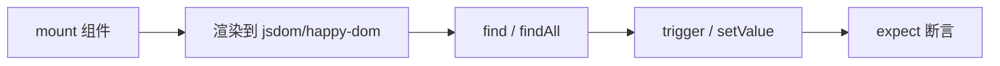

# Vue Test Utils

组件单测常用 @vue/test-utils：mount 挂载、find 找节点、trigger 模拟交互、emitted 查事件。trigger 后要 await 等 DOM 更新，选择器优先写 data-testid。

## 安装与基本挂载

```bash
pnpm add -D @vue/test-utils
```

```ts
import { mount } from '@vue/test-utils';
import Counter from './Counter.vue';

describe('Counter', () => {
  it('increments on click', async () => {
    const wrapper = mount(Counter);
    await wrapper.find('button').trigger('click');
    expect(wrapper.text()).toContain('1');
  });
});
```



---

## mount vs shallowMount

| API | 行为 | 适用 |
|-----|------|------|
| `mount` | 渲染子组件完整树 | 集成行为、插槽 |
| `shallowMount` | 子组件 stub 为占位 | 隔离被测组件 |

```ts
import { shallowMount } from '@vue/test-utils';

shallowMount(Parent, {
  global: { stubs: { ChildList: true } },
});
```

Vue 3 中 `shallowMount` 仍可用，但更多团队用 `mount` + 定向 `stubs`。

---

## 查找元素

```ts
// CSS 选择器
wrapper.find('button.submit');
wrapper.findAll('li');

// data-testid（推荐）
wrapper.find('[data-testid="submit-btn"]');

// 组件引用
import Child from './Child.vue';
wrapper.findComponent(Child);
wrapper.findComponent({ name: 'Child' });
```

| 方法 | 找不到时 |
|------|----------|
| `find` | 返回空 `DOMWrapper`（`exists()` false） |
| `get` | 抛错（更利于必存在元素） |

```vue
<!-- 被测组件 -->
<button data-testid="increment">+</button>
```

---

## 触发交互

```ts
// 点击
await wrapper.find('button').trigger('click');

// 输入
await wrapper.find('input').setValue('hello');

// 表单提交
await wrapper.find('form').trigger('submit.prevent');

// 键盘
await wrapper.find('input').trigger('keydown', { key: 'Enter' });
```

**必须 `await`**：`trigger` / `setValue` 后 Vue 的 DOM 更新是异步的。

---

## 断言文本与可见性

```ts
expect(wrapper.text()).toContain('提交成功');
expect(wrapper.find('.error').isVisible()).toBe(true);
expect(wrapper.find('input').element.value).toBe('alice');
```

`text()` 聚合子节点文本；需要 HTML 用 `html()`。

---

## Props 与 Emits

```ts
import { mount } from '@vue/test-utils';
import EmitButton from './EmitButton.vue';

it('emits submit with payload', async () => {
  const wrapper = mount(EmitButton, { props: { label: 'OK' } });
  await wrapper.find('button').trigger('click');
  expect(wrapper.emitted('submit')).toHaveLength(1);
  expect(wrapper.emitted('submit')![0]).toEqual([{ ok: true }]);
});
```

| API | 作用 |
|-----|------|
| `props` | 传入初始 props |
| `emitted()` | 获取 emit 记录 |
| `setProps` | 运行时更新 props |

---

## 全局配置与插件

```ts
const wrapper = mount(App, {
  global: {
    plugins: [pinia, router],
    stubs: { RouterLink: true, Teleport: true },
    mocks: { $t: (key: string) => key },
    provide: { theme: 'dark' },
  },
});
```

测试 Pinia/Router 时通过 `global.plugins` 注入；i18n 可 `createI18n` 后 `plugins: [i18n]`。

---

## 异步组件与 Suspense

```ts
import { flushPromises } from '@vue/test-utils';

it('loads async child', async () => {
  const wrapper = mount(AsyncParent);
  await flushPromises(); // 等待所有 pending Promise
  expect(wrapper.find('.loaded').exists()).toBe(true);
});
```

`defineAsyncComponent` 或 `await` 在 setup 中的组件需 `flushPromises`。

---

## 测试 script setup 组件

```vue
<!-- UserGreeting.vue -->
<script setup lang="ts">
defineProps<{ name: string }>();
</script>
<template><p>Hello, {{ name }}</p></template>
```

```ts
mount(UserGreeting, { props: { name: 'Vue' } });
```

`defineExpose` 暴露的方法：

```ts
const vm = wrapper.vm as { reset: () => void };
vm.reset();
```

---

## 常见坑

| 现象 | 原因 | 处理 |
|------|------|------|
| 断言时 DOM 未更新 | 未 await | `await trigger` / `nextTick` |
| RouterLink 报错 | 未安装 router | stub 或 `createRouter` |
| Teleport 内容找不到 | 挂到 body 外 | `attachTo: document.body` 或 stub |
| 样式类不存在 | happy-dom 不解析 scoped | 断言 data-testid |

```ts
mount(Modal, { attachTo: document.body });
```

---

## 与 Testing Library 理念

可选 `@testing-library/vue`：更贴近用户查询（`getByRole`），减少实现细节耦合。团队可二选一或混用，VTU 更贴近 Vue API。

---

## 小结

Vue Test Utils 通过 `mount` 在内存 DOM 中渲染组件，用 `find` 定位元素、`trigger` 模拟交互、`emitted()` 断言 emit。`trigger` 和 `setValue` 后必须 `await`，否则 DOM 可能尚未更新。依赖 Router、Pinia 等全局插件时通过 `global.plugins` 注入；Teleport 内容可 `attachTo: document.body` 或 stub。可选 `@testing-library/vue` 以更贴近用户视角查询，VTU 则更贴近 Vue API，团队可二选一或混用。
