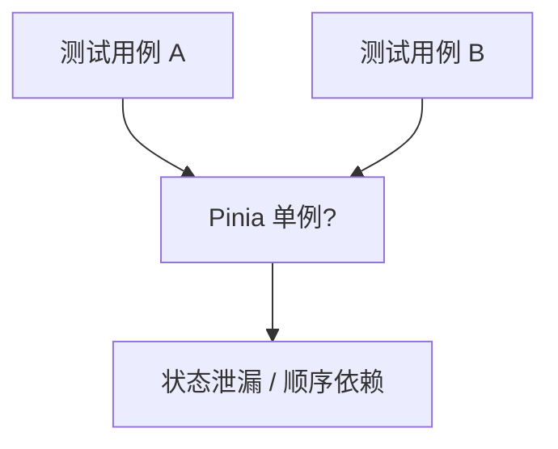

# Router 与 Pinia mock

组件测试要隔离全局依赖：每个用例新建 Pinia；Router 用 Memory History 或 stub；Store 逻辑优先单测 action。

## 为什么要 mock？



| 风险 | 后果 |
|------|------|
| 共用生产 router | 跳转影响其他用例 |
| Pinia 未重置 | state 残留 |
| 真实 HTTP | 慢且不稳定 |

---

## 测试用 Router 工厂

```ts
// tests/router.ts
import { createRouter, createMemoryHistory, RouteRecordRaw } from 'vue-router';

export function createTestRouter(routes: RouteRecordRaw[] = []) {
  return createRouter({
    history: createMemoryHistory(),
    routes: [
      { path: '/', component: { template: '<div>home</div>' } },
      { path: '/login', component: { template: '<div>login</div>' } },
      ...routes,
    ],
  });
}
```

```ts
import { mount } from '@vue/test-utils';
import { createTestRouter } from '@/tests/router';
import Profile from './Profile.vue';

it('redirects when not authed', async () => {
  const router = createTestRouter();
  const pushSpy = vi.spyOn(router, 'push');

  mount(Profile, {
    global: { plugins: [router] },
  });

  await router.isReady();
  // 根据组件内守卫断言
  expect(pushSpy).toHaveBeenCalledWith('/login');
});
```

**Memory History** 不操作真实地址栏，适合 Node 环境。

---

## stub RouterLink / RouterView

简单组件只需占位，无需完整路由表：

```ts
mount(NavBar, {
  global: {
    stubs: {
      RouterLink: {
        template: '<a><slot /></a>',
        props: ['to'],
      },
      RouterView: true,
    },
  },
});
```

---

## 测试 useRoute / useRouter

被测组件使用组合式 API 时，必须 `plugins: [router]` 且在挂载前 `router.push`：

```ts
const router = createTestRouter();
await router.push('/users/42');
await router.isReady();

const wrapper = mount(UserDetail, {
  global: { plugins: [router] },
});

expect(wrapper.text()).toContain('42');
```

---

## Pinia 测试 setup

```ts
// tests/pinia.ts
import { setActivePinia, createPinia } from 'pinia';
import { beforeEach } from 'vitest';

beforeEach(() => {
  setActivePinia(createPinia());
});
```

每个用例前新建 Pinia，防止 state 泄漏。

---

## 测试 Store

```ts
// stores/counter.ts
import { defineStore } from 'pinia';

export const useCounterStore = defineStore('counter', {
  state: () => ({ count: 0 }),
  actions: {
    increment() { this.count++; },
  },
});
```

```ts
import { setActivePinia, createPinia } from 'pinia';
import { useCounterStore } from '@/stores/counter';

beforeEach(() => setActivePinia(createPinia()));

it('increments', () => {
  const store = useCounterStore();
  store.increment();
  expect(store.count).toBe(1);
});
```

Store 可单独测，无需 mount 组件。

---

## 组件 + Pinia 集成

```ts
import { createPinia } from 'pinia';

mount(CartButton, {
  global: { plugins: [createPinia()] },
});
```

若组件依赖已填充的 store：

```ts
const pinia = createPinia();
setActivePinia(pinia);
const cart = useCartStore();
cart.items = [{ id: 1, qty: 2 }];

mount(CartSummary, { global: { plugins: [pinia] } });
```

---

## Mock action 中的 API

```ts
import { vi } from 'vitest';
import * as api from '@/api/user';

vi.spyOn(api, 'fetchUser').mockResolvedValue({ id: 1, name: 'Test' });

const store = useUserStore();
await store.load();
expect(store.user?.name).toBe('Test');
```

`vi.mock('@/api/user')` 在模块顶层 hoist，适合整模块替换。

---

## Router + Pinia 联合

```ts
function mountWithPlugins(component: Component) {
  const pinia = createPinia();
  const router = createTestRouter();
  return {
    wrapper: mount(component, { global: { plugins: [pinia, router] } }),
    router,
    pinia,
  };
}
```

导航守卫里读 Pinia 时，两者须在同一 app 上下文。

---

## @pinia/testing

```bash
pnpm add -D @pinia/testing
```

```ts
import { createTestingPinia } from '@pinia/testing';

mount(MyComponent, {
  global: {
    plugins: [
      createTestingPinia({
        createSpy: vi.fn,
        initialState: { user: { name: 'Alice' } },
      }),
    ],
  },
});
```

自动 stub 所有 action 为 spy，便于断言 `store.save` 被调用。

---

## 常见坑

| 现象 | 处理 |
|------|------|
| `inject() can only be used inside setup` | 未通过 `plugins` 安装 |
| 路由守卫不执行 | 需 `await router.isReady()` |
| `useRoute` 无 params | 先 `router.push` 带参路径 |
| persistedstate 插件干扰 | 测试环境禁用持久化插件 |

---

## 小结

组件测试需隔离 Router 与 Pinia：每用例前 `setActivePinia(createPinia())` 防止 state 泄漏；Router 用 Memory History 工厂或 stub `RouterLink`/`RouterView`。Store action 可单独单测，组件集成时通过 `global.plugins` 注入。API 调用用 `vi.spyOn` 或 `vi.mock` 替换；`@pinia/testing` 可快速 stub 所有 action 为 spy。导航守卫测试需 `await router.isReady()`，并在挂载前 `router.push` 带参路径。
