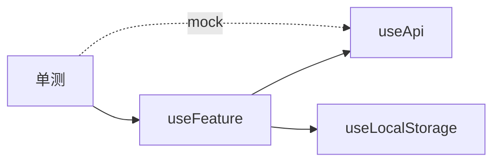

# Composables 单测

无生命周期的 composable 可直接在 Vitest 里调用；含 `onMounted` 的要包进 setup。异步用 `flushPromises`，定时器用 `vi.useFakeTimers`。

## Composables 为何适合单测？

| 特点 | 测试优势 |
|------|----------|
| 纯逻辑聚合 | 无 DOM 依赖时可极速运行 |
| 输入输出清晰 | props 式参数 + 返回 refs |
| 可组合 | 分层 mock 依赖 composable |



---

## 基础模式：@vue/test-utils 的 composable 挂载

无 DOM 的 composable 可用轻量包装组件：

```ts
// composables/useCounter.ts
import { ref } from 'vue';

export function useCounter(initial = 0) {
  const count = ref(initial);
  const inc = () => count.value++;
  const dec = () => count.value--;
  return { count, inc, dec };
}
```

```ts
// composables/useCounter.test.ts
import { ref } from 'vue';
import { useCounter } from './useCounter';

describe('useCounter', () => {
  it('increments', () => {
    const { count, inc } = useCounter(0);
    inc();
    expect(count.value).toBe(1);
  });
});
```

**无需 mount**：只要不调用 `onMounted` 等需组件实例的钩子。

---

## 带生命周期的 composable

```ts
import { onMounted, onUnmounted, ref } from 'vue';

export function useWindowWidth() {
  const width = ref(window.innerWidth);
  const onResize = () => { width.value = window.innerWidth; };

  onMounted(() => window.addEventListener('resize', onResize));
  onUnmounted(() => window.removeEventListener('resize', onResize));

  return { width };
}
```

需放在 `setup` 或 `mount` 中执行：

```ts
import { mount } from '@vue/test-utils';
import { defineComponent } from 'vue';
import { useWindowWidth } from './useWindowWidth';

function withComposable<T>(composable: () => T) {
  let result!: T;
  mount(defineComponent({
    setup() { result = composable(); return () => null; },
  }));
  return result;
}

it('reads width', () => {
  const { width } = withComposable(() => useWindowWidth());
  expect(width.value).toBe(window.innerWidth);
});
```

或使用社区库 `@vue/test-utils` 的 `withSetup` 模式 / `@testing-library/vue` 的 `renderComposable`（若引入）。

---

## 测试异步 composable

```ts
export function useUser(id: Ref<number>) {
  const user = ref<User | null>(null);
  const loading = ref(false);

  watch(id, async (newId) => {
    loading.value = true;
    user.value = await fetchUser(newId);
    loading.value = false;
  }, { immediate: true });

  return { user, loading };
}
```

```ts
vi.mock('@/api', () => ({ fetchUser: vi.fn() }));

it('loads user', async () => {
  vi.mocked(fetchUser).mockResolvedValue({ id: 1, name: 'A' });
  const id = ref(1);
  const { user, loading } = useUser(id);
  await flushPromises();
  expect(loading.value).toBe(false);
  expect(user.value?.name).toBe('A');
});
```

---

## 定时器与 debounce

```ts
import { vi, beforeEach, afterEach } from 'vitest';

beforeEach(() => vi.useFakeTimers());
afterEach(() => vi.useRealTimers());

it('debounces search', async () => {
  const { query, results } = useSearch();
  query.value = 'vue';
  vi.advanceTimersByTime(300);
  await flushPromises();
  expect(results.value).toHaveLength(3);
});
```

---

## provide / inject 测试

```ts
// 父组件提供
mount(defineComponent({
  setup() {
    provide('theme', ref('dark'));
    return () => h(Child);
  },
}));

// 或直接 mock inject
vi.mock('vue', async () => {
  const actual = await vi.importActual<typeof import('vue')>('vue');
  return { ...actual, inject: vi.fn(() => ref('dark')) };
});
```

优先通过真实 `provide` 测集成，仅隔离外部时用 `vi.mock`。

---

## 依赖其他 composable

```ts
// useCartTotal.ts
export function useCartTotal() {
  const cart = useCartStore();
  const total = computed(() =>
    cart.items.reduce((s, i) => s + i.price * i.qty, 0)
  );
  return { total };
}
```

```ts
import { setActivePinia, createPinia } from 'pinia';

beforeEach(() => setActivePinia(createPinia()));

it('sums cart', () => {
  const store = useCartStore();
  store.items = [{ price: 10, qty: 2 }];
  const { total } = useCartTotal();
  expect(total.value).toBe(20);
});
```

---

## 错误与边界

```ts
it('throws on invalid id', async () => {
  vi.mocked(fetchUser).mockRejectedValue(new Error('404'));
  const id = ref(-1);
  const { error } = useUser(id);
  await flushPromises();
  expect(error.value?.message).toBe('404');
});
```

覆盖：空数据、取消请求（`onUnmounted` + `AbortController`）、竞态（后返回覆盖先返回）。

---

## 文件命名与导出

| 实践 | 说明 |
|------|------|
| `useXxx.ts` + `useXxx.test.ts` | 同目录 |
| 导出纯函数辅助 | 与 composable 分开测 |
| 避免默认导出 | 利于 tree-shaking 与 mock |

---

## 与组件测试的分工

| Composables 单测 | 组件测试 |
|------------------|----------|
| 状态机、算法、API 编排 | 模板绑定、事件、插槽 |
| 快、稳 | 较慢 |

组件测应假设 composable 已测过，只验证「是否正确调用与展示」。

---

## 小结

无生命周期的 composable 可直接在 Vitest 中调用测试；含 `onMounted` 等钩子的需包装进 `setup()` 或 `withSetup` 辅助函数。异步逻辑用 `flushPromises` 等待，定时器与 debounce 用 `vi.useFakeTimers`。provide/inject 优先通过真实 provide 测集成，隔离外部依赖时用 `vi.mock`。composable 负责状态机与 API 编排，组件测试只验证是否正确调用与展示，职责单一、单测性价比最高。
