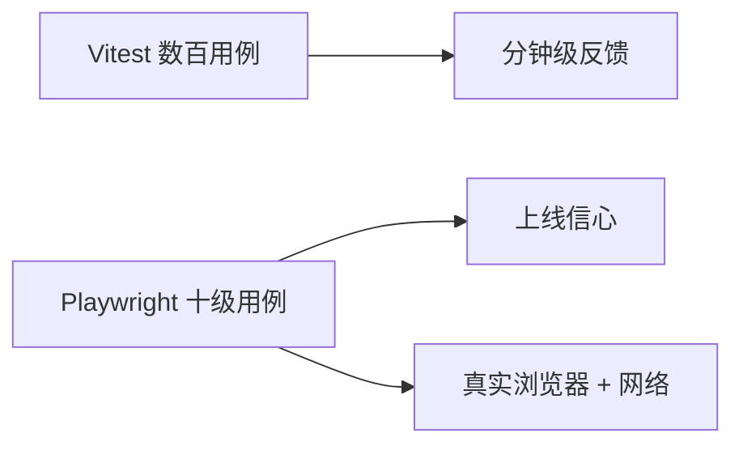

# Playwright E2E

Playwright 适合守少量高价值用户路径：用 `getByRole` 定位，`storageState` 复用登录，CI 开 trace 和重试。

## E2E 在 Vue 项目中的定位



| 适合 E2E | 不适合 E2E |
|----------|------------|
| 登录 → 核心业务流程 | 每个表单校验规则 |
| 支付/权限关键路径 | 纯 utils 计算 |
| 跨页面状态保持 | 已用单元测试覆盖的逻辑 |

---

## 安装与初始化

```bash
pnpm create playwright
# 或
pnpm add -D @playwright/test
pnpm exec playwright install
```

```ts
// playwright.config.ts
import { defineConfig, devices } from '@playwright/test';

export default defineConfig({
  testDir: './e2e',
  fullyParallel: true,
  forbidOnly: !!process.env.CI,
  retries: process.env.CI ? 2 : 0,
  use: {
    baseURL: 'http://localhost:5173',
    trace: 'on-first-retry',
    screenshot: 'only-on-failure',
  },
  webServer: {
    command: 'pnpm dev',
    url: 'http://localhost:5173',
    reuseExistingServer: !process.env.CI,
  },
  projects: [{ name: 'chromium', use: { ...devices['Desktop Chrome'] } }],
});
```

`webServer` 自动启动 Vite dev；生产测可改为 `pnpm preview`。

---

## 第一个 E2E 用例

```ts
// e2e/home.spec.ts
import { test, expect } from '@playwright/test';

test('homepage has title', async ({ page }) => {
  await page.goto('/');
  await expect(page).toHaveTitle(/Vue App/);
  await expect(page.getByRole('heading', { name: '欢迎' })).toBeVisible();
});

test('navigates to about', async ({ page }) => {
  await page.goto('/');
  await page.getByRole('link', { name: '关于' }).click();
  await expect(page).toHaveURL(/\/about/);
});
```

---

## 推荐定位策略

优先级（Playwright 官方）：

| 优先级 | 定位器 | 示例 |
|--------|--------|------|
| 1 | `getByRole` | `getByRole('button', { name: '提交' })` |
| 2 | `getByLabel` | `getByLabel('邮箱')` |
| 3 | `getByText` | `getByText('加载失败')` |
| 4 | `getByTestId` | `getByTestId('checkout')` |
| 5 | CSS/XPath | 最后手段 |

与 Vue 组件配合：为关键交互加 `data-testid`，但不要替代语义化 role。

---

## 表单与断言

```ts
test('submits login form', async ({ page }) => {
  await page.goto('/login');
  await page.getByLabel('用户名').fill('admin');
  await page.getByLabel('密码').fill('secret');
  await page.getByRole('button', { name: '登录' }).click();

  await expect(page).toHaveURL('/dashboard');
  await expect(page.getByText('欢迎回来')).toBeVisible();
});
```

```ts
// 软断言收集多个失败
await expect.soft(page.getByText('A')).toBeVisible();
await expect.soft(page.getByText('B')).toBeVisible();
```

---

## 鉴权状态复用

避免每个用例都走登录 UI：

```ts
// e2e/auth.setup.ts
import { test as setup } from '@playwright/test';

setup('authenticate', async ({ page }) => {
  await page.goto('/login');
  await page.getByLabel('用户名').fill(process.env.E2E_USER!);
  await page.getByLabel('密码').fill(process.env.E2E_PASS!);
  await page.getByRole('button', { name: '登录' }).click();
  await page.context().storageState({ path: 'e2e/.auth/user.json' });
});
```

```ts
// playwright.config.ts
projects: [
  { name: 'setup', testMatch: /auth\.setup\.ts/ },
  {
    name: 'chromium',
    dependencies: ['setup'],
    use: { storageState: 'e2e/.auth/user.json' },
  },
],
```

---

## 网络 mock 与 API

```ts
test('shows error on 500', async ({ page }) => {
  await page.route('**/api/users', (route) =>
    route.fulfill({ status: 500, body: 'error' })
  );
  await page.goto('/users');
  await expect(page.getByText('服务暂时不可用')).toBeVisible();
});
```

E2E 尽量走真实 API（staging）；仅隔离不稳定第三方时用 `route`。

---

## Vue Router 与 SPA

Playwright 默认等待 `load`；Vue 客户端导航后 URL 变但无整页加载：

```ts
await page.getByRole('link', { name: '设置' }).click();
await expect(page).toHaveURL('/settings');
await expect(page.getByRole('heading', { name: '设置' })).toBeVisible();
```

`toHaveURL` 与元素可见性组合等待 SPA 渲染完成。

---

## CI 配置

```yaml
# .github/workflows/e2e.yml
jobs:
  e2e:
    runs-on: ubuntu-latest
    steps:
      - uses: actions/checkout@v4
      - uses: pnpm/action-setup@v4
      - run: pnpm install --frozen-lockfile
      - run: pnpm exec playwright install --with-deps
      - run: pnpm exec playwright test
      - uses: actions/upload-artifact@v4
        if: failure()
        with:
          name: playwright-report
          path: playwright-report/
```

---

## 调试

```bash
pnpm exec playwright test --ui        # UI 模式
pnpm exec playwright test --debug     # 逐步调试
pnpm exec playwright codegen localhost:5173  # 录制脚本
```

失败时 `trace` 可在 Playwright Trace Viewer 回放。

---

## 与 Cypress 选型

| | Playwright | Cypress |
|---|------------|---------|
| 浏览器 | Chromium/Firefox/WebKit | 主要 Chromium |
| 并行 | 内置多 worker | 需付费或拆分 |
| 多标签 | 原生支持 | 受限 |
| Vue 生态 | 官方无关，均可用 | 历史用户多 |

Vue 官方文档两者皆有示例；新项目多倾向 Playwright。

---

## 小结

Playwright 守护少量高价值用户路径，定位优先用 `getByRole` 和 `getByLabel`，CSS 选择器作最后手段。鉴权状态通过 `storageState` 复用，避免每用例重复登录 UI。CI 中 `webServer` 联动 Vite 启动 dev 或 preview；失败时开启 trace 与 retry 便于排查。E2E 适合登录到核心业务流程、支付权限等关键路径；表单校验规则和纯 utils 计算应交给 Vitest。新项目多倾向 Playwright，Cypress 在 Vue 生态仍有历史用户。
