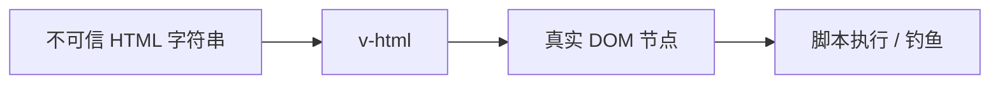

# v-html 与 XSS 防护

Vue 插值默认安全；`v-html` 是常见的破防入口。不可信 HTML 走 DOMPurify 白名单，再配合 CSP 做纵深防御。

## Vue 的默认安全模型

```vue
<!-- 安全：文本转义 -->
<p>{{ userInput }}</p>
<!-- 若 userInput 为 <script>alert(1)</script>，显示为纯文本 -->

<!-- 危险：原样插入 HTML -->
<div v-html="userInput"></div>
```



| 指令/API | 是否转义 |
|----------|----------|
| `{{ }}` / `v-text` | 是 |
| `v-html` | 否 |
| 属性绑定 `:href="userUrl"` | URL 需校验 |

---

## XSS 类型简表

| 类型 | 说明 | Vue 相关场景 |
|------|------|--------------|
| 存储型 | 恶意内容存库后展示给他人 | 评论、文章正文 `v-html` |
| 反射型 | URL 参数回显到页面 | 搜索关键词未转义 |
| DOM 型 | 纯前端把不可信数据写入 DOM | `innerHTML`、`v-html` |

攻击者可窃取 cookie、伪造请求、篡改页面（钓鱼）。

---

## DOMPurify 净化

```bash
pnpm add dompurify
pnpm add -D @types/dompurify
```

```ts
// utils/sanitize.ts
import DOMPurify from 'dompurify';

export function sanitizeHtml(dirty: string): string {
  return DOMPurify.sanitize(dirty, {
    ALLOWED_TAGS: ['p', 'br', 'strong', 'em', 'a', 'ul', 'ol', 'li', 'h2', 'h3'],
    ALLOWED_ATTR: ['href', 'title', 'target', 'rel'],
  });
}
```

```vue
<script setup lang="ts">
import { computed } from 'vue';
import { sanitizeHtml } from '@/utils/sanitize';

const props = defineProps<{ content: string }>();
const safeHtml = computed(() => sanitizeHtml(props.content));
</script>

<template>
  <div v-html="safeHtml" />
</template>
```

**永远**对不可信内容净化后再 `v-html`；可信 CMS 也应白名单标签。

---

## 封装 SafeHtml 组件

```vue
<!-- components/SafeHtml.vue -->
<script setup lang="ts">
import { computed } from 'vue';
import DOMPurify from 'dompurify';

const props = defineProps<{ html: string }>();
const clean = computed(() => DOMPurify.sanitize(props.html));
</script>

<template>
  <div class="prose" v-html="clean" />
</template>
```

团队规范：**禁止裸 `v-html`**，仅通过 `SafeHtml` 使用，Code Review 可 grep 拦截。

---

## 链接与 javascript: 协议

```ts
export function safeUrl(url: string): string {
  try {
    const u = new URL(url, window.location.origin);
    if (!['http:', 'https:', 'mailto:'].includes(u.protocol)) return '#';
    return u.href;
  } catch {
    return '#';
  }
}
```

```vue
<a :href="safeUrl(userLink)">链接</a>
```

`v-html` 内的 `<a href="javascript:...">` 由 DOMPurify 默认剥离。

---

## 内容安全策略（CSP）

HTTP 头限制脚本来源，纵深防御即使漏净化也难执行内联脚本：

```
Content-Security-Policy:
  default-src 'self';
  script-src 'self';
  style-src 'self' 'unsafe-inline';
  img-src 'self' data: https:;
```

| 指令 | 作用 |
|------|------|
| `script-src 'self'` | 禁止外链与内联随意脚本 |
| `nonce-xxx` | 允许带 nonce 的内联脚本（Vite 构建可配） |

Nuxt/Vite 生产部署在 Nginx/CDN 配置 CSP；开发环境可放宽。

---

## 富文本编辑器

| 方案 | 说明 |
|------|------|
| 存 Markdown，渲染时净化 | 攻击面小 |
| 存 HTML，展示必过 DOMPurify | 常见 CMS |
| 编辑器输出白名单 | TipTap、Quill 配置 allowed formats |

**不要在服务端用正则「去标签」**，易被绕过（`` 等）。

---

## 其他注入面

| 场景 | 风险 | 处理 |
|------|------|------|
| `eval` / `new Function` | 执行任意代码 | 禁止 |
| 动态组件 `:is="userInput"` | 加载恶意组件 | 白名单映射 |
| `v-bind` 对象展开用户 JSON | 事件处理器注入 | 校验 schema |
| SSR 拼接 HTML | 服务端 XSS | 转义或使用 renderer |

```vue
<!-- 危险 -->
<div v-bind="userControlledObject" />

<!-- 安全：只取已知字段 -->
<div :class="user.className" :data-id="user.id" />
```

---

## 依赖与供应链

- 锁定 `dompurify` 版本，关注 CVE
- 第三方 UI 组件若内部 `v-html`，查文档是否净化
- `npm audit` 与 Renovate 自动升级

---

## 安全审查要点

`v-html` 使用点均应有 DOMPurify 净化或可信来源说明；用户 URL 需协议白名单，拒绝 `javascript:`；生产环境应启用 CSP；富文本入库可在服务端二次净化；ESLint 可配置自定义规则禁止裸 `v-html`。

---

## 小结

Vue 插值默认转义，`v-html` 是唯一常见破防入口，不可信 HTML 须用 DOMPurify 白名单净化，团队规范禁止裸 `v-html`，统一通过 `SafeHtml` 组件。链接需校验协议，拒绝 `javascript:`。CSP 头部提供纵深防御；富文本存 Markdown 渲染时净化，或存 HTML 展示时必过 DOMPurify。动态组件 `:is`、v-bind 对象展开用户 JSON 等也是注入面，需白名单或 schema 校验。
