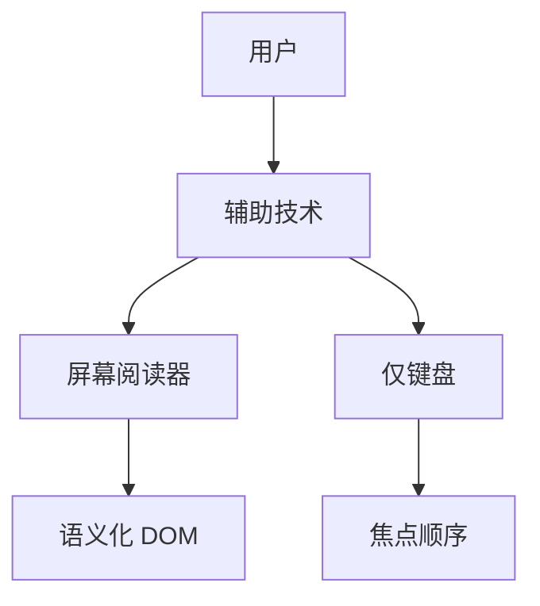

# 可访问性基础

a11y 从语义 HTML 起步：真按钮、关联 label、图片 alt；动态 UI 再补 ARIA。配合 ESLint a11y 规则和 axe 做回归。

## 为什么 Vue 项目要关心 a11y？



| 动机 | 说明 |
|------|------|
| 合规 | 多国法律要求公共网站可访问 |
| 用户规模 | 老年、临时损伤用户 |
| 工程质量 | 语义化利于 SEO 与自动化测试 |

Vue 不自动替你加 ARIA；`<div @click>` 不等于按钮。

---

## 语义化 HTML 优先

```vue
<!-- ❌ -->
<div class="btn" @click="submit">提交</div>

<!-- ✅ -->
<button type="submit" @click="submit">提交</button>
```

| 元素 | 用途 |
|------|------|
| `<button>` | 页面内操作 |
| `<a href>` | 导航到新 URL |
| `<nav>` | 导航区域 |
| `<main>` | 主内容（页内唯一） |
| `<h1>`–`<h6>` | 标题层级，勿跳级 |

---

## 表单可访问性

```vue
<template>
  <div>
    <label for="email">邮箱</label>
    <input
      id="email"
      v-model="email"
      type="email"
      aria-required="true"
      :aria-invalid="!!errors.email"
      :aria-describedby="errors.email ? 'email-error' : undefined"
    />
    <p v-if="errors.email" id="email-error" role="alert">
      {{ errors.email }}
    </p>
  </div>
</template>
```

| 属性 | 作用 |
|------|------|
| `<label for>` | 点击标签聚焦输入框 |
| `aria-invalid` | 告知校验失败 |
| `aria-describedby` | 关联错误说明 |
| `role="alert"` | 动态错误被朗读 |

Element Plus / Ant Design Vue 组件多数内置部分 a11y，仍需查文档。

---

## 图片与图标

```vue


<!-- 装饰性图标 -->
<svg aria-hidden="true" focusable="false">...</svg>
<span class="sr-only">关闭</span>
```

Font Icon 需配 **可见文本** 或 `aria-label`：

```vue
<button aria-label="删除">
  <IconTrash aria-hidden="true" />
</button>
```

---

## ARIA 常用属性

| 属性 | 场景 |
|------|------|
| `aria-label` | 无可见文本的控制项 |
| `aria-labelledby` | 引用其他元素作名称 |
| `aria-expanded` | 折叠面板、菜单 |
| `aria-selected` | 选项卡 |
| `aria-live="polite"` | 异步提示区域 |
| `role="dialog"` | 模态框 |

```vue
<button
  :aria-expanded="open"
  aria-controls="menu-panel"
  @click="open = !open"
>
  菜单
</button>
<ul v-show="open" id="menu-panel" role="menu">...</ul>
```

**规则**：能用原生语义就不用 ARIA；勿滥用 `role`。

---

## 键盘操作

| 键 | 期望行为 |
|----|----------|
| Tab / Shift+Tab | 焦点顺序前进/后退 |
| Enter / Space | 激活按钮 |
| Esc | 关闭弹层 |
| 方向键 | 列表、Tabs（按模式） |

```vue
<div
  role="button"
  tabindex="0"
  @click="activate"
  @keydown.enter.prevent="activate"
  @keydown.space.prevent="activate"
>
  自定义控件
</div>
```

优先用 `<button>`，避免自己实现键盘逻辑。

---

## 颜色与对比度

- 正文对比度 ≥ 4.5:1（WCAG AA）
- 不单靠颜色传达状态（加图标或文字）
- 暗色模式同步检查

```css
.sr-only {
  position: absolute;
  width: 1px;
  height: 1px;
  padding: 0;
  margin: -1px;
  overflow: hidden;
  clip: rect(0, 0, 0, 0);
  border: 0;
}
```

---

## Vue 与 UI 库

| 库 | 注意点 |
|----|--------|
| Element Plus | 表单、Dialog 查 a11y 章节 |
| Headless UI | 无样式，需自己保证对比度 |
| Radix Vue | 内置焦点与 ARIA 模式 |

自定义组件参考 [WAI-ARIA Authoring Practices](https://www.w3.org/WAI/ARIA/apg/)。

---

## 自动化检测

```bash
pnpm add -D eslint-plugin-vuejs-accessibility axe-core @axe-core/playwright
```

```js
// .eslintrc
'vuejs-accessibility/alt-text': 'error',
'vuejs-accessibility/label-has-for': 'error',
```

```ts
// Playwright
import AxeBuilder from '@axe-core/playwright';

test('a11y', async ({ page }) => {
  await page.goto('/');
  const results = await new AxeBuilder({ page }).analyze();
  expect(results.violations).toEqual([]);
});
```

自动化不能替代人工键盘与读屏测试。

---

## 常见反模式

| 反模式 | 修复 |
|--------|------|
| `tabindex > 0` | 调整 DOM 顺序 |
| 移除焦点轮廓 `outline: none` | 自定义 `:focus-visible` 样式 |
| 标题用 `<div class="h1">` | 用 `<h1>` |
| 动态内容无 live region | `aria-live` |

---

## 小结

可访问性从语义 HTML 开始：用真 `<button>` 而非 `<div @click>`，表单 input 关联 `<label>`，图片提供 alt。动态 UI 才补充 ARIA 属性如 `aria-expanded`、`aria-describedby`。键盘操作须可 Tab 到达，保留可见 focus 样式。正文对比度 ≥ 4.5:1，不单靠颜色传达状态。自动化检测用 `eslint-plugin-vuejs-accessibility` 与 axe，但不能替代人工键盘与读屏测试。
