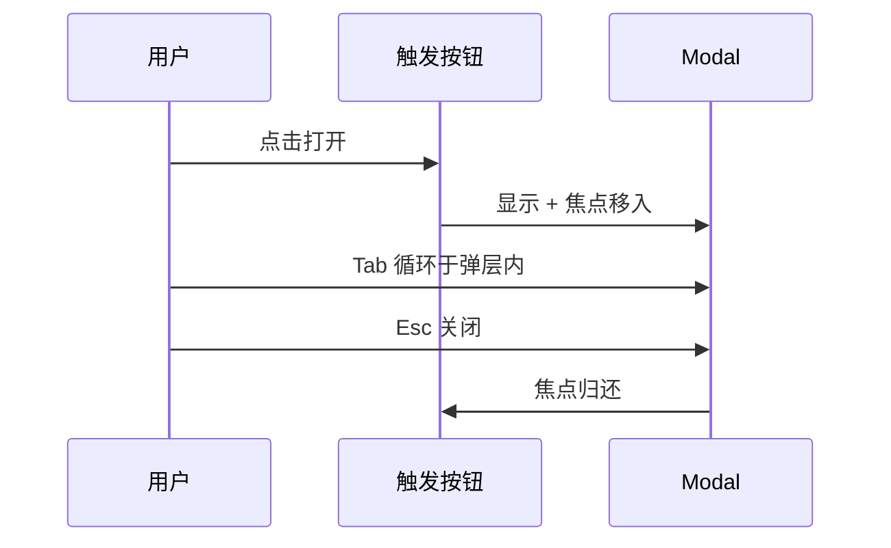
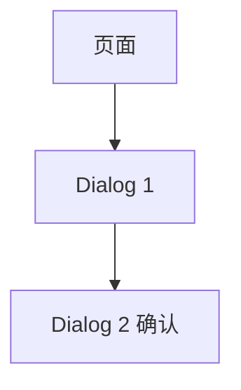

# 焦点管理与弹层

弹层打开时移焦点并做 Tab 陷阱，关闭后把焦点还给触发器。Vue 里用 Teleport，配合 `useFocusTrap` 或成熟 UI 库。

## 弹层 a11y 生命周期



| 阶段 | 要求 |
|------|------|
| 打开 | 焦点进入弹层首项或标题 |
| 打开期间 | 背景不可 Tab 到（inert 或 trap） |
| 关闭 | 焦点回到触发器 |
| Esc | 关闭（除非不可取消） |

---

## Teleport 与 DOM 结构

```vue
<script setup lang="ts">
const open = ref(false);
const triggerRef = ref<HTMLButtonElement>();
</script>

<template>
  <button ref="triggerRef" @click="open = true">打开设置</button>

  <Teleport to="body">
  <div v-if="open" role="dialog" aria-modal="true" aria-labelledby="dialog-title">
      <h2 id="dialog-title">设置</h2>
      <!-- 内容 -->
      <button @click="open = false">关闭</button>
    </div>
  </Teleport>
</template>
```

`Teleport` 避免 `z-index` 与 `overflow: hidden` 裁剪；a11y 属性仍需手动或使用库。

---

## 焦点陷阱（focus trap）

Tab 不应落到弹层背后的页面：

```ts
// composables/useFocusTrap.ts（简化示意）
export function useFocusTrap(containerRef: Ref<HTMLElement | null>, active: Ref<boolean>) {
  const focusable = 'button, [href], input, select, textarea, [tabindex]:not([tabindex="-1"])';

  function onKeydown(e: KeyboardEvent) {
    if (!active.value || e.key !== 'Tab' || !containerRef.value) return;
    const els = [...containerRef.value.querySelectorAll<HTMLElement>(focusable)]
      .filter((el) => !el.disabled);
    const first = els[0];
    const last = els[els.length - 1];
    if (e.shiftKey && document.activeElement === first) {
      e.preventDefault();
      last.focus();
    } else if (!e.shiftKey && document.activeElement === last) {
      e.preventDefault();
      first.focus();
    }
  }

  onMounted(() => document.addEventListener('keydown', onKeydown));
  onUnmounted(() => document.removeEventListener('keydown', onKeydown));
}
```

生产环境推荐 **focus-trap-vue** 或 **@vueuse/integrations/useFocusTrap**。

---

## 打开与关闭时的焦点

```vue
<script setup lang="ts">
import { useFocusTrap } from '@vueuse/integrations/useFocusTrap';

const open = ref(false);
const modalRef = ref<HTMLElement>();
const triggerRef = ref<HTMLButtonElement>();

const { activate, deactivate } = useFocusTrap(modalRef, { immediate: false });

watch(open, async (val) => {
  if (val) {
    await nextTick();
    activate();
    modalRef.value?.querySelector<HTMLElement>('input, button')?.focus();
  } else {
    deactivate();
    triggerRef.value?.focus();
  }
});
</script>
```

---

## 背景 inert

HTML `inert` 使背景子树不可聚焦、不可点击：

```vue
<main :inert="modalOpen">
  <!-- 页面主体 -->
</main>
```

```ts
// 或不支持 inert 的浏览器用 aria-hidden
watch(modalOpen, (open) => {
  document.getElementById('app')?.setAttribute('aria-hidden', String(open));
});
```

注意：`aria-hidden` 不能用在含焦点的祖先上。

---

## 多层弹层栈



| 规则 | 说明 |
|------|------|
| 仅顶层 trap | 下层暂停 trap |
| z-index 与焦点一致 | 最上层接焦点 |
| 关闭顺序 | 先关 D2 焦点回 D1 |

用 Pinia 或 provide 维护 `dialogStack` 数组。

---

## 下拉菜单与 Listbox

非模态浮层：打开时焦点进菜单，方向键导航，Esc 关闭：

```vue
<ul
  v-show="open"
  role="listbox"
  @keydown.down.prevent="moveNext"
  @keydown.up.prevent="movePrev"
  @keydown.esc="close"
>
  <li
    v-for="(opt, i) in options"
    :key="opt.value"
    role="option"
    :aria-selected="i === activeIndex"
    :tabindex="i === activeIndex ? 0 : -1"
  >
    {{ opt.label }}
  </li>
</ul>
```

Radix Vue / Headless UI 已实现 APG 模式。

---

## 滚动锁定

弹层打开时禁止 body 滚动：

```ts
import { useScrollLock } from '@vueuse/core';

const isLocked = useScrollLock(document.body);
watch(open, (v) => { isLocked.value = v; });
```

移动端注意地址栏与 `position: fixed` 跳动。

---

## 与 Element Plus Dialog

```vue
<el-dialog
  v-model="visible"
  title="提示"
  :close-on-click-modal="false"
  destroy-on-close
>
  ...
</el-dialog>
```

查阅版本文档是否默认 focus trap；必要时 `@opened` 回调中手动 `focus()` 首输入框。

---

## 测试焦点行为

```ts
// Vitest + user-event 或 Playwright
test('returns focus on close', async ({ page }) => {
  await page.getByRole('button', { name: '打开' }).click();
  await page.keyboard.press('Escape');
  await expect(page.getByRole('button', { name: '打开' })).toBeFocused();
});
```

---

## 小结

弹层打开时焦点移入弹层内，Tab 在弹层内循环，Esc 关闭后焦点归还触发器。Vue 中用 `Teleport` 挂到 body，配合 `@vueuse/integrations/useFocusTrap` 或成熟 UI 库 Dialog。背景可用 HTML `inert` 禁用交互；多层弹层需维护焦点栈，仅顶层 trap 生效。下拉菜单用方向键导航，Radix Vue / Headless UI 已实现 WAI-ARIA 模式。Playwright 可断言关闭后触发器重新获得焦点。
