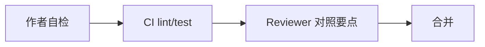

# PR Review 要点

PR Review 要覆盖 i18n、XSS、a11y、Vue 惯用法和测试。作者先自检，Reviewer 按 Blocker → Major 卡点。

## Review 流程

提交前跑 `pnpm lint` 与 `vue-tsc`；CI 跑 Vitest、Playwright 冒烟与 axe；人工 Review 对照下文要点。

---

## 国际化（i18n）

用户可见文案不应硬编码在模板中，key 命名保持一致如 `module.section.key`。复数与插值参数需完整；新增 key 时各语言文件同步更新。切换语言时 `document.documentElement.lang` 应随之更新；日期与金额用 `d()` / `n()` 而非手写格式。

---

## 安全

无裸 `v-html`，或已走 `SafeHtml`/DOMPurify 净化。用户 URL 不得为 `javascript:` 等危险协议。禁止 `eval` / `new Function` / 动态 `import(userInput)`。敏感 token 不应出现在客户端日志；API 密钥仅放 `runtimeConfig` 服务端字段。依赖升级需关注 CVE；cookie 会话场景注意 CSRF。

---

## 可访问性（a11y）

交互元素用 `<button>` / `<a>`，不用 div 冒充。表单 input 有关联 `<label>`；图标按钮有 `aria-label` 或可见文本。图片有有意义 `alt` 或装饰图 `aria-hidden`。弹层设 `role="dialog"`、`aria-modal` 与焦点陷阱；关闭后焦点回到触发器。颜色对比度达标，不单靠颜色表达状态；关键路径可键盘完成。

---

## Vue 组件与 API

`v-for` 有稳定 `:key`（非 index，除非静态列表）。props 有类型与合理 default；不直接 mutate props。大列表考虑虚拟滚动或分页。`watch` 有清理（定时器、订阅）；组合式函数职责单一。SSR 项目避免在 setup 顶层用 `window`。

---

## 状态与数据

服务端状态与 UI 状态边界清晰；Pinia action 处理 loading/error。避免重复请求（Nuxt 用 useFetch key）；乐观更新有回滚。敏感数据不进 persistedstate。

---

## 路由与权限

需登录路由有 guard / middleware；权限 UI 与接口双重校验。404 与无权限页区分；外链加 `rel="noopener noreferrer"`。

---

## 性能

路由级懒加载 `import()`；重型组件 `defineAsyncComponent`。图片懒加载与合适尺寸；避免多余深度 watch。KeepAlive 设 `include`/`max` 边界。

---

## 测试

新 composable 有单测；关键 UI 交互有组件或 E2E 覆盖。bug 修复附带回归用例；mock 不掩盖真实集成问题。

---

## 严重程度分级

| 级别 | 示例 | 处理 |
|------|------|------|
| Blocker | 裸 v-html 用户内容、无鉴权暴露数据 | 必须修 |
| Major | 弹层无焦点陷阱、缺 label | 合并前修 |
| Minor | key 命名不一致 | 可跟进 issue |
| Nit | 文案标点 | 可选 |

---

## 小结

PR Review 分三层：编码规范、CI 自动化、人工要点对照。优先级上 Blocker（安全/a11y）高于 Major（性能/测试）高于 Minor。作者合并前对照 i18n、安全、a11y 等维度自检，可减少 Review 往返。Blocker 如裸 v-html 渲染用户内容、无鉴权暴露数据必须修复；Major 如弹层无焦点陷阱、表单缺 label 应在合并前修复。
