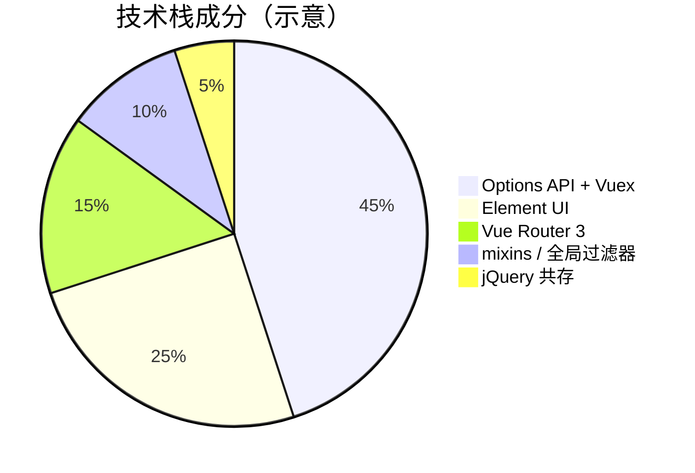

# Vue 2 遗留项目现状

Vue 2 已 EOL，策略在冻结、维持、迁移之间取舍；2.7 可作过渡，长期出路是 Vue 3 + Vite + Pinia。

## Vue 2 EOL 意味着什么？

| 项目 | 状态 |
|------|------|
| Vue 2.7 | 最后特性版本，仅安全相关修补已结束 |
| @vue/composition-api | 2.7 内置，独立包可移除 |
| Vue CLI | 维护模式，新项目应用 Vite |
| Vuex 3 | 仍可用于 2.x，新项目推荐 Pinia |

**无官方新特性与安全补丁** → 长期停留 2.x 需自担供应链风险。

---

## 典型遗留项目画像



| 特征 | 说明 |
|------|------|
| 构建 | Webpack + Vue CLI 4/5 |
| 语法 | Options API、filters、`$on` 事件总线 |
| UI | Element UI、iView、Ant Design Vue 1.x |
| 状态 | Vuex 3 modules |
| 测试 | Jest + vue-test-utils v1 |

---

## 维护策略矩阵

| 策略 | 适用 | 动作 |
|------|------|------|
| **冻结** | 极少变更、内网、短生命周期 | 锁定依赖版本，仅修致命 bug |
| **维持** | 持续小需求、暂无迁移预算 | 2.7 + 局部 Composition API，补测试 |
| **迁移** | 产品活跃、安全合规要求高 | 规划 Vue 3 + Vite |
| **重写** | 技术债过重、业务可切片 | 新仓库并行，模块联邦接入 |

---

## 风险清单

| 风险 | 影响 |
|------|------|
| 无安全补丁 | 依赖漏洞无法官方修复 |
| 招聘与培训 | 新人更熟悉 Vue 3 |
| 生态停滞 | 新库仅支持 Vue 3 |
| 双栈成本 | 与 Vue 3 新项目组件无法复用 |
| IE11（若仍支持） | Vue 3 不支持，困在 2.x |

---

## 2.7 作为过渡站

Vue 2.7 **向后移植** 了部分 Vue 3 API：

```vue
<script setup>
import { ref, onMounted } from 'vue';
const count = ref(0);
onMounted(() => console.log(count.value));
</script>
```

| 可用 | 不可用 |
|------|--------|
| `ref` / `reactive` / `computed` | Teleport、Fragments 多根（部分） |
| `<script setup>`（需构建支持） | Vue 3 全局 API 树摇 |
| `defineComponent` 改进 | Pinia 需 Vue 3（可用 Vuex） |

遗留项目可先 2.7 统一版本，再逐步迁 3。

---

## 依赖兼容性速查

| 依赖 | Vue 2 | Vue 3 |
|------|-------|-------|
| Vue Router | 3.x | 4.x |
| Vuex | 3.x | 4.x（或 Pinia） |
| Element UI | ✅ | → Element Plus |
| Ant Design Vue | 1.x | 3.x+ |
| Vuetify | 2.x | 3.x |
| @vue/test-utils | v1 | v2 |

升级前做 **依赖矩阵审计**（npm ls + 文档）。

---

## 人力与里程碑粗估

| 规模 | 迁移粗估（仅供参考） |
|------|----------------------|
| 小型（<30 路由） | 4–8 人周 |
| 中型 | 2–4 人月 |
| 大型单体 | 分季度、按模块 |

因素：测试覆盖率、UI 库替换、自定义 webpack loader、TS  adoption。

---

## 何时不该急着升？

- 系统即将下线（<6 个月）
- 无自动化测试且业务极其复杂
- 关键第三方插件无 Vue 3 替代

此时 **冻结 + 安全扫描 + WAF** 可能是务实选择，但需书面记录技术债。

---

## 与组织对齐

| 干系人 | 关心点 |
|--------|--------|
| 产品 | 功能冻结窗口、回归范围 |
| 运维 | 构建产物、CDN、监控不变 |
| 安全 | EOL 合规、漏洞响应 SLA |
| 开发 | 培训、分支策略、MR 规范 |

输出一页 **迁移 RFC**：目标版本、时间线、回滚方案。

---

## 文档与知识传承

- 标记模块 Owner 与「最后熟悉人」
- 录制 Options API 业务流 walkthrough
- 在 README 写明 Node 版本、启动命令、已知坑

---

## 小结

Vue 2 已 EOL，无官方新特性与安全补丁，长期停留需自担供应链风险。典型遗留项目用 Webpack + Vue CLI、Options API、Vuex 3、Element UI。策略可在冻结（锁定依赖）、维持（2.7 + 局部 Composition API）、迁移（Vue 3 + Vite + Pinia）间取舍。2.7 向后移植了 ref/reactive 与 script setup，可作过渡但非长期方案。出路是 Vue 3 + Vite + Pinia + vue-router 4；升级前做依赖矩阵审计并与组织对齐迁移 RFC。
