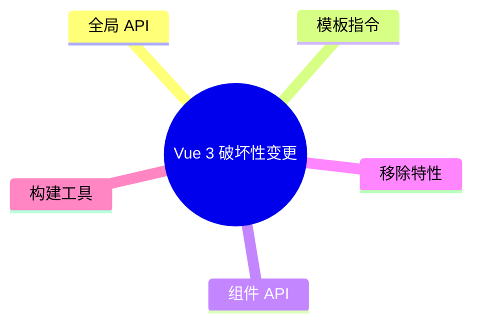

# 破坏性变更清单

Vue 2→3 的破坏性变更集中在应用入口、v-model 协议、filters/事件总线移除、v-if/v-for 优先级等；用 codemod 和 compat 抓遗漏。

## 变更总览



| 类别 | 影响面 |
|------|--------|
| 全局 API | main.js、插件 |
| 模板 | v-model、key、v-if/v-for |
| 组件 | $listeners、$attrs |
| 移除 | filters、$on/$off |

---

## 应用实例与全局 API

| Vue 2 | Vue 3 |
|-------|-------|
| `new Vue({ ... })` | `createApp(App)` |
| `Vue.use(plugin)` | `app.use(plugin)` |
| `Vue.component` | `app.component` |
| `Vue.prototype.$x` | `app.config.globalProperties.$x` |
| `new Vue({ router, store, render })` | `createApp().use(router).use(pinia).mount()` |

```ts
// Vue 3
import { createApp } from 'vue';
import { createPinia } from 'pinia';
import App from './App.vue';

const app = createApp(App);
app.use(createPinia());
app.mount('#app');
```

---

## v-model 变更

| Vue 2 | Vue 3 |
|-------|-------|
| 组件默认 `value` + `input` | `modelValue` + `update:modelValue` |
| `.sync` 修饰符 | `v-model:propName` |
| 多个 v-model 需 `model` 选项 | 多个 `v-model:xxx` |

```vue
<!-- 子组件 Vue 3 -->
<script setup>
defineProps<{ modelValue: string }>();
const emit = defineEmits<{ 'update:modelValue': [v: string] }>();
</script>

<!-- 父 -->
<Child v-model="text" />
<Child v-model:title="title" />
```

---

## 事件与 $listeners

Vue 3 将 **未声明为 props 的属性** 归入 `$attrs`（含 class、style、onXxx 形式的事件监听）。

| Vue 2 | Vue 3 |
|-------|-------|
| `v-on="$listeners"` | 删除，`$attrs` 含 on 前缀监听 |
| `this.$listeners` | 合并进 `$attrs` |

```vue
<!-- 透明包装组件 -->
<script setup>
defineOptions({ inheritAttrs: false });
</script>
<template>
  <input v-bind="$attrs" />
</template>
```

---

## 移除：过滤器 filters

```vue
<!-- Vue 2 ❌ -->
{{ price | currency }}

<!-- Vue 3 ✅ -->
{{ formatCurrency(price) }}
```

或 computed / 方法；全局过滤器改为工具函数或 `app.config.globalProperties`（不推荐）。

---

## 移除：事件 API $on / $off / $once

```ts
// Vue 2 事件总线
const bus = new Vue();

// Vue 3 → mitt / pinia / provide-inject
import mitt from 'mitt';
export const bus = mitt();
```

---

## v-if 与 v-for 优先级

| 版本 | 同一元素上 |
|------|------------|
| Vue 2 | `v-for` 优先于 `v-if` |
| Vue 3 | `v-if` 优先于 `v-for` |

**最佳实践**：不要共用同一元素；用 `<template v-for>` 包裹。

```vue
<template v-for="item in list" :key="item.id">
  <div v-if="item.visible">{{ item.name }}</div>
</template>
```

---

## key 与 template

Vue 3 中 `<template v-for>` **必须** 带 key（放在 template 上）。

```vue
<template v-for="user in users" :key="user.id">
  <UserRow :user="user" />
</template>
```

---

## 生命周期重命名

| Vue 2 | Vue 3 Options |
|-------|---------------|
| `beforeDestroy` | `beforeUnmount` |
| `destroyed` | `unmounted` |

Composition：`onBeforeUnmount` / `onUnmounted`。

---

## 其他模板与 API

| 变更 | 说明 |
|------|------|
| `$children` 移除 | 用 ref / provide |
| 函数式组件 | 仅普通函数 + `defineComponent` |
| `inline-template` 移除 | 用 SFC |
| `Vue.config.ignoredElements` | `app.config.compilerOptions.isCustomElement` |
| 多根节点 | Vue 3 支持 Fragment |

---

## Vue Router / Vuex

| Vue Router 3 | Vue Router 4 |
|--------------|--------------|
| `new VueRouter` | `createRouter` |
| `mode: 'history'` | `createWebHistory()` |
| `router.addRoutes` | `addRoute` 循环 |
| `*` 通配 | `/:pathMatch(.*)*` |

| Vuex 3 | Vuex 4 / Pinia |
|--------|----------------|
| `new Vuex.Store` | `createStore` 或 Pinia |
| `mapState` 等 | Pinia 组合式更简洁 |

---

## 迁移工具

```bash
npx vue-codemod src
# 或官方 @vue/compat 配合编译告警
```

配合 ESLint `eslint-plugin-vue` `vue/vue3-migration` 规则集。

---

## 小结

Vue 2→3 破坏性变更集中在应用入口、v-model 协议、移除 filters/事件总线、v-if/v-for 优先级反转。入口从 `new Vue` 改为 `createApp`，全局 API 改实例 API。组件 v-model 默认 `modelValue` + `update:modelValue`；`.sync` 改为 `v-model:propName`。filters 移除，改用方法或 computed；`$on/$off` 移除，改用 mitt。`$listeners` 合并进 `$attrs`。同一元素上 v-if 与 v-for 优先级反转，最佳实践用 `<template v-for>` 包裹。配合 `@vue/compat` 与 codemod 逐项捕获遗漏。
