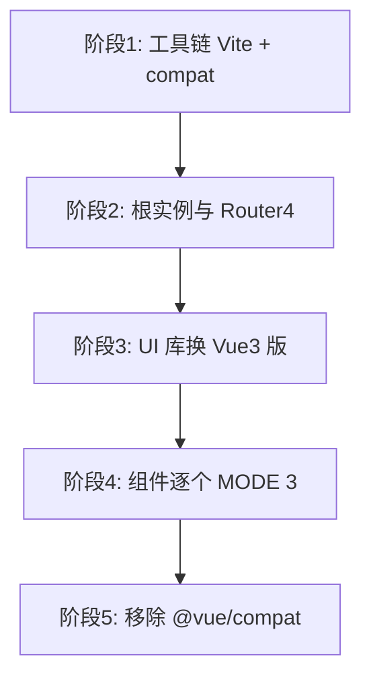

# vue-compat 渐进迁移

`@vue/compat` 在 Vue 3 运行时兼容 Vue 2 行为：配 Vite alias 和 `configureCompat`，按警告 ID 逐项关闭，最后移除 compat。

## compat 工作原理

```mermaid
flowchart LR
  Source[Vue 2 风格源码] --> CompatBuild[@vue/compat 构建]
  CompatBuild --> Warnings[运行时/编译警告]
  CompatBuild --> Vue3Runtime[Vue 3 内核]
```

| 能力 | 说明 |
|------|------|
| 兼容层 | 模拟 2.x API（filters、$listeners 等可配置） |
| 警告 | 指出需改的代码位置 |
| 目标 | 最终切换到 `vue` 正式包 |

---

## 安装与别名配置

```bash
pnpm add vue@^3 @vue/compat
pnpm remove vue@2  # 迁移过程中
```

```ts
// vite.config.ts
import vue from '@vitejs/plugin-vue';

export default defineConfig({
  resolve: {
    alias: {
      vue: '@vue/compat',
    },
  },
  plugins: [
    vue({
      template: {
        compilerOptions: {
          compatConfig: { MODE: 2 },
        },
      },
    }),
  ],
});
```

`MODE: 2` 默认尽量像 Vue 2；修完警告后可改 `MODE: 3` 或移除 compat。

---

## 应用级 compat 配置

```ts
import { configureCompat } from 'vue';

configureCompat({
  GLOBAL_MOUNT: false,           // 已改用 createApp
  GLOBAL_EXTEND: false,
  COMPONENT_V_MODEL: false,      // 已改 modelValue
  FILTERS: true,                 // 暂保留 filters，后续关
});
```

| 粒度 | 函数 |
|------|------|
| 全局 | `configureCompat({ FEATURE_ID: true/false })` |
| 单组件 | `defineOptions({ compatConfig: { MODE: 3 } })` |

对已迁移组件设 `MODE: 3` 强制严格模式。

---

## 典型警告与修复

| 警告 ID | 修复方向 |
|---------|----------|
| `GLOBAL_MOUNT` | `new Vue` → `createApp` |
| `COMPONENT_V_MODEL` | `value`/`input` → `modelValue` |
| `FILTERS` | 改为方法或 computed |
| `INSTANCE_EVENT_EMITTER` | `$on` → mitt |
| `INSTANCE_LISTENERS` | 删除 `$listeners`，用 `$attrs` |
| `WATCH_ARRAY` | deep watch 行为差异，显式 `deep: true` |

控制台会打印文档链接与堆栈。

---

## 分阶段迁移路线



| 阶段 | 交付物 |
|------|--------|
| 1 | 开发环境跑通，警告清单导出 |
| 2 | Vuex4/Pinia、Router4 |
| 3 | Element Plus 等 |
| 4 | 警告数归零 |
| 5 | alias 改回 `vue` |

---

## 与 TypeScript

```ts
// env.d.ts
declare module 'vue' {
  interface ComponentCustomProperties {
    $http: typeof axios;
  }
}
```

compat 下类型仍来自 `vue` 包；注意 `@vue/runtime-core` 与 2.x 类型差异。

---

## 测试策略

- 迁移前补 **关键路径 E2E** 作安全网
- 每关闭一项 compat flag，跑回归
- VTU 升级到 v2，`createLocalVue` 移除

```ts
import { mount } from '@vue/test-utils';
import { createRouter, createMemoryHistory } from 'vue-router';
```

---

## 无法 compat 的场景

| 场景 | 处理 |
|------|------|
| 依赖仅支持 Vue 2 的私有 API | 换库或 iframe 隔离 |
| 自定义 vue-loader 插件 | 重写为 Vite 插件 |
| IE11 | 不升 Vue 3 |

---

## 退出 compat 验证

确认无 `@vue/compat` 引用与 `configureCompat` 调用；Vite alias 改回 `vue`；全量 `pnpm build` + E2E + 预发验证。

---

## 团队协作战术

| 战术 | 说明 |
|------|------|
| 警告看板 | 按 FEATURE_ID 分组 issue |
| 禁止新增 2.x 模式 | CI 统计警告不增 |
| 垂直切片 | 按业务模块改完即 `MODE: 3` |

---

## 小结

`@vue/compat` 在 Vue 3 运行时兼容 Vue 2 行为，Vite alias 指向 compat 并配 `configureCompat`，按警告 ID 逐项关闭兼容项。分阶段路线：工具链 Vite + compat → 根实例与 Router4 → UI 库换 Vue3 版 → 组件逐个 MODE 3 → 移除 compat。迁移前补关键路径 E2E；每关闭一项 compat flag 跑回归。无法 compat 的场景包括依赖 Vue 2 私有 API 的库、自定义 vue-loader 插件、IE11 支持。退出时确认无 compat 引用、alias 改回 `vue`、E2E 通过。
