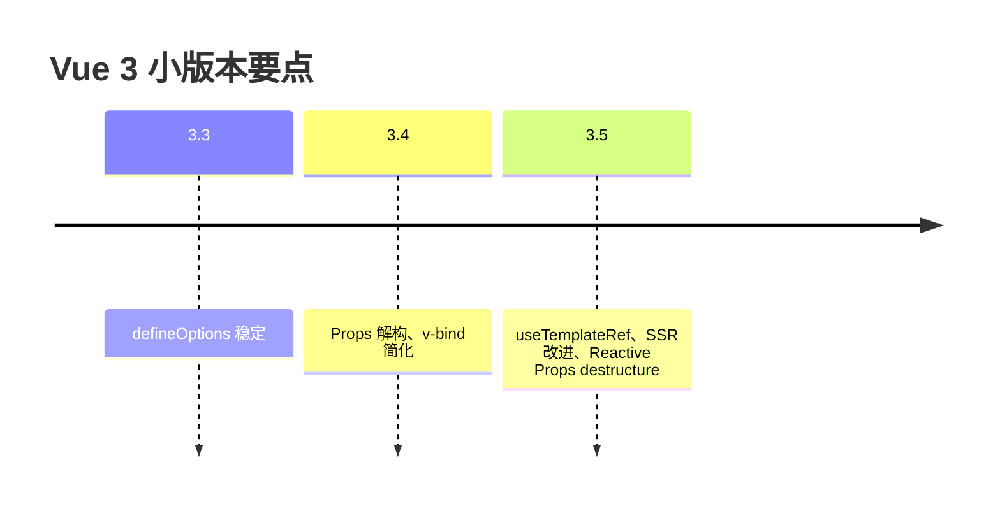

# Vue 3.4 与 3.5 新特性

3.4/3.5 强化了 Props 解构、`defineModel`、`useTemplateRef` 和 SSR hydration；多数项目可低风险 MINOR 升级，跟进 CHANGELOG 即可。

## 版本线定位



| 版本 | 主题 |
|------|------|
| 3.4 | 编译器重写、性能 |
| 3.5 | 模板 ref、hydration 工具 |

无破坏性大改，遵循 semver  MINOR 升级。

---

## Vue 3.4：响应式优化

- `ref` 通知路径更细，减少无效 effect
- `computed` 仅在其依赖变更时重新计算
- 数组 `shift`/`splice` 等操作追踪改进

**对业务透明**，升级后压测可能见到更少组件重渲染。

---

## Vue 3.4：Props 解构（Reactive Props Destructure）

编译器自动将解构后的 props 保持响应式（实验特性逐步稳定）：

```vue
<script setup lang="ts">
const { title, count = 0 } = defineProps<{
  title: string;
  count?: number;
}>();
// title、count 在模板中仍响应式
</script>

<template>
  <h1>{{ title }} ({{ count }})</h1>
</template>
```

| 过去 | 现在 |
|------|------|
| 解构丢响应式，需 `toRefs(props)` | 编译器注入 getter |

注意：仍勿解构到外部函数长期持有（脱离组件作用域）。

---

## Vue 3.4：v-bind 同名简写

```vue
<!-- 以前 -->


<!-- 3.4+ -->

```

当属性名与变量名相同时可省略值，减少噪音。

---

## Vue 3.4：defineModel 稳定

```vue
<script setup lang="ts">
const title = defineModel<string>('title', { default: '' });
</script>

<template>
  <input v-model="title" />
</template>
```

替代手写 `modelValue` + `update:modelValue`，多 v-model 更简洁。

---

## Vue 3.5：useTemplateRef

```vue
<script setup lang="ts">
import { useTemplateRef, onMounted } from 'vue';

const inputRef = useTemplateRef<HTMLInputElement>('inputEl');

onMounted(() => {
  inputRef.value?.focus();
});
</script>

<template>
  <input ref="inputEl" />
</template>
```

类型安全的模板 ref，避免 `ref<HTMLInputElement>()` 与模板字符串不同步。

---

## Vue 3.5：SSR 与 Hydration

- 更清晰的 hydration mismatch 警告信息
- `data-allow-mismatch` 用于已知的合法差异（谨慎使用）

```vue
<div data-allow-mismatch="children">{{ time }}</div>
```

配合 Nuxt `ClientOnly` 仍是首选策略。

---

## Vue 3.5：Teleport defer

```vue
<Teleport defer to="body">
  <Modal v-if="show" />
</Teleport>
```

目标容器晚于 Teleport 挂载时延迟传送，减少 SSR/布局顺序问题。

---

## Vue 3.5：app 级 errorHandler 改进

统一捕获未处理 promise 与渲染错误，便于接入 Sentry：

```ts
app.config.errorHandler = (err, instance, info) => {
  reportToSentry(err, { info, component: instance?.$?.type?.name });
};
```

---

## 升级步骤

```bash
pnpm up vue@^3.5 @vitejs/plugin-vue@latest
pnpm up vue-tsc@latest
```

| 步骤 | 动作 |
|------|------|
| 1 | 读 [CHANGELOG](https://github.com/vuejs/core/blob/main/CHANGELOG.md) |
| 2 | 本地 `vue-tsc ，noEmit` |
| 3 | 跑 Vitest + 关键 E2E |
| 4 | 启用新语法（defineModel、useTemplateRef）渐进采用 |

---

## 与 React Compiler 类比

Vue 3.4+ 编译器优化（如静态提升、内联 props）与「少写 memo」方向一致；**Vue 无需手动 memo 为默认**，但 `v-memo` 仍可用于极端列表。

---

## 小结

Vue 3.4 带来 Props 解构保持响应式、v-bind 同名简写、defineModel 稳定与响应式性能优化。3.5 新增 `useTemplateRef` 类型安全模板 ref、更清晰的 hydration mismatch 警告、Teleport defer 与 app 级 errorHandler 改进。升级步骤：读 CHANGELOG → bump 版本 → `vue-tsc ，noEmit` → Vitest + E2E。多数项目为低风险 MINOR 升级；新代码可渐进采用 defineModel、useTemplateRef 等新 API。
