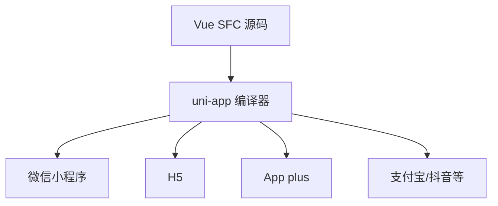

# uni-app 与小程序

uni-app 用 Vue 语法加条件编译覆盖国内小程序和 H5；要熟悉 `pages.json`、view 标签、uni 导航 API 和 `#ifdef`。

## uni-app 在跨端版图中的位置



| 方案 | 语法 | 典型场景 |
|------|------|----------|
| uni-app | Vue 2/3 | 国内多小程序 + H5 |
| Taro | React/Vue | 京东系多端 |
| 原生小程序 | WXML | 极致性能、平台新特性 |
| Nuxt | Vue | Web SSR，非小程序主战场 |

---

## 项目创建与目录

```bash
npx degit dcloudio/uni-preset-vue#vite-ts my-uni-app
cd my-uni-app && pnpm install
pnpm dev:mp-weixin
```

```
src/
├── pages.json          # 页面路由与 tabBar
├── manifest.json       # 应用配置、appid
├── pages/
│   └── index/index.vue
├── components/
├── static/
└── App.vue
```

`pages.json` 相当于小程序 `app.json` + 路由表合体。

---

## 条件编译

```vue
<template>
  <view>
    <!-- #ifdef MP-WEIXIN -->
    <button open-type="getPhoneNumber">微信手机号</button>
    <!-- #endif -->

    <!-- #ifdef H5 -->
    <a href="/download">下载 App</a>
    <!-- #endif -->
  </view>
</template>

<script setup>
// #ifdef MP-WEIXIN
import { onShareAppMessage } from '@dcloudio/uni-app';
onShareAppMessage(() => ({ title: '分享标题' }));
// #endif
</script>

<style>
/* #ifdef MP */
.container { padding: 20rpx; }
/* #endif */
</style>
```

| 平台标识 | 含义 |
|----------|------|
| `MP-WEIXIN` | 微信小程序 |
| `H5` | 浏览器 |
| `APP-PLUS` | App |
| `MP` | 所有小程序 |

---

## 组件与标签差异

| Web (Vue) | uni-app / 小程序 |
|-----------|------------------|
| `<div>` | `<view>` |
| `<span>` | `<text>` |
| `` | `<image>` |
| `router-link` | `navigator` / `uni.navigateTo` |

样式单位推荐 **rpx**（响应式像素），设计稿 750 宽。

---

## 路由与导航

```ts
// 保留当前页，跳转到应用内某页
uni.navigateTo({ url: '/pages/detail/detail?id=1' });

// 关闭当前页
uni.redirectTo({ url: '/pages/login/login' });

// tabBar 页面
uni.switchTab({ url: '/pages/home/home' });
```

无 Vue Router；路由由 `pages.json` 声明，`uni.*` API 导航。

---

## 网络与登录

```ts
uni.request({
  url: 'https://api.example.com/user',
  header: { Authorization: `Bearer ${token}` },
  success: (res) => console.log(res.data),
});
```

小程序域名需在后台配置 **合法 request 域名**；本地开发可开调试跳过校验。

---

## Vue 3 + script setup

uni-app 已支持 Vue 3 组合式 API：

```vue
<script setup lang="ts">
import { ref, onMounted } from 'vue';
import { onLoad } from '@dcloudio/uni-app';

const list = ref<string[]>([]);

onLoad((query) => {
  console.log('页面参数', query);
});

onMounted(() => {
  // 部分 DOM API 在小程序不可用
});
</script>
```

页面级用 `onLoad`、`onShow`；应用级用 `onLaunch`（`App.vue`）。

---

## 跨端差异与坑

| 问题 | 说明 |
|------|------|
| 无 `window` / `document` | 用 `uni.getSystemInfo` |
| CSS 限制 | 部分选择器不支持 |
| 包体积 | 主包 2MB 限制，分包 |
| 富文本 | `rich-text` 或 uParse |
| 同步 vue-router 代码 | 不能直接复用，需抽象 |

---

## 与主站 Vue 项目协作

| 模式 | 做法 |
|------|------|
| 独立仓库 | 小程序单独迭代 |
| Monorepo | `packages/shared` 放纯 TS 逻辑 |
| 微前端 | 小程序通常不适用 iframe |

**可复用**：API 类型、工具函数、Pinia 逻辑（无 DOM）；**难复用**：页面组件、Router。

---

## 选型建议

| 选 uni-app | 选原生/其他 |
|------------|-------------|
| 要多端发布、团队熟 Vue | 单微信且要最新能力 |
| 业务表单为主 | 重度 Canvas/游戏 |
| 交付周期紧 | 包体极致敏感 |

---

## 小结

uni-app 用 Vue 语法加 `#ifdef` 条件编译覆盖国内小程序与 H5。核心在 `pages.json` 路由、`view`/`text` 标签替代 div/span、`uni.*` API 导航与请求。Vue 3 script setup 已支持；纯 TS 逻辑层可与 Web 共享 composables，页面组件与 Router 难直接复用。国内小程序多端发布、团队熟 Vue 时首选 uni-app；单微信且要最新能力或重度 Canvas 可考虑原生。
