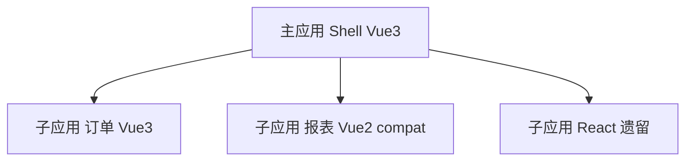

# 微前端与模块联邦

Vue 微前端可选 qiankun（应用级）或 Module Federation（模块级）。**架构选型与 MF 原理**见 [09-微前端与模块联邦](../../../前端工程化体系/09-微前端与模块联邦.md)；本节聚焦 **Vue 运行时集成**。

## 为什么 Vue 项目需要微前端？



| 痛点 | 微前端解法 |
|------|------------|
| 单体仓库编译慢 | 子应用独立 CI |
| Vue 2/3 并存 | 分应用升级 |
| 多团队并行 | 边界清晰、独立发布 |

---

## 方案对比

| 方案 | 原理 | 优点 | 缺点 |
|------|------|------|------|
| iframe | 浏览器隔离 | 简单、CSS/JS 完全隔离 | 体验差、通信麻烦 |
| qiankun | 单 SPA + JS 沙箱 | 成熟、中文文档多 | 运行时开销、样式隔离需配置 |
| Module Federation | Webpack/Vite 共享 chunk | 依赖去重、接近单体体验 | 构建复杂、版本契约 |
| Web Components | 自定义元素 | 框架无关 | DX、样式穿透 |

---

## qiankun + Vue 3 子应用

**子应用导出生命周期**：

```ts
// main.ts
import { createApp } from 'vue';
import App from './App.vue';
import { renderWithQiankun, qiankunWindow } from 'vite-plugin-qiankun/dist/helper';

let app: ReturnType<typeof createApp> | null = null;

function render(props: { container?: HTMLElement } = {}) {
  const container = props.container?.querySelector('#app') ?? '#app';
  app = createApp(App);
  app.mount(container);
}

renderWithQiankun({
  mount(props) { render(props); },
  bootstrap() { return Promise.resolve(); },
  unmount() {
    app?.unmount();
    app = null;
  },
});

if (!qiankunWindow.__POWERED_BY_QIANKUN__) {
  render();
}
```

**主应用注册**：

```ts
import { registerMicroApps, start } from 'qiankun';

registerMicroApps([
  {
    name: 'order',
    entry: '//localhost:7101',
    container: '#subapp',
    activeRule: '/order',
  },
]);
start();
```

| 注意 | 说明 |
|------|------|
| 路由 base | 子应用 `createWebHistory('/order')` |
| 公共依赖 | 可选 externals vue（需版本一致） |
| 样式隔离 | `strictStyleIsolation` / `experimentalStyleIsolation` |

---

## Vite Module Federation

```bash
pnpm add @originjs/vite-plugin-federation -D
```

**远程应用 remote**：

```ts
// vite.config.ts
import federation from '@originjs/vite-plugin-federation';

export default defineConfig({
  plugins: [
    vue(),
    federation({
      name: 'remote_app',
      filename: 'remoteEntry.js',
      exposes: {
        './OrderList': './src/components/OrderList.vue',
      },
      shared: ['vue', 'vue-router', 'pinia'],
    }),
  ],
});
```

**主应用 host**：

```ts
federation({
  name: 'host',
  remotes: {
    remote_app: 'http://localhost:5001/assets/remoteEntry.js',
  },
  shared: ['vue', 'vue-router', 'pinia'],
}),
```

```vue
<script setup>
import { defineAsyncComponent } from 'vue';

const OrderList = defineAsyncComponent(() => import('remote_app/OrderList'));
</script>

<template>
  <OrderList />
</template>
```

---

## 共享依赖版本契约


| 规则 | 说明 |
|------|------|
| `vue` 单例 | 必须同主版本，避免双实例 |
| Pinia store | 主应用 provide 或独立实例 |
| Router | 通常各子应用独立路由，主应用做菜单 |

`shared.requiredVersion` 在 federation 配置中声明。

---

## 通信

| 方式 | 场景 |
|------|------|
| qiankun `initGlobalState` | 简单全局状态 |
| CustomEvent / mitt | 松耦合事件 |
| URL 参数 | 一次性传参 |
| 后端会话 | 权威用户态 |

避免子应用直接互调内部 store。

---

## Vue 2 子应用共存

- 子应用保持 Vue 2 + qiankun 生命周期
- 或 Vue 2 子应用升 3 后联邦暴露组件
- 主应用 Vue 3 不直接 import Vue 2 组件

---

## 部署与 CORS

| 项 | 要求 |
|----|------|
| remoteEntry.js | CDN 可访问、CORS 头 |
| 路径 | 生产环境绝对 URL |
| 缓存 | remoteEntry 短缓存，chunk 带 hash |

---

## 何时不必微前端

- 团队 <10 人、单产品
- 无独立发布需求
- 沟通成本 > 构建收益

优先 **Monorepo + 模块化** 往往更简单。

---

## 小结

Vue 微前端可选 qiankun（应用级）或 Module Federation（模块级）。qiankun 子应用导出 mount/unmount 生命周期，注意路由 base 与样式隔离。Vite MF 用 `@originjs/vite-plugin-federation` 暴露/消费远程组件。三大关键：Vue 单例（同主版本）、路由 base、CSS 隔离。团队小于 10 人、无独立发布需求时，Monorepo + 模块化往往比微前端更简单。
