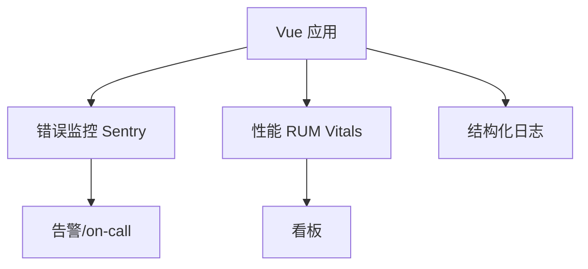

# 监控与排障

生产监控靠 `errorHandler` 加 Sentry 兜底；熟记 hydration、inject、动态 import 的高频错误。Source Map 上传平台，别公开暴露。

## 可观测性三层



| 层级 | 回答的问题 |
|------|------------|
| 错误 | 什么坏了、影响多少用户 |
| 性能 | 慢在哪里 |
| 日志 | 用户操作路径与业务上下文 |

---

## 全局错误捕获

```ts
// main.ts
import * as Sentry from '@sentry/vue';

const app = createApp(App);

Sentry.init({
  app,
  dsn: import.meta.env.VITE_SENTRY_DSN,
  integrations: [Sentry.browserTracingIntegration({ router })],
  tracesSampleRate: 0.1,
});

app.config.errorHandler = (err, instance, info) => {
  console.error(err, info);
  Sentry.captureException(err, {
    extra: {
      info,
      component: instance?.$?.type?.__name,
    },
  });
};

window.addEventListener('unhandledrejection', (e) => {
  Sentry.captureException(e.reason);
});
```

| 钩子 | 捕获 |
|------|------|
| `errorHandler` | 渲染/侦听器内同步错误 |
| `warnHandler` | 开发警告（可选上报） |
| `unhandledrejection` | 未处理 Promise |

---

## Source Map 策略

| 环境 | 建议 |
|------|------|
| 生产构建 | `hidden` 或 `hidden-source-map` |
| Sentry | 上传 map，浏览器不公开 |
| 内网 | 可保留 map 便于直连调试 |

```ts
// vite.config.ts
build: {
  sourcemap: 'hidden',
},
```

---

## Vue DevTools 生产排障

- 生产默认不加载 DevTools
- 内网调试可临时启用或通过 **vue-devtools 独立应用** 连接
- 检查：组件树、Pinia state、路由、性能时间线

**注意**：勿向公网用户暴露可写 DevTools。

---

## 常见运行时错误图谱

| 错误信息 | 常见原因 | 处理 |
|----------|----------|------|
| `Cannot read properties of null` | 异步数据未判空 | `v-if` / 可选链 |
| `Maximum call stack size exceeded` | 递归更新、循环依赖 | 查 watch 互相触发 |
| `Hydration mismatch` | SSR 双端不一致 | ClientOnly、统一数据 |
| `injection "xxx" not found` | 未 provide / 插件未安装 | 检查 app.use |
| `Failed to resolve component` | 未注册或自动导入失败 | 组件名、路径 |
| `Invalid vnode type` | 组件 import 为 undefined | 默认导出、异步失败 |

---

## 路由与异步 chunk 失败

用户发布新版本后旧 tab 懒加载 404：

```ts
router.onError((error, to) => {
  if (/Failed to fetch dynamically imported module/.test(error.message)) {
    window.location.href = to.fullPath;
  }
});
```

配合构建 **版本号轮询** 提示用户刷新。

---

## Pinia / 状态排障

```ts
// 开发环境订阅
if (import.meta.env.DEV) {
  const store = useUserStore();
  store.$subscribe((mutation, state) => {
    console.log('[pinia]', mutation.type, state);
  });
}
```

生产用 Sentry breadcrumb 记录关键 action，勿记录 PII。

---

## 网络与 API

```ts
// axios 拦截器统一上报
instance.interceptors.response.use(
  (res) => res,
  (err) => {
    Sentry.captureException(err, {
      tags: { api: err.config?.url, status: err.response?.status },
    });
    return Promise.reject(err);
  }
);
```

区分 4xx 业务错误与 5xx 基础设施错误。

---

## 用户会话复现

| 手段 | 说明 |
|------|------|
| Sentry Session Replay | 录屏式复现（注意隐私打码） |
| 用户 ID 关联 | `Sentry.setUser({ id })` |
| 请求 trace id | 前后端统一 header |
| 功能开关 | 缩小问题范围 |

---

## 告警与 SLI

| 指标 | 建议阈值（示例） |
|------|------------------|
| JS 错误率 | >0.1% 5min 告警 |
| LCP P75 | >2.5s |
| API 5xx | 环比 spike |

避免对已知第三方脚本错误过度告警（ignore 规则）。

---

## 本地复现步骤

同浏览器版本与 viewport；同登录角色与数据快照；关闭扩展干扰；`pnpm build && preview` 模拟生产；Network 禁用缓存对比。

---

## 小结

生产监控靠 `app.config.errorHandler` 与 Sentry 捕获未处理异常；`unhandledrejection` 兜底 Promise 错误。Source Map 用 `hidden` 构建，上传 Sentry 但不公开给浏览器。高频错误包括 hydration mismatch、inject 未 provide、动态 import 失败，后者可在 `router.onError` 中检测并刷新页面。DevTools 生产默认不加载；排障时结合用户 session 复现与 API 日志 trace id 关联。
