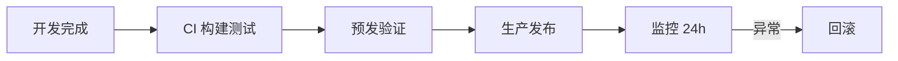

# 上线发布流程

上线前核对构建产物、环境变量、路由 fallback、监控、安全与回滚；SPA 和 Nuxt 按差异项验证，发布后 24 小时盯指标。

## 发布流程概览



---

## 构建与产物

`pnpm build` 无错误警告；`vue-tsc` 类型检查通过；单元测试与冒烟 E2E 通过。bundle 体积无异常膨胀；Source map 上传 Sentry。SPA 的 `index.html` 短缓存，静态资源 hash 长缓存；Nuxt 确认 `.output` 部署路径正确。

---

## 环境变量

生产 API 地址非 dev/staging；`.env.production` 敏感信息不提交仓库。`VITE_*` / `NUXT_PUBLIC_*` 与运维台账一致；服务端密钥仅在 Nitro `runtimeConfig` 私有字段。功能开关默认值符合生产策略。

---

## 路由与服务器

History 模式需 fallback 到 `index.html`；`BASE_URL` 与子路径部署正确。HTTPS 强制跳转；gzip/brotli 已启用；CDN 刷新或版本化路径。Nuxt 确认 `routeRules` prerender/ssr 符合预期。

```nginx
# SPA fallback 示例
location / {
  try_files $uri $uri/ /index.html;
}
```

---

## 安全

CSP 头已配置；`X-Frame-Options` / `frame-ancestors` 设置。Cookie 设 `Secure` `HttpOnly` `SameSite`。依赖 `pnpm audit` 无未处理高危；无裸 `v-html` 用户内容；CORS 非 `*` 带凭证。

---

## 性能与体验

Lighthouse 性能达团队基线；LCP 关键图 preload；路由懒加载生效。404 / 500 友好页；加载骨架屏或 Suspense fallback。favicon、meta、OG 标签完整。

---

## 监控与日志

Sentry DSN 指向生产项目；`release` 版本号与 git tag 一致。Web Vitals 上报；告警规则已启用。BFF 健康检查端点 `/healthz`（如有）；日志无 console.debug 泄漏敏感信息。

---

## 业务与数据

支付/下单等核心流程预发走通；权限角色矩阵抽样验证。国际化各语言抽检；时区与日期格式正确。第三方 SDK（统计、客服）使用生产 key。

---

## 回滚预案

上一稳定版镜像/包可一键部署；数据库迁移可逆或向前兼容。动态 import 失败刷新策略已上线；on-call 与升级窗口已通知；回滚演练在预发做过。

---

## 微前端额外项

remoteEntry URL 生产可达；主应用与子应用版本兼容；共享 vue 版本一致；子应用独立回滚不影响主壳。

---

## 发布后 24 小时

错误率对比发布前；LCP/INP 大盘；客服/运营反馈通道；关闭迁移 feature flag（如适用）；发布说明归档。

---

## 小结

上线前 prod build 通过，环境变量注入正确，无 dev 依赖泄漏。History 模式 SPA 需服务器 fallback；HTTPS 与安全头就绪。Sentry / RUM 监控与告警配置完成；保留上一版本 artifact 以便快速回滚。发布后 24h 盯错误率与 Web Vitals，微前端场景额外验证 remoteEntry 可达与 vue 版本一致。
