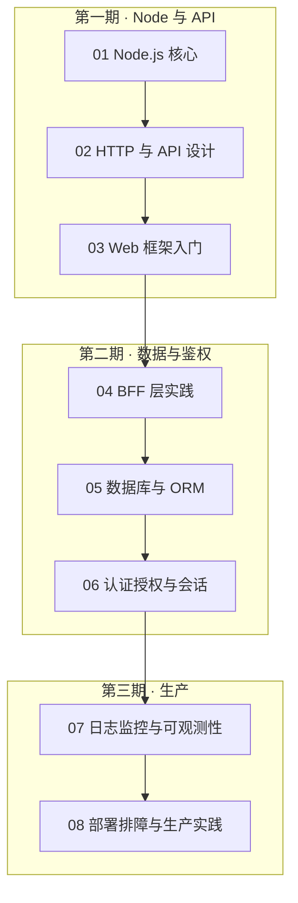

# 后端服务篇 · 阅读地图

> 从前端视角延伸到 **Node.js 与服务端**：运行时原理、HTTP/API、BFF、数据层与生产部署。各章独立成篇，开篇点题、文末 **小结**；正文用自然叙述串联概念、动机与做法。

**前置建议**：JavaScript（异步、模块、事件循环）→ TypeScript → [前端工程化体系](../前端工程化体系/00-阅读地图.md) 中的网络与安全基础 → 再进入本篇。

**与前端体系的衔接**：SSR/Nuxt/Next 的服务端逻辑、BFF 聚合、鉴权与会话，在本篇找通用后端视角；框架内 API 用法仍见 [React 14](../前端框架篇/React/14-服务端与元框架/) · [Vue 16](../前端框架篇/Vue/16-Nuxt与SSR/)。

---

## 阅读地图

| 区块 | 模块 | 内容侧重 | 状态 |
|------|------|----------|------|
| **P0 基础** | 01～03 | Node 运行时、HTTP/API、Express/Fastify | 待补充 |
| **P1 架构** | 04～06 | BFF、数据库、认证授权 | 待补充 |
| **P2 生产** | 07～08 | 可观测性、部署与排障 | 待补充 |

---

## 目录总览（规划）

---

## 模块索引（规划）

### 01 · Node.js 核心

| 文档 | 主题 | 状态 |
|------|------|------|
| 01-Node.js是什么与适用场景 | 定位、与浏览器 JS 差异 | 待写 |
| 02-事件循环与异步IO | event loop、libuv、宏微任务 | 待写 |
| 03-模块系统与包管理 | CommonJS/ESM、pnpm、Monorepo | 待写 |
| 04-Stream与Buffer | 流式处理、大文件、背压 | 待写 |

### 02 · HTTP 与 API 设计

| 文档 | 主题 | 状态 |
|------|------|------|
| 01-HTTP协议复习 | 方法、状态码、Header、缓存 | 待写 |
| 02-REST与API设计原则 | 资源、版本、错误体、分页 | 待写 |
| 03-OpenAPI与契约 | Swagger、类型生成、前后端协作 | 待写 |

### 03 · Web 框架入门

| 文档 | 主题 | 状态 |
|------|------|------|
| 01-Express基础 | 路由、中间件、错误处理 | 待写 |
| 02-Fastify与性能 |  schema、插件、对比 Express | 待写 |
| 03-NestJS概览 | 模块化、DI、适合中大型服务 | 待写 |

### 04 · BFF 层实践

| 文档 | 主题 | 状态 |
|------|------|------|
| 01-BFF是什么 | 聚合、裁剪、鉴权转发 | 待写 |
| 02-与Next-Nuxt服务端协作 | Route Handler、Server Routes | 待写 |
| 03-GraphQL作为BFF | 何时选、N+1、复杂度 | 待写 |

### 05 · 数据库与 ORM

| 文档 | 主题 | 状态 |
|------|------|------|
| 01-关系型基础 | SQL 复习、索引、事务 | 待写 |
| 02-Prisma-Drizzle | 建模、迁移、类型安全 | 待写 |
| 03-Redis与缓存 | 会话、限流、缓存策略 | 待写 |

### 06 · 认证授权与会话

| 文档 | 主题 | 状态 |
|------|------|------|
| 01-JWT与Session | 选型、刷新、存储 | 待写 |
| 02-OAuth2与OIDC | 第三方登录、Passport 思路 | 待写 |
| 03-RBAC与权限模型 | 角色、资源、前后端一致 | 待写 |

### 07 · 日志监控与可观测性

| 文档 | 主题 | 状态 |
|------|------|------|
| 01-结构化日志 | pino/winston、traceId | 待写 |
| 02-指标与健康检查 | Prometheus、/healthz | 待写 |
| 03-链路追踪 | OpenTelemetry 入门 | 待写 |

### 08 · 部署排障与生产实践

| 文档 | 主题 | 状态 |
|------|------|------|
| 01-Docker与进程管理 | 镜像、PM2、graceful shutdown | 待写 |
| 02-环境变量与配置 | 12-factor、secrets | 待写 |
| 03-常见生产问题 | 内存泄漏、连接池、超时 | 待写 |

---

## 推荐学习路径

| 目标 | 建议路径 |
|------|----------|
| 前端转全栈 | 01 Node 核心 → 02 HTTP → 03 Express → 04 BFF |
| 补 SSR 服务端 | 01 事件循环 → 04 BFF → 06 认证 |
| 独立 API 服务 | 02 REST → 03 NestJS → 05 数据库 → 08 部署 |

---

## 小结

后端服务篇规划 8 个模块，从前端自然延伸到 Node 运行时、API 设计、BFF、数据与鉴权、生产部署。当前为**目录占位**，正文待逐模块补充。

**易混点**：BFF 不是「把所有逻辑堆在 Node」；JWT 放 localStorage 的安全权衡需前后端一起看。

核对：是否已具备 JS 异步与 HTTP 基础？SSR 项目的服务端入口是否能在框架篇与本篇之间建立对照？
