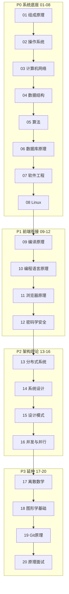

# 计算机基础篇 · 阅读地图

> 补全前端知识体系之下的 **计算机通识底座**：组成原理、操作系统、网络、数据结构、算法、数据库、编译与语言原理、浏览器、分布式、系统设计等。各章独立成篇，开篇点题、文末 **小结**；**正文不嵌跨章 md 链接**，单篇可离线阅读。

**规模**：**20 模块 / 136 篇**（✅ 已全部撰写）

**前置建议**：无硬性前置；可与 [前端基础体系](../前端基础体系/00-阅读地图.md) 并行阅读。

**与前端体系的衔接**：事件循环对照 OS 线程/进程；性能优化对照算法复杂度与 Cache 局部性；部署排障对照 Linux/网络；Diff/虚拟列表对照算法模块；面试原理题可经 [20-原理面试串联](#20-原理面试串联) 串讲。

---

## 阅读地图

| 区块 | 模块 | 内容侧重 | 篇数 | 状态 |
|------|------|----------|------|------|
| **P0 系统底座** | 01～08 | 组成、OS、网络、数据结构、算法、数据库、软工、Linux | 62 | ✅ |
| **P1 前端衔接** | 09～12 | 编译原理、语言原理、浏览器、密码学 | 24 | ✅ |
| **P2 架构理论** | 13～16 | 分布式、系统设计、设计模式、并发 | 29 | ✅ |
| **P3 延伸面试** | 17～20 | 离散数学、图形学、Git 原理、面试串联 | 22 | ✅ |

写法对齐 [JavaScript 体系](../前端基础体系/03-JavaScript体系.md)：**叙述 + 表格 + mermaid + 代码/示意**；篇均约 150 行，要点、易混点、核对题收束。

---

## 目录总览

---

## 模块索引

### 01 · 计算机组成原理

| 文档 | 主题 | 状态 |
|------|------|------|
| [01-计算机系统层次与性能度量](./01-计算机组成原理/01-计算机系统层次与性能度量.md) | Amdahl、局部性、性能指标 | ✅ |
| [02-数据的表示](./01-计算机组成原理/02-数据的表示.md) | 进制、补码、浮点 IEEE754 | ✅ |
| [03-CPU与指令执行](./01-计算机组成原理/03-CPU与指令执行.md) | 流水线、分支预测 | ✅ |
| [04-存储层次与Cache](./01-计算机组成原理/04-存储层次与Cache.md) | L1/L2/L3、命中率 | ✅ |
| [05-内存与IO系统](./01-计算机组成原理/05-内存与IO系统.md) | DMA、SSD/HDD 差异 | ✅ |
| [06-总线中断与外设](./01-计算机组成原理/06-总线中断与外设.md) | 总线、中断、外设概念 | ✅ |

### 02 · 操作系统

| 文档 | 主题 | 状态 |
|------|------|------|
| [01-OS概述与系统调用](./02-操作系统/01-OS概述与系统调用.md) | 内核态/用户态、syscall | ✅ |
| [02-进程与线程](./02-操作系统/02-进程与线程.md) | PCB、上下文切换、协程对照 | ✅ |
| [03-CPU调度算法](./02-操作系统/03-CPU调度算法.md) | FCFS、RR、优先级、多级反馈 | ✅ |
| [04-进程同步与死锁](./02-操作系统/04-进程同步与死锁.md) | 信号量、管程、死锁四条件 | ✅ |
| [05-内存管理](./02-操作系统/05-内存管理.md) | 分页、分段、虚拟内存 | ✅ |
| [06-文件系统与inode](./02-操作系统/06-文件系统与inode.md) | 目录树、inode、硬软链接 | ✅ |
| [07-IO多路复用](./02-操作系统/07-IO多路复用.md) | select/poll/epoll，对照 Node/浏览器 | ✅ |
| [08-虚拟化与容器底层](./02-操作系统/08-虚拟化与容器底层.md) | namespace、cgroup 概念 | ✅ |

### 03 · 计算机网络

| 文档 | 主题 | 状态 |
|------|------|------|
| [01-分层模型](./03-计算机网络/01-分层模型.md) | OSI vs TCP/IP、封装解封装 | ✅ |
| [02-物理层与数据链路层](./03-计算机网络/02-物理层与数据链路层.md) | 帧、MAC、ARP | ✅ |
| [03-IP与路由](./03-计算机网络/03-IP与路由.md) | IPv4/IPv6、子网、NAT | ✅ |
| [04-TCP详解](./03-计算机网络/04-TCP详解.md) | 握手挥手、滑动窗口、拥塞控制 | ✅ |
| [05-UDP与QUIC概览](./03-计算机网络/05-UDP与QUIC概览.md) | 无连接、QUIC 动机 | ✅ |
| [06-DNS原理与解析链](./03-计算机网络/06-DNS原理与解析链.md) | 递归/迭代、缓存 | ✅ |
| [07-HTTP机制](./03-计算机网络/07-HTTP机制.md) | HTTP/1.1、HTTP/2、HTTP/3 | ✅ |
| [08-HTTPS与TLS握手](./03-计算机网络/08-HTTPS与TLS握手.md) | 证书、对称/非对称混合 | ✅ |
| [09-Socket与WebSocket](./03-计算机网络/09-Socket与WebSocket.md) | 套接字、全双工 | ✅ |
| [10-抓包与网络排障](./03-计算机网络/10-抓包与网络排障.md) | Wireshark、curl 原理层 | ✅ |

> 浏览器侧缓存/CORS/同源见 [工程化 08](../前端工程化体系/08-浏览器与网络基础.md)；本篇偏协议栈与传输机制。

### 04 · 数据结构

| 文档 | 主题 | 状态 |
|------|------|------|
| [01-复杂度与抽象数据类型](./04-数据结构/01-复杂度与抽象数据类型.md) | 大 O、ADT | ✅ |
| [02-数组链表栈队列](./04-数据结构/02-数组链表栈队列.md) | 线性结构 | ✅ |
| [03-哈希表](./04-数据结构/03-哈希表.md) | 冲突、扩容、JS Map/Set | ✅ |
| [04-二叉树与BST](./04-数据结构/04-二叉树与BST.md) | 遍历、搜索 | ✅ |
| [05-堆与优先队列](./04-数据结构/05-堆与优先队列.md) | 大顶堆、TopK | ✅ |
| [06-平衡树与跳表](./04-数据结构/06-平衡树与跳表.md) | 红黑树、B+ 树概念 | ✅ |
| [07-图](./04-数据结构/07-图.md) | 存储、BFS/DFS | ✅ |
| [08-Trie并查集与前端选型](./04-数据结构/08-Trie并查集与前端选型.md) | Trie、Union-Find、业务选型 | ✅ |

### 05 · 算法与复杂度

| 文档 | 主题 | 状态 |
|------|------|------|
| [01-大O与主定理](./05-算法与复杂度/01-大O与主定理.md) | 复杂度分析 | ✅ |
| [02-排序算法对比](./05-算法与复杂度/02-排序算法对比.md) | 快排、归并、堆排 | ✅ |
| [03-二分与双指针](./05-算法与复杂度/03-二分与双指针.md) | 边界、左右夹逼 | ✅ |
| [04-滑动窗口与子串](./05-算法与复杂度/04-滑动窗口与子串.md) | 固定/可变窗口 | ✅ |
| [05-递归回溯与剪枝](./05-算法与复杂度/05-递归回溯与剪枝.md) | 排列组合、DFS | ✅ |
| [06-分治思想](./05-算法与复杂度/06-分治思想.md) | 归并、快排、最近点对 | ✅ |
| [07-贪心算法](./05-算法与复杂度/07-贪心算法.md) | 区间、堆贪心 | ✅ |
| [08-动态规划入门](./05-算法与复杂度/08-动态规划入门.md) | 状态转移、背包 | ✅ |
| [09-图算法](./05-算法与复杂度/09-图算法.md) | 拓扑、最短路概念 | ✅ |
| [10-前端相关算法](./05-算法与复杂度/10-前端相关算法.md) | Diff、虚拟列表、调度、LRU | ✅ |

### 06 · 数据库原理

| 文档 | 主题 | 状态 |
|------|------|------|
| [01-关系模型与ER设计](./06-数据库原理/01-关系模型与ER设计.md) | 表、键、范式 | ✅ |
| [02-SQL与关系代数](./06-数据库原理/02-SQL与关系代数.md) | 选择、投影、连接 | ✅ |
| [03-索引原理](./06-数据库原理/03-索引原理.md) | B+ 树、聚簇/非聚簇 | ✅ |
| [04-事务与ACID](./06-数据库原理/04-事务与ACID.md) | 原子性、持久性 | ✅ |
| [05-隔离级别与MVCC](./06-数据库原理/05-隔离级别与MVCC.md) | 脏读、幻读、版本链 | ✅ |
| [06-锁日志与崩溃恢复](./06-数据库原理/06-锁日志与崩溃恢复.md) | redo/undo、WAL | ✅ |
| [07-NoSQL与NewSQL选型](./06-数据库原理/07-NoSQL与NewSQL选型.md) | KV、文档、列存 | ✅ |

> Prisma/Redis 实操见 [后端 05](../后端服务篇/00-阅读地图.md)；本篇偏存储引擎与事务理论。

### 07 · 软件工程基础

| 文档 | 主题 | 状态 |
|------|------|------|
| [01-软件生命周期与开发模型](./07-软件工程基础/01-软件生命周期与开发模型.md) | 瀑布、敏捷、迭代 | ✅ |
| [02-需求分析与UML入门](./07-软件工程基础/02-需求分析与UML入门.md) | 用例、类图 | ✅ |
| [03-设计原则](./07-软件工程基础/03-设计原则.md) | SOLID、DRY、YAGNI | ✅ |
| [04-架构风格](./07-软件工程基础/04-架构风格.md) | 分层、MVC、事件驱动 | ✅ |
| [05-测试分类与质量属性](./07-软件工程基础/05-测试分类与质量属性.md) | 单元/集成/E2E、非功能需求 | ✅ |
| [06-技术债务与重构策略](./07-软件工程基础/06-技术债务与重构策略.md) | 识别、偿还、童子军规则 | ✅ |

### 08 · Linux 与 Shell

| 文档 | 主题 | 状态 |
|------|------|------|
| [01-Linux目录结构与权限](./08-Linux与Shell/01-Linux目录结构与权限.md) | rwx、chmod、chown | ✅ |
| [02-常用命令与管道](./08-Linux与Shell/02-常用命令与管道.md) | grep、awk、sed 入门 | ✅ |
| [03-Shell脚本基础](./08-Linux与Shell/03-Shell脚本基础.md) | 变量、条件、循环 | ✅ |
| [04-进程管理与systemd](./08-Linux与Shell/04-进程管理与systemd.md) | ps、kill、服务单元 | ✅ |
| [05-网络与服务排查](./08-Linux与Shell/05-网络与服务排查.md) | ss、curl、端口 | ✅ |
| [06-性能工具入门](./08-Linux与Shell/06-性能工具入门.md) | top、vmstat、perf | ✅ |
| [07-日志定时任务与运维](./08-Linux与Shell/07-日志定时任务与运维.md) | cron、journalctl、磁盘 | ✅ |

### 09 · 编译原理

| 文档 | 主题 | 状态 |
|------|------|------|
| [01-编译解释与转译](./09-编译原理/01-编译解释与转译.md) | 前端工具链定位 | ✅ |
| [02-词法分析与语法分析](./09-编译原理/02-词法分析与语法分析.md) | 正则、CFG、递归下降 | ✅ |
| [03-AST与遍历变换](./09-编译原理/03-AST与遍历变换.md) | 访问者、codemod 思路 | ✅ |
| [04-语义分析与类型检查](./09-编译原理/04-语义分析与类型检查.md) | 符号表、类型推导 | ✅ |
| [05-代码生成与优化](./09-编译原理/05-代码生成与优化.md) | IR、DCE、内联 | ✅ |
| [06-前端工具链对照](./09-编译原理/06-前端工具链对照.md) | Babel、SWC、Vue/React 编译 | ✅ |

> 交叉：[工程化 02](../前端工程化体系/02-模块化与构建层.md) · [Vue 07 编译渲染](../前端框架篇/Vue/07-编译渲染与更新机制/)

### 10 · 编程语言原理

| 文档 | 主题 | 状态 |
|------|------|------|
| [01-编程范式](./10-编程语言原理/01-编程范式.md) | 命令式、函数式、OO | ✅ |
| [02-类型系统](./10-编程语言原理/02-类型系统.md) | 静态/动态、强/弱 | ✅ |
| [03-作用域闭包与内存模型](./10-编程语言原理/03-作用域闭包与内存模型.md) | 词法作用域、栈/堆 | ✅ |
| [04-垃圾回收算法](./10-编程语言原理/04-垃圾回收算法.md) | 标记清除、分代、引用计数 | ✅ |
| [05-运行时与V8概览](./10-编程语言原理/05-运行时与V8概览.md) | Ignition、TurboFan | ✅ |
| [06-JS与TS在语言谱系中的位置](./10-编程语言原理/06-JS与TS在语言谱系中的位置.md) | 动态语言 + 渐进类型 | ✅ |

### 11 · 浏览器工作原理

| 文档 | 主题 | 状态 |
|------|------|------|
| [01-浏览器多进程架构](./11-浏览器工作原理/01-浏览器多进程架构.md) | Browser/Renderer/GPU 进程 | ✅ |
| [02-URL到首字节](./11-浏览器工作原理/02-URL到首字节.md) | DNS/TCP/TLS/HTTP 串联 | ✅ |
| [03-HTML解析与DOM树](./11-浏览器工作原理/03-HTML解析与DOM树.md) | 解析器、DOM 构建 | ✅ |
| [04-CSS解析与渲染树](./11-浏览器工作原理/04-CSS解析与渲染树.md) | CSSOM、Render Tree | ✅ |
| [05-布局绘制合成与GPU](./11-浏览器工作原理/05-布局绘制合成与GPU.md) | Layout/Paint/Composite | ✅ |
| [06-JS引擎与事件循环](./11-浏览器工作原理/06-JS引擎与事件循环.md) | 对照 OS 线程、宏微任务 | ✅ |
| [07-安全模型](./11-浏览器工作原理/07-安全模型.md) | 同源、Site Isolation | ✅ |

### 12 · 密码学与安全原理

| 文档 | 主题 | 状态 |
|------|------|------|
| [01-哈希盐与HMAC](./12-密码学与安全原理/01-哈希盐与HMAC.md) | SHA、bcrypt、消息认证 | ✅ |
| [02-对称与非对称加密](./12-密码学与安全原理/02-对称与非对称加密.md) | AES、RSA 概念 | ✅ |
| [03-数字签名与证书链](./12-密码学与安全原理/03-数字签名与证书链.md) | CA、PKI | ✅ |
| [04-密钥交换与TLS原理层](./12-密码学与安全原理/04-密钥交换与TLS原理层.md) | ECDHE、混合加密 | ✅ |
| [05-常见攻击模型](./12-密码学与安全原理/05-常见攻击模型.md) | MITM、重放、彩虹表 | ✅ |

> XSS/CSRF/CSP 实践见 [工程化 07](../前端工程化体系/07-前端安全体系.md)；本篇偏密码学底座。

### 13 · 分布式系统

| 文档 | 主题 | 状态 |
|------|------|------|
| [01-分布式挑战与CAP](./13-分布式系统/01-分布式挑战与CAP.md) | 分区、可用、一致 | ✅ |
| [02-一致性与副本](./13-分布式系统/02-一致性与副本.md) | 强一致、最终一致 | ✅ |
| [03-分布式事务](./13-分布式系统/03-分布式事务.md) | 2PC、TCC、Saga 概念 | ✅ |
| [04-消息队列与异步通信](./13-分布式系统/04-消息队列与异步通信.md) | 解耦、削峰、顺序 | ✅ |
| [05-负载均衡与服务发现](./13-分布式系统/05-负载均衡与服务发现.md) | LB 算法、注册中心 | ✅ |
| [06-分布式缓存与CDN原理](./13-分布式系统/06-分布式缓存与CDN原理.md) | 一致性哈希、边缘节点 | ✅ |
| [07-微服务vs单体](./13-分布式系统/07-微服务vs单体.md) | 理论层，对照 [工程化 09](../前端工程化体系/09-微前端与模块联邦.md) | ✅ |

### 14 · 系统设计

| 文档 | 主题 | 状态 |
|------|------|------|
| [01-系统设计方法论与估算](./14-系统设计/01-系统设计方法论与估算.md) | QPS、存储、带宽毛估 | ✅ |
| [02-缓存设计](./14-系统设计/02-缓存设计.md) | 穿透、击穿、雪崩 | ✅ |
| [03-数据库扩展](./14-系统设计/03-数据库扩展.md) | 读写分离、分库分表 | ✅ |
| [04-限流熔断与降级](./14-系统设计/04-限流熔断与降级.md) | 令牌桶、断路器 | ✅ |
| [05-秒杀热点与高并发](./14-系统设计/05-秒杀热点与高并发.md) | 队列、库存、幂等 | ✅ |
| [06-经典题型](./14-系统设计/06-经典题型.md) | 短链、Feed、IM | ✅ |
| [07-搜索与推荐概览](./14-系统设计/07-搜索与推荐概览.md) | 倒排、召回排序 | ✅ |
| [08-设计评审与ADR写作](./14-系统设计/08-设计评审与ADR写作.md) | 方案文档、权衡记录 | ✅ |

### 15 · 设计模式

| 文档 | 主题 | 状态 |
|------|------|------|
| [01-设计模式总览](./15-设计模式/01-设计模式总览.md) | GoF 分类、SOLID 关系 | ✅ |
| [02-创建型模式](./15-设计模式/02-创建型模式.md) | 单例、工厂、建造者 | ✅ |
| [03-结构型模式](./15-设计模式/03-结构型模式.md) | 适配器、装饰、代理、外观 | ✅ |
| [04-行为型模式](./15-设计模式/04-行为型模式.md) | 观察者、策略、状态、命令 | ✅ |
| [05-前端常用模式](./15-设计模式/05-前端常用模式.md) | HOC、Render Props、Compound | ✅ |
| [06-反模式与过度设计](./15-设计模式/06-反模式与过度设计.md) | 金锤、上帝对象 | ✅ |
| [07-模式与React-Vue对照](./15-设计模式/07-模式与React-Vue对照.md) | 组件层映射 | ✅ |
| [08-模式选型决策树](./15-设计模式/08-模式选型决策树.md) | 何时引入模式 | ✅ |

### 16 · 并发与并行

| 文档 | 主题 | 状态 |
|------|------|------|
| [01-并发并行与异步](./16-并发与并行/01-并发并行与异步.md) | 概念辨析 | ✅ |
| [02-竞态条件与内存可见性](./16-并发与并行/02-竞态条件与内存可见性.md) | happens-before | ✅ |
| [03-锁无锁与CAS](./16-并发与并行/03-锁无锁与CAS.md) | mutex、自旋、CAS | ✅ |
| [04-线程池与Worker模型](./16-并发与并行/04-线程池与Worker模型.md) | 池化、Web Worker | ✅ |
| [05-JS并发模型](./16-并发与并行/05-JS并发模型.md) | Event Loop、Worker、Atomics | ✅ |
| [06-并发Bug排查思路](./16-并发与并行/06-并发Bug排查思路.md) | 复现、工具、防御 | ✅ |

### 17 · 离散数学与逻辑

| 文档 | 主题 | 状态 |
|------|------|------|
| [01-集合映射与关系](./17-离散数学与逻辑/01-集合映射与关系.md) | 交并补、等价关系 | ✅ |
| [02-命题逻辑与证明](./17-离散数学与逻辑/02-命题逻辑与证明.md) | 逆否、反证 | ✅ |
| [03-图论基础](./17-离散数学与逻辑/03-图论基础.md) | 图、路径、连通性，对照数据结构/算法 | ✅ |
| [04-组合与概率入门](./17-离散数学与逻辑/04-组合与概率入门.md) | 排列组合、期望 | ✅ |
| [05-算法题中的数学工具](./17-离散数学与逻辑/05-算法题中的数学工具.md) | 快速幂、模运算 | ✅ |

### 18 · 计算机图形学基础

| 文档 | 主题 | 状态 |
|------|------|------|
| [01-坐标系矢量与矩阵变换](./18-计算机图形学基础/01-坐标系矢量与矩阵变换.md) | 平移旋转缩放 | ✅ |
| [02-光栅化与抗锯齿](./18-计算机图形学基础/02-光栅化与抗锯齿.md) | 像素、采样 | ✅ |
| [03-颜色空间与Gamma](./18-计算机图形学基础/03-颜色空间与Gamma.md) | sRGB、线性空间 | ✅ |
| [04-Canvas2D渲染管线](./18-计算机图形学基础/04-Canvas2D渲染管线.md) | 路径、状态栈 | ✅ |
| [05-WebGL与GPU渲染概览](./18-计算机图形学基础/05-WebGL与GPU渲染概览.md) | 着色器、缓冲区 | ✅ |

### 19 · Git 与版本控制原理

| 文档 | 主题 | 状态 |
|------|------|------|
| [01-版本控制演化](./19-Git与版本控制原理/01-版本控制演化.md) | CVCS vs DVCS | ✅ |
| [02-Git对象模型](./19-Git与版本控制原理/02-Git对象模型.md) | blob、tree、commit | ✅ |
| [03-分支合并与DAG](./19-Git与版本控制原理/03-分支合并与DAG.md) | merge、fast-forward | ✅ |
| [04-rebase与merge原理层](./19-Git与版本控制原理/04-rebase与merge原理层.md) | 重写历史 vs 保留 | ✅ |
| [05-工作流概念](./19-Git与版本控制原理/05-工作流概念.md) | Git Flow、Trunk Based | ✅ |

> Husky/CI 工作流见 [工程化 04/05](../前端工程化体系/04-代码规范与质量保障.md)；本篇写 Git 内在模型。

### 20 · 原理面试串联

| 文档 | 主题 | 状态 |
|------|------|------|
| [01-面试答题框架](./20-原理面试串联/01-面试答题框架.md) | 是什么/为什么/怎么做/trade-off | ✅ |
| [02-网络OS高频题串讲](./20-原理面试串联/02-网络OS高频题串讲.md) | TCP、进程线程、内存 | ✅ |
| [03-数据结构算法高频模式](./20-原理面试串联/03-数据结构算法高频模式.md) | 双指针、DP、二叉树 | ✅ |
| [04-浏览器JS原理高频题](./20-原理面试串联/04-浏览器JS原理高频题.md) | 事件循环、渲染、闭包 | ✅ |
| [05-系统设计白板题套路](./20-原理面试串联/05-系统设计白板题套路.md) | 估算、画图、扩展 | ✅ |
| [06-错题本与知识串联法](./20-原理面试串联/06-错题本与知识串联法.md) | 如何复盘 | ✅ |

---

## 推荐学习路径

| 目标 | 建议路径 |
|------|----------|
| **面试原理补强** | 02 OS → 03 网络 → 04/05 数据结构算法 → 20 面试串联 |
| **前端性能底层** | 01 Cache/局部性 → 05 复杂度 → 11 浏览器 → 05-10 前端算法 |
| **全栈/部署** | 03 网络 → 06 数据库 → 08 Linux → 13 分布式 |
| **架构设计** | 07 软工 → 15 设计模式 → 14 系统设计 → 13 分布式 |
| **编译/语言深入** | 09 编译 → 10 语言原理 → 11 浏览器 → 16 并发 |

---

## 各模块篇数

| 模块 | 篇数 | 模块 | 篇数 |
|------|------|------|------|
| 01 组成原理 | 6 | 11 浏览器原理 | 7 |
| 02 操作系统 | 8 | 12 密码学安全 | 5 |
| 03 计算机网络 | 10 | 13 分布式系统 | 7 |
| 04 数据结构 | 8 | 14 系统设计 | 8 |
| 05 算法与复杂度 | 10 | 15 设计模式 | 8 |
| 06 数据库原理 | 7 | 16 并发与并行 | 6 |
| 07 软件工程 | 6 | 17 离散数学 | 5 |
| 08 Linux | 7 | 18 图形学基础 | 5 |
| 09 编译原理 | 6 | 19 Git 原理 | 5 |
| 10 语言原理 | 6 | 20 面试串联 | 6 |

---

## 与现有篇章的分工

| 主题 | 计算机基础篇 | 已有篇章 |
|------|--------------|----------|
| HTTP 缓存/CORS | 03-07 协议机制 | [工程化 08](../前端工程化体系/08-浏览器与网络基础.md) 浏览器实践 |
| JS 事件循环 | 02-07 / 11-06 / 16-05 | [基础 JS 03](../前端基础体系/03-JavaScript体系.md) |
| XSS/CSRF | 12 密码学 + 11-07 安全模型 | [工程化 07](../前端工程化体系/07-前端安全体系.md) 防护实践 |
| 数据库使用 | 06 原理 | [后端 05](../后端服务篇/00-阅读地图.md) ORM/Redis |
| Git/Husky | 19 原理 | [工程化 04/05](../前端工程化体系/04-代码规范与质量保障.md) 工作流 |
| Diff/虚拟列表 | 05-10 | [React 11](../前端框架篇/React/11-性能优化/) / [Vue 20](../前端框架篇/Vue/20-跨端与生产实践/) |
| 微服务 | 13-07 理论 | [工程化 09](../前端工程化体系/09-微前端与模块联邦.md) 集成 |
| 测试方法论 | 07-05 分类 | [工程化 13](../前端工程化体系/13-前端测试方法论.md) 通识 |

**原则**：本篇偏「为什么」与通用模型；工程化/框架/后端篇偏「怎么做」。

---

## 小结

计算机基础篇 **20 模块 / 136 篇**已全部撰写，可按 P0→P3 或上文学习路径选读；导航链接仅在本阅读地图与「与现有篇章的分工」中保留。

**易混点**：应用层 HTTP 不能替代 TCP/TLS 原理；会写 SQL 不等于理解索引与 MVCC；设计模式不是越多越好。

核对：读某主题时是否先确认「原理在本篇、实践在工程化/框架/后端」？面试复习是否经 20 模块串讲而非孤立背题？
