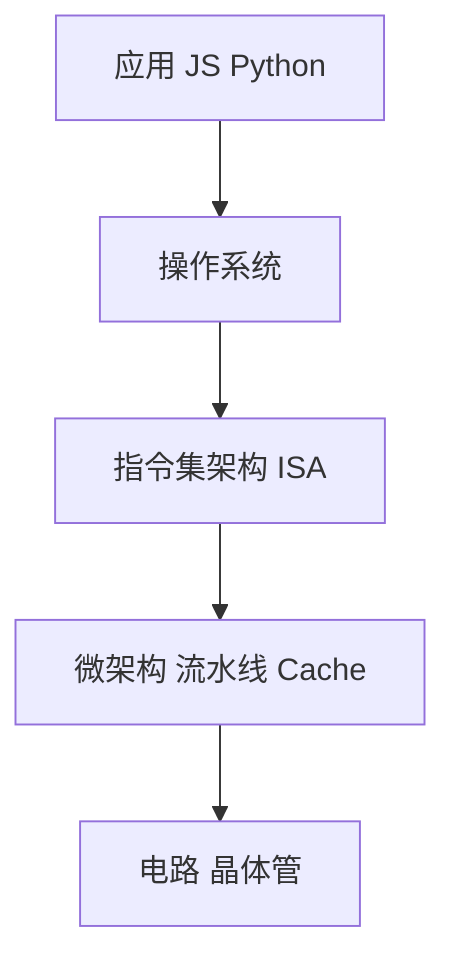
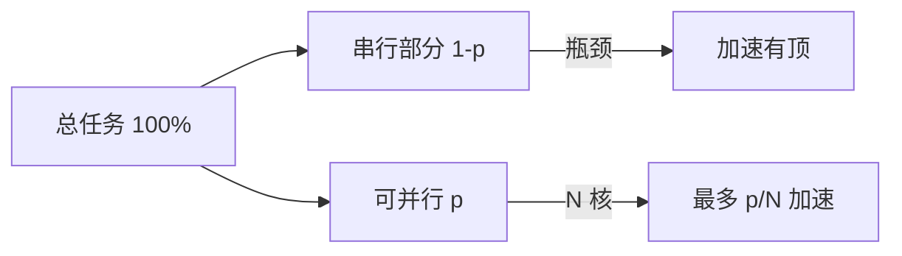
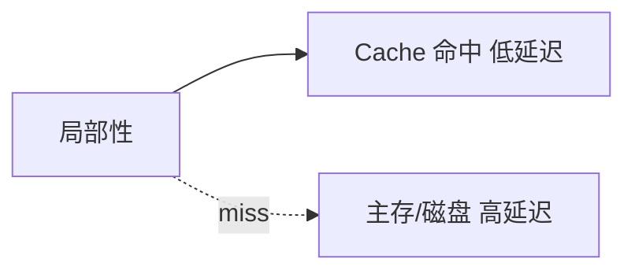
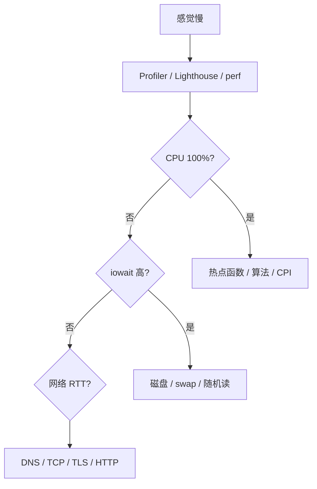

# 计算机系统层次与性能度量

从晶体管到业务接口，计算机被拆成多层抽象；**性能瓶颈落在哪一层，优化手段就不同**。Amdahl 定律、局部性与 CPI/吞吐量，是把「感觉慢」变成可量化分析的基础。

---

## 系统层次结构

现代计算机按职责分层：上层用下层提供的能力，不必关心更底层的实现细节。对前端而言，页面卡顿可能来自 React 渲染（应用层）、V8 GC（运行时）、缺页中断（OS）或 Cache miss（硬件），分层有助于缩小排查范围。



| 层次 | 关注点 | 前端相关例子 |
|------|--------|--------------|
| **应用** | 算法、框架、打包 | React 渲染、chunk 体积 |
| **OS/运行时** | 调度、I/O、内存 | Node 事件循环、V8 GC |
| **ISA** | 机器指令语义 | x86-64、ARM64 |
| **微架构** | 流水线、分支预测、Cache | 同频不同代 CPU 性能差 |
| **电路** | 频率、功耗、散热 | 笔记本降频、电池模式 |

同一 ISA 上可以有多种微架构实现：Intel 大小核、Apple M 系列、AMD Zen 各代，跑同一份 x86/ARM 二进制，实际 IPC 和功耗曲线却不同。

**指令集 vs 微架构**：ISA 规定「`add` 做什么」；微架构决定「这条 `add` 几个周期、能否与下一条并行」。买 CPU 看的不只是主频，微架构、核心数、Cache 容量与带宽同样决定吞吐。

---

## 性能度量：响应时间与吞吐

性能讨论里常混用三个维度：**单次任务耗时**（延迟）、**单位时间完成量**（吞吐）、**CPU 真正执行时间**（与 wall-clock 可能不一致）。

| 指标 | 含义 | 场景 |
|------|------|------|
| **响应时间 / 延迟** | 完成一次任务耗时 | 首屏 LCP、API P99 |
| **吞吐 / 带宽** | 单位时间完成任务数 | QPS、网络 Mbps |
| **CPU 时间** | 指令在 CPU 上执行的时间 | 不含等磁盘、等网络的空闲 |

```plaintext
CPU 时间 = 指令数 × CPI × 时钟周期
```

| 符号 | 全称 | 说明 |
|------|------|------|
| **CPI** | Cycles Per Instruction | 每条指令平均周期；Cache miss、分支失误会拉高 CPI |
| **IPC** | Instructions Per Cycle | CPI 的倒数，越高越好 |

**示例**：某段 JS 编译后执行 10⁹ 条指令，CPI=2，主频 3 GHz → CPU 时间 ≈ 10⁹×2 / 3×10⁹ ≈ **0.67 s**（不含 I/O 等待）。

Wall-clock 时间 = CPU 时间 + 等待时间（I/O、锁、调度）。用户感知的是 wall-clock；Profiler 里要分清 `Scripting` 与 `Idle`/`System`。

```javascript
// performance.now() 量 wall-clock；Profiler 的 CPU 列更接近算力占用
const t0 = performance.now();
heavyCompute();
console.log('wall', performance.now() - t0);
```

| 观测工具 | 看什么 |
|----------|--------|
| Chrome Performance | Main 线程 Scripting vs Idle |
| Lighthouse TBT | 长任务阻塞主线程 |
| Node `--prof` / clinic | V8 与 libuv 时间分布 |
| Linux `perf stat` | 硬件 CPI、cache-misses |

---

## Amdahl 定律

并行优化有上限：加速比受**不可并行部分**制约。加 Worker、开 cluster、上多核打包，都要先估算串行占比。

```plaintext
加速比 S = 1 / ((1 - p) + p / N)
```

- `p`：可并行部分占比  
- `N`：并行度（核心数、Worker 数）

| p（可并行占比） | N=4 | N=8 | 启示 |
|-----------------|-----|-----|------|
| 50% | 1.6× | 1.78× | 一半串行，加核收益有限 |
| 90% | 3.08× | 4.71× | 先砍串行瓶颈 |
| 95% | 3.48× | 6.15× | 并行度高时仍受 5% 串行封顶 |

当 N→∞ 且 p=0.2 时，最大加速比 = 1/(1-0.2) = **1.25×**，80% 串行时，再多核也白搭。

**前端映射**：

| 场景 | Amdahl 视角 |
|------|-------------|
| Webpack 多进程打包 | 解析/插件若占 40% 且难并行，整体加速有顶 |
| Worker 跑 CPU 密集 | 主线程序列化、postMessage 属于串行部分 |
| Node cluster | 多进程适合 CPU 密集 API；I/O 密集常单进程 + 异步更划算 |



---

## 局部性原理

程序访问指令和数据时，往往**刚用过的还会再用**（时间局部性），**相邻地址即将被访问**（空间局部性）。Cache、预取、OS 页缓存都建立在这两条规律上。

| 类型 | 含义 | 典型 |
|------|------|------|
| **时间** | 刚用过的还会再用 | 循环变量、热函数、闭包捕获 |
| **空间** | 相邻地址即将访问 | 数组顺序遍历、连续 Buffer |



违背局部性的写法会直接反映为 CPI 上升：随机跳读大表、链表指针追逐、频繁分配小对象导致堆分散。

```javascript
// 顺序访问 — Cache 友好
for (let i = 0; i < arr.length; i++) sum += arr[i];

// 随机索引大数组 — 每跳一次可能新 Cache line
for (const id of randomIds) total += bigTable[id];

// 对象数组 vs 结构体数组（TypedArray 模拟 SoA）
// AoS: [{x,y}, ...]  改 x 时 y 也在同一对象，但遍历单字段不友好
// SoA: xs[], ys[]     遍历 xs 时空间局部性好
```

---

## 性能分析分层思路

遇到「慢」，先量再猜：



| 现象 | 组成原理视角 |
|------|--------------|
| 同样算法，M1 比旧本快 | 微架构 + 内存带宽 + 大 L2/L3 |
| `JSON.parse` 大文件卡主线程 | 高 CPI + 单线程 = 长 wall-clock |
| 构建 CPU 100%、磁盘空闲 | 计算 bound；加内存/help 有限 |
| 构建磁盘 100%、CPU 低 | I/O bound；换 SSD、减随机读 |
| Lighthouse TBT 高 | 长任务占满时间片，与 OS 调度叠加 |

---

## 与前端/Node 的衔接

| 层级 | 典型优化 |
|------|----------|
| 应用 | 减渲染次数、虚拟列表、代码分割 |
| 运行时 | 避免 mega 对象、控制闭包捕获 |
| OS | 异步 I/O、Worker 隔离 CPU 密集 |
| 硬件 | 顺序访问、紧凑数据结构 |

性能分析宜分层：**先量**（Profiler、Lighthouse、`perf`），**再定位** CPU、内存带宽还是 I/O，**最后**对症优化。

---

## 基准测试与对比陷阱

跑分前确认对比条件一致，否则数字没有参考价值：

| 变量 | 为何重要 |
|------|----------|
| 冷/热启动 | 首次执行含 JIT 编译 |
| 电源模式 | 笔记本电池模式降频 |
| 后台进程 | 抢占 CPU 与内存带宽 |
| 输入规模 | O(n) 算法 n 不同不可比 |

```javascript
// 微基准要预热 + 多次取中位数
function bench(fn, warmup = 10, runs = 100) {
  for (let i = 0; i < warmup; i++) fn();
  const times = [];
  for (let i = 0; i < runs; i++) {
    const t0 = performance.now();
    fn();
    times.push(performance.now() - t0);
  }
  times.sort((a, b) => a - b);
  return times[Math.floor(times.length / 2)];
}
```

---

## 小结

计算机从应用到晶体管分层抽象；**CPU 时间 = 指令数 × CPI × 周期**。Amdahl 定律说明并行加速有顶；**局部性**决定 Cache 与预取效果，是写高性能代码的隐含前提。

**易混点**：吞吐高 ≠ 延迟低（批处理 vs 交互）；主频高 ≠ CPI 低；Wall time 含 I/O 等待，不等于 CPU 时间；加核不能消除串行瓶颈；IPC 与 CPI 互为倒数。

核对：Amdahl 中 p=0.2、N=∞ 时最大加速比多少？为何顺序遍历数组通常比随机访问快？CPI 与 IPC 什么关系？`performance.now()` 量的是 CPU 时间还是 wall-clock？
