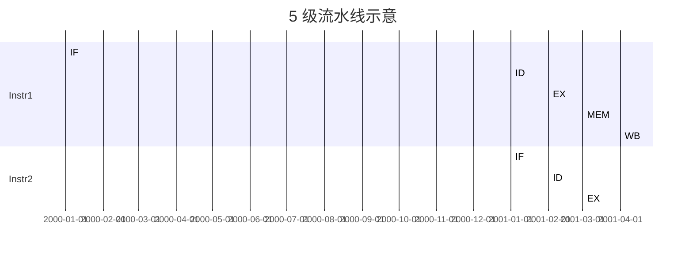
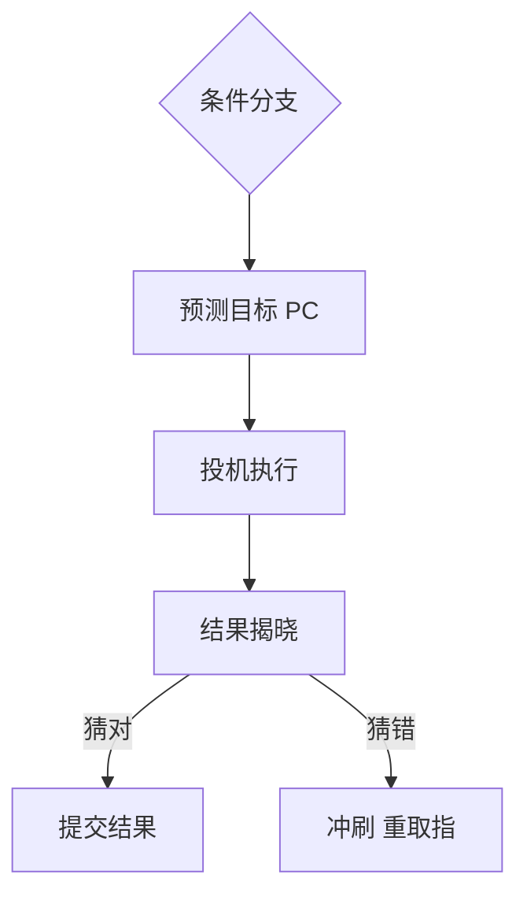
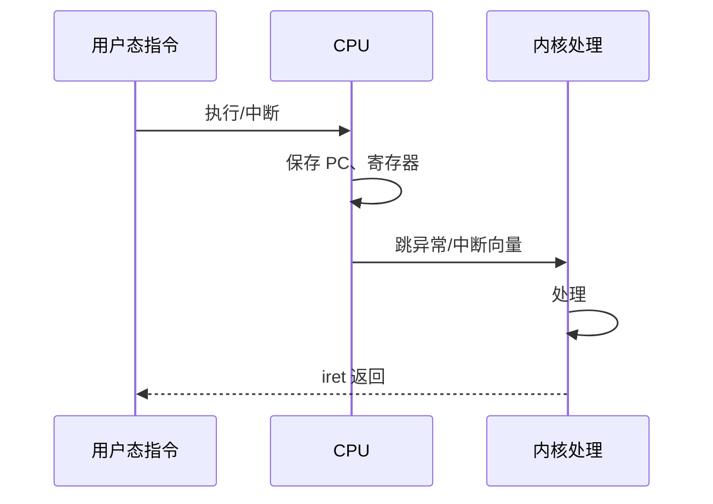

# CPU 与指令执行

CPU 按**取指 → 译码 → 执行 → 访存 → 写回**循环跑指令；现代芯片用**流水线**重叠各阶段，并用**分支预测**掩盖跳转代价。懂这些，才能理解「分支多、指针跳」为何拖慢 JS 热点路径。

---

## 指令周期与 ISA

每条机器指令经历固定阶段。高级语言一行代码往往对应多条 load/store/add 指令；V8 编译后热点函数才是 CPU 真正反复执行的机器码。


| 概念 | 说明 |
|------|------|
| **ISA** | 指令集（x86-64、ARM、RISC-V）；软件可见的 CPU 语言 |
| **微架构** | 同一 ISA 的不同实现（Intel 大小核、Apple M 系列） |
| **CPI / IPC** | 每指令周期数或其倒数；流水线满负荷时 IPC 可 >1 |

汇编与高级语言的映射（示意）：

```plaintext
C:  a = b + c;
    load b → register
    load c → register
    add
    store → a
```

V8 路径：源码 → Ignition 字节码 → TurboFan 优化机器码。热点函数体积与布局影响 **I-Cache** 命中，指令越紧凑、跳转越少，取指阶段 stall 越少。

---

## 流水线

将指令拆成多级，**不同指令的不同阶段同时占用硬件**，理想情况下每周期 retire 一条指令。



| hazard | 原因 | 处理 |
|---------|------|------|
| **结构** | 同一硬件资源冲突 | 多端口、分资源 |
| **数据** | 读后写、写后读依赖 | 旁路 forwarding |
| **控制** | 分支/跳转目标未知 | 预测 + 冲刷 pipeline |

**气泡（bubble）**：依赖未满足或预测失败时流水线插入空泡，CPI 上升。数据 hazard 靠 forwarding 缓解；控制 hazard 靠分支预测。

---

## 分支预测

条件分支的目标地址要等比较结果出来才知道。现代 CPU 在结果揭晓前**投机执行**预测路径，猜错则冲刷流水线（常 10–20 周期）。



| 类型 | 说明 |
|------|------|
| **静态** | 编译器 hint；向后跳默认 taken |
| **动态** | 分支历史表 BHT、两级自适应预测 |
| **代价** | 猜错丢弃投机结果，浪费流水线深度 |

**对代码的影响**：

```javascript
// 可预测：几乎总是 true
for (let i = 0; i < n; i++) if (flag) sum++;

// 难预测：近似随机分支
for (const x of data) if (hash(x) & 1) a++; else b++;
```

排序、分桶、减少不可预测分支有时比少几条指令更有效，但前端业务里**算法复杂度**通常仍优先于微优化。

---

## 超标量、乱序与多核

| 技术 | 作用 |
|------|------|
| **超标量** | 同一周期发射多条指令到不同执行单元 |
| **乱序执行** | 在保持程序语义前提下重排，填流水线空泡 |
| **多核** | 真并行；需 OS 调度器分配时间片 |
| **SMT 超线程** | 一物理核两个逻辑核，共享执行单元 |

**易混点（概念层）**：

- **超线程**：逻辑核数翻倍，执行单元未翻倍，CPU 密集任务常只有 1.2–1.3× 收益。
- **Worker 线程**：OS 级调度到不同核；与 JS 主线程通信有序列化成本（Amdahl 定律：并行收益受串行部分限制）。

---

## SIMD 与向量化

**SIMD**（单指令多数据）一条指令对多个数据 lane 做相同运算，常见于多媒体与数值库。

| 扩展 | 平台 | 典型宽度 |
|------|------|----------|
| SSE/AVX | x86 | 128～512 bit |
| NEON | ARM | 128 bit |
| WASM SIMD | 跨平台 | 128 bit lane |

```javascript
// JS 层通常依赖引擎或 WASM；手写 SIMD 多在 C++/Rust/Wasm
// 例：图像像素批量加、矩阵点乘
```

Canvas 滤镜、音视频编解码、机器学习推理在 native 层大量用 SIMD；纯 JS 热点往往靠 V8 自动向量化或下沉到 WASM。

---

## 异常、中断与特权级

CPU 执行中遇到**异常**（缺页、除零、非法指令）或收到**中断**（定时器、外设 IRQ）会：



| 事件 | 同步/异步 | 例子 |
|------|-----------|------|
| 异常 | 同步 | 缺页、除零 |
| 中断 IRQ | 异步 | 网卡收包、定时器 |
| 系统调用 | 主动陷入 | read/write |

syscall 与异常共用类似的**特权级切换**路径：用户态不能直接写设备寄存器，必须陷进内核。

---

## 取指带宽与 I-Cache

取指阶段从 **L1I** 读机器码；函数体过大或跳转分散会导致 **I-Cache miss**，取指 stall 叠加执行 stall。

| 因素 | 影响 |
|------|------|
| 函数体积 | 热点 loop 超过 L1I 容量则 miss |
| 间接跳转 | `switch`、虚表、多态 call 难预取 |
| JIT 代码 | TurboFan 生成块可能分散在代码堆 |

Profiler 里若 **frontend bound** 或 **ICache miss** 高，先查是否分支过多、函数是否内联失败，再考虑算法层优化。

---

## 与前端/Node 的衔接

| 场景 | CPU 视角 |
|------|----------|
| 长任务阻塞主线程 | 单核上 CPI×指令数 占满时间片 |
| `switch` 超大枚举 | 跳转表 vs 链式分支，预测与 I-Cache |
| React 大量小组件 | 函数调用多、间接跳转，V8 内联/单态化 |
| WASM 数值计算 | 接近原生指令，少边界检查 |
| `JSON.parse` | 分支多、内存分配多，CPI 与带宽双高 |

优化顺序：Profiler 确认热点 → 降算法复杂度 → 减分配 → 最后才考虑分支/Cache 微优化。CPU 密集任务考虑 **Worker / WASM / 服务端** offload。

```javascript
// 分片避免长时间占满时间片（协作式让出）
function chunk(n, deadlineMs) {
  const end = performance.now() + deadlineMs;
  while (n > 0 && performance.now() < end) { /* unit */ n--; }
  if (n > 0) queueMicrotask(() => chunk(n, deadlineMs));
}
```

---

## 性能计数器与观测

Linux **perf**、浏览器 **Performance** 面板、Node `--prof` 都能间接反映 CPU 行为：

| 指标 | 含义 |
|------|------|
| cycles / instructions | IPC 粗算 |
| cache-misses | 数据/指令 Cache |
| branch-misses | 分支预测失败 |

```bash
perf stat -e cycles,instructions,cache-misses,branch-misses node app.js
```

前端 Performance 里 **Scripting / Rendering** 高不一定等于 CPI 高，但长时间 **Long Task** 通常对应主线程指令流占满调度时间片。

---

## 小结

指令经多级流水线执行；**数据/控制 hazard** 和**分支预测失败**拉高 CPI。超标量与多核提供并行，但 JS 主线程仍是单线程事件模型。

**易混点**：流水线 ≠ 多核；分支预测失败只影响性能不影响正确性；主频高但 IPC 低仍可能慢；超线程 ≠ 双倍物理核；SIMD 需引擎/WASM 支持，不是写 JS 就自动向量化。

核对：控制 hazard 由什么引起？为何随机 if/else 可能比顺序累加更慢？IF 阶段在做什么？syscall 与异常在特权级切换上有何相似？
