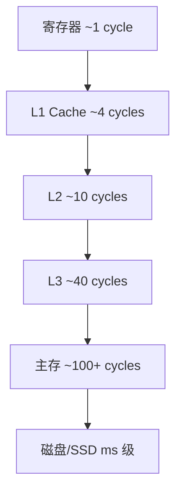
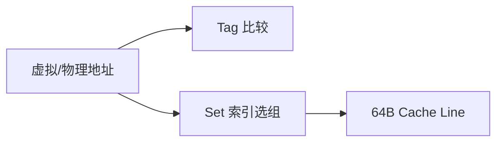
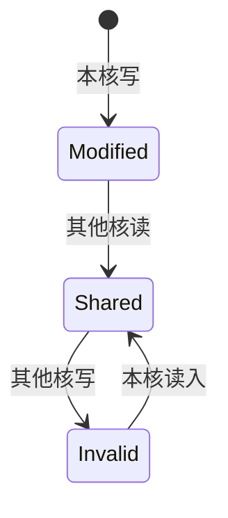

# 存储层次与 Cache

CPU 与主存速度差距可达两个数量级，靠 **Cache 层次**（L1/L2/L3）和**局部性**掩盖延迟。命中率差几个百分点，整体性能可差一截，数组 vs 链表、对象形状、打包 chunk 分割都与此有关。

---

## 存储金字塔

越靠近 CPU 的存储越快、越小、越贵；越往下容量越大、延迟越高。程序员写的每一行 JS，最终都落在这一金字塔的某一层上被访问。



| 层次 | 典型容量 | 典型延迟 | 谁管理 |
|------|----------|----------|--------|
| **L1I / L1D** | 32–64 KB/核 | ~4 cycles | CPU 硬件 |
| **L2** | 256 KB–1 MB/核 | ~10 cycles | CPU |
| **L3** | 8–64 MB 共享 | ~40 cycles | CPU |
| **主存** | GB 级 | ~100+ cycles | OS 虚拟内存 |
| **磁盘** | TB 级 | ms 级 | OS + 文件系统 |

**原则**：越快越贵越小；工作集（热数据体积）超过 L3 时，会频繁 miss 到主存甚至 swap。

---

## Cache 行与命中

数据按 **Cache line**（通常 **64 字节**）整块搬入 Cache。读一个字节可能触发整行载入；写也可能整行标记 dirty。

```plaintext
地址 → [ tag | set index | block offset ]
```

| 术语 | 含义 |
|------|------|
| **命中 hit** | 数据已在 Cache，低延迟 |
| **缺失 miss** | 需从下层加载，CPU stall |
| **替换** | LRU、LFU 等 evict 旧行 |
| **写策略** | write-through 直写 / write-back 回写 |

**平均访存时间 AMAT**：

```plaintext
AMAT = hit_time + miss_rate × miss_penalty
```

| 命中率 | 相对体验 |
|--------|----------|
| 99% | 尚可 |
| 90% | 明显变慢 |
| 50% | 接近主存速度，灾难 |

**示例**：hit_time=4 cycles，miss_penalty=100 cycles，miss_rate=5% → AMAT = 4 + 0.05×100 = **9 cycles**；miss_rate 升到 20% → AMAT = **24 cycles**，接近 3 倍差距。

---

## 映射方式（概念）

| 方式 | 特点 |
|------|------|
| **直接映射** | 每行固定槽位，冲突时互踢 |
| **组相联** | 若干路选一，L1/L2 常见 4–8 路 |
| **全相联** | 任意行可放，成本高，TLB 常见 |



---

## 局部性与 false sharing

**时间局部性**：刚用过的还会再用。**空间局部性**：相邻地址即将访问。两者决定 miss 率：

| 访问模式 | Cache 表现 |
|----------|------------|
| 顺序扫数组 | 一行内多个元素一次载入 |
| 链表、指针追逐 | 每节点可能新 miss |
| 结构体字段常一起读 | 紧凑布局更友好 |
| 大对象稀疏访问 | 工作集超出 L3 |

**False sharing**：不同核写**同一 Cache line** 里的不同变量 → 行在核间来回 invalidation，逻辑上无数据竞争却拖慢性能。

```javascript
// 概念：多 Worker 各写自己的计数器，若 packed 在同一 64B 行 行会互踢
// 缓解：按 line 对齐 padding、每 Worker 独立 TypedArray 区段
const counters = new Int32Array(8); // 8 个 Worker 各写 counters[i]
// 若 i 相邻且在同一 64B 行，false sharing 严重
// 改为 stride = 16（64B / 4B per int）可隔离
```

---

## L1/L2/L3 分工

| Cache | 特点 |
|-------|------|
| **L1I** | 指令 Cache，与 L1D 分离 |
| **L1D** | 数据 Cache，最快最小 |
| **L2** | per-core，更大稍慢 |
| **L3** | 片内共享，多核争用带宽 |

**预取**：硬件推测性加载下一 Cache line；软件 `prefetch` 指令（原生层）对顺序扫描有帮助。随机访问几乎无法预取。

**Thrashing**：工作集 > Cache 容量时，反复 evict 热数据，命中率崩塌，大数组随机跳读、超大对象图遍历常见。

```bash
# Linux 查看 cache 统计（示意）
perf stat -e cache-references,cache-misses ./your-benchmark
```

---

## 与前端性能优化衔接

| 优化 | Cache 视角 |
|------|------------|
| **代码 split 合理 chunk** | 热路径小 bundle → I-Cache 友好 |
| **避免 mega 对象字面量** | 属性分散，hidden class 稳定仍可能 miss |
| **TypedArray 数值计算** | 连续内存，利于向量化 |
| **DOM 批量读写** | 减少随机指针式访问 |
| **服务端大 JSON 序列化** | 内存带宽 bound |
| **React 列表 key 稳定** | 减少 DOM 结构抖动带来的间接访问 |

浏览器还有 **HTTP 缓存 / 内存缓存**，那是应用层策略；本篇讲的是 **CPU Cache**。两者名字相似，层次完全不同。

**Node**：Buffer 多在堆外连续区；频繁小对象 GC 增加指针扫描，与 Cache 间接相关。

```javascript
// 列优先 vs 行优先矩阵乘（概念）
// 行优先访问 arr[i][j] 连续 — 友好
// 列优先在大矩阵上 miss 多
```

---

## 指令 Cache 与数据 Cache

I-Cache miss 发生在取指阶段，常见于：
- 跳转频繁、分支难预测
- 代码体积大，热路径被冷代码挤出
- JIT 生成多段代码，局部性差

| 场景 | 表现 |
|------|------|
| 巨型 bundle 单文件 | I-Cache 压力 |
| 动态 `import()` 按需加载 | 减 I-Cache 工作集 |
| V8 TurboFan 优化后代码 | 紧凑机器码，I-Cache 友好 |

---

## 写策略与一致性

| 策略 | 行为 | 场景 |
|------|------|------|
| write-through | 写 Cache 同时写下一层 | 简单，写慢 |
| write-back | 只写 Cache，脏行 evict 时回写 | 常见，写快 |
| write-allocate | miss 时先载入行再写 | 与 write-back 常配合 |
| no-write-allocate | miss 时直写下层 | 部分只读场景 |

多核写同一物理页时，MESI 等协议保证 Cache 一致性；false sharing 是「行级」一致性流量，不是逻辑数据竞争。



---

## 软件侧预取与布局

| 技巧 | 说明 |
|------|------|
| 结构体数组 SoA | 单字段遍历局部性好 |
| 分页加载 | 减工作集，提高命中率 |
| 对齐到 64B | 避免 false sharing |
| 复用 Buffer | 减分配，地址更稳定 |

V8 的 **Pointer Compression** 把 64 位指针压到 32 位，减堆体积，间接减 D-Cache 压力，属于运行时对存储层次的优化。

---

## 排查 Cache 问题

| 症状 | 可能原因 | 手段 |
|------|----------|------|
| 同算法不同数据结构差 10× | 访问模式 | 换数组/TypedArray |
| 多 Worker 变慢 | false sharing | 对齐、分片 |
| 构建后首次快、二次更快 | I-Cache 预热 | 正常，看 steady state |

```bash
perf stat -e cache-misses,cache-references,instructions ./bench
# miss 率 = cache-misses / cache-references
```

---

## 小结

存储自寄存器至磁盘形成层次；**Cache line 64B**、**命中率**决定 AMAT。顺序访问、紧凑数据结构友好；false sharing 是多线程隐形杀手。

**易混点**：L3 大不等于应用数据都在 Cache，工作集超 L3 仍会 thrashing；浏览器 HTTP 缓存 ≠ CPU Cache；miss penalty 含整条 line 载入时间；I-Cache 与 D-Cache 分开，代码大与数据大是不同瓶颈。

核对：AMAT 公式三项各是什么？为何两个无关变量在同一 Cache line 会拖慢多线程？L1I 与 L1D 为何分开？HTTP 磁盘缓存属于哪一层存储？
