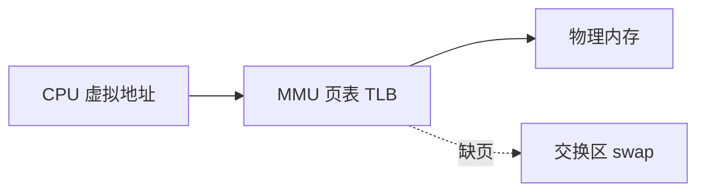
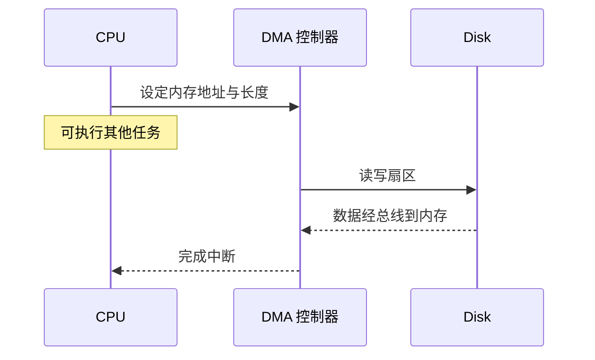
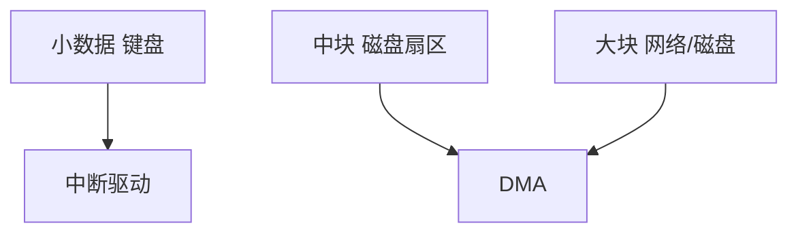

# 内存与 I/O 系统

**主存**供 CPU 直接寻址，**I/O 设备**（磁盘、网卡）速度慢几个数量级，靠 **DMA**、驱动与 OS 缓冲桥接。分清内存 bound 与 I/O bound，才能解释 SSD 换 HDD、为什么 `readFileSync` 和异步读盘行为不同。

---

## 主存与地址空间

进程看到的是**虚拟地址**连续空间；MMU 经页表映射到**物理地址**。缺页时 OS 从磁盘换入或分配新页。

| 概念 | 说明 |
|------|------|
| **物理地址** | DRAM 芯片上的真实位置 |
| **虚拟地址** | 进程视角的线性空间 |
| **页 page** | 通常 4 KB；大页 2 MB/1 GB 减 TLB miss |
| **RSS** | 实际驻留物理页大小 |



**易混点**：任务管理器里「内存 2GB」可能是虚拟大小；**RSS / 工作集** 才是实际占用的物理页。Node `--max-old-space-size` 限制的是堆，不含 Buffer 堆外区。

---

## I/O 方式对比

外设速度与 CPU 不匹配，传输方式决定 CPU 参与度。

| 方式 | CPU 参与 | 适用 |
|------|----------|------|
| **程序控制 I/O** | 轮询每个字节 | 几乎不用 |
| **中断驱动** | 每块数据中断一次 | 慢设备、小传输 |
| **DMA** | 设备控制器直访内存，块完成后中断 | 磁盘、网卡、大传输 |



**前端映射**：浏览器下载、Node 读盘，内核用 DMA 把数据拷到内核缓冲区，再 **copy 到用户空间**（`mmap`/`sendfile` 可减少拷贝次数）。

---

## 磁盘：HDD vs SSD

| | **HDD** | **SSD（NAND）** |
|---|---------|-----------------|
| 机制 | 机械臂 + 旋转盘 | 闪存页块 |
| **随机读延迟** | ms 级（寻道+旋转） | µs–100µs 级 |
| **顺序吞吐** | 尚可 | 很高 |
| **随机写** | 差 | 需擦除块，写放大 |
| **寿命** | 机械磨损 | P/E 次数有限 |

**对开发的影响**：

- 构建工具、数据库、Docker 镜像，SSD 显著缩短 **冷启动** 与 **随机读**。
- 日志 append、大文件顺序写，HDD 仍可用。
- CI 缓存、临时文件策略，避免 SSD 上无意义高频小写。

HDD 随机读慢的主因是**磁头寻道**（seek），其次才是转速（影响顺序吞吐）。

| IOPS 对比（量级） | HDD 随机 | SATA SSD | NVMe |
|-------------------|----------|----------|------|
| 4K 随机读 | 数百 | 万级 | 十万级+ |

---

## 内存映射 I/O 与零拷贝

| 机制 | 作用 |
|------|------|
| **mmap** | 文件映射到虚拟地址，按页 fault 载入 |
| **sendfile** 等 | 内核态把页从文件缓存送到 socket，少 user copy |
| **io_uring** | Linux 异步 I/O 批量提交（Node 部分版本探索） |

Node `fs.readFile` → 内核读入 page cache → 拷贝到 Buffer；大文件用 **Stream** 控制内存峰值。

```javascript
import fs from 'node:fs';
import { pipeline } from 'node:stream/promises';

// 流式读 — 控制峰值内存，仍多次 syscall/DMA
await pipeline(
  fs.createReadStream('large.json'),
  async function* (source) {
    for await (const chunk of source) {
      yield processChunk(chunk);
    }
  },
  fs.createWriteStream('out.json')
);
```


---

## 带宽与延迟

| 组件 | 量级（示意，随硬件变） |
|------|------------------------|
| DDR5 内存 | 50–100+ GB/s 带宽 |
| NVMe SSD | 3–7 GB/s 顺序 |
| SATA SSD | ~0.5 GB/s |
| 千兆网 | ~125 MB/s |
| HDD 随机 IOPS | 数百 |

**瓶颈判断**：

| 观测 | 倾向 |
|------|------|
| CPU 100%、iowait 低 | 计算 bound |
| `iowait` 高、磁盘队列长 | I/O bound |
| 网络 API 慢 | 可能是 RTT、TLS、DNS，不一定是磁盘 |

```bash
# Linux 快速看 I/O 等待
top   # 看 %wa (iowait)
iostat -x 1
```

---

## page cache 与读盘路径

读文件时，内核优先查 **page cache**（文件页缓存在内存里）：

| 情况 | 行为 |
|------|------|
| cache 命中 | 几乎不走物理磁盘，仍可能 copy 到用户态 |
| cache 未命中 | DMA 读盘 → 填入 cache → copy |
| 内存压力 | 冷页被回收，下次再读盘 |

写文件：`write()` 常先写 page cache，后台 flush 到磁盘（取决于 `fsync` 与挂载选项）。

---

## 与前端/Node 的衔接

| API / 现象 | 底层 |
|------------|------|
| `fetch` 下载大文件 | 网卡 DMA → 内核 socket buffer → 用户 |
| Chrome 磁盘缓存 | SSD 随机读；与 HTTP 语义不同层 |
| `readFileSync` 阻塞 | 等 DMA + 拷贝完成，占 JS 线程 |
| Stream pipeline | 控制内存峰值，仍多次 syscall/DMA |
| IndexedDB 大写入 | 浏览器层落盘，底层仍是 OS I/O |

I/O 多路复用减少**阻塞等待**的线程数，不减少磁盘本身延迟。

---

## 中断驱动 vs DMA 的 CPU 占用

| 传输 1MB 数据 | CPU 参与度 |
|---------------|------------|
| 程序控制 I/O | 几乎 100% 轮询 |
| 中断驱动 | 每块一次中断，仍要 copy |
| DMA | 设定描述符后 CPU 可干别的 |



---

## NVMe 与队列深度

NVMe 用多队列并行提交命令，IOPS 远高于 SATA：

| 接口 | 队列 | 典型场景 |
|------|------|----------|
| SATA AHCI | 单队列深度 32 | 老 SSD |
| NVMe | 多队列 64K 深度 | 现代 SSD、数据库 |

Node 单线程仍受 **单连接 syscall** 限制；数据库、静态资源 CDN 更能吃满 NVMe 带宽。

---

## 小结

主存通过虚拟地址映射；I/O 慢，**DMA** 减轻 CPU 逐字节搬运。SSD 擅随机读低延迟，HDD 怕随机寻道；优化前先分清 CPU、内存带宽还是 I/O 瓶颈。

**易混点**：DMA 完成≠零拷贝到 JS 堆；虚拟内存大≠物理内存够；异步 I/O 是线程不阻塞等，磁盘仍要转；page cache 命中时读盘可能不走物理磁盘；`iowait` 高说明 CPU 在等 I/O，不是 CPU 算力不够。

核对：DMA 传输时 CPU 能否执行别的指令？HDD 随机读慢的主因是转速还是寻道？RSS 与虚拟内存大小什么关系？page cache 命中时数据从哪来？
