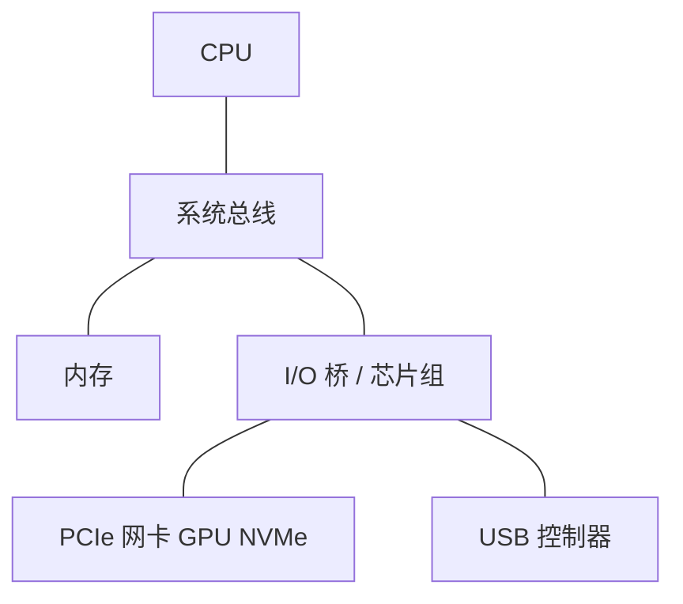
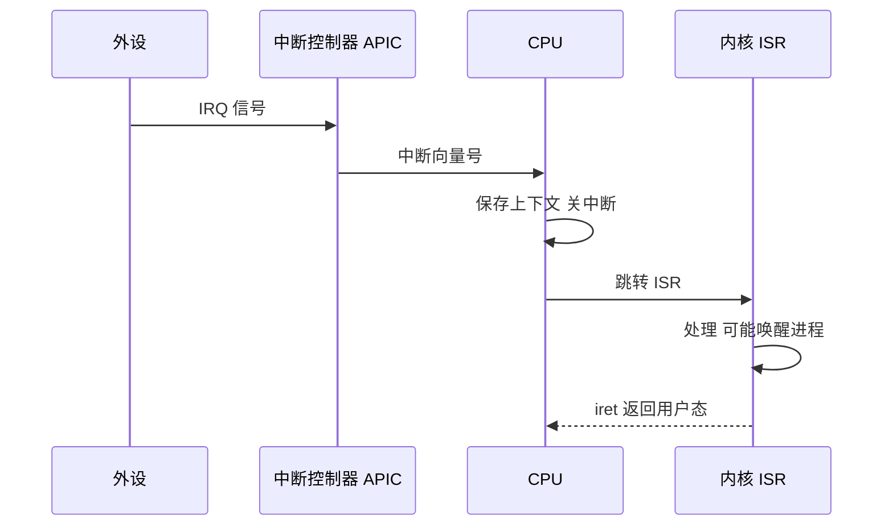
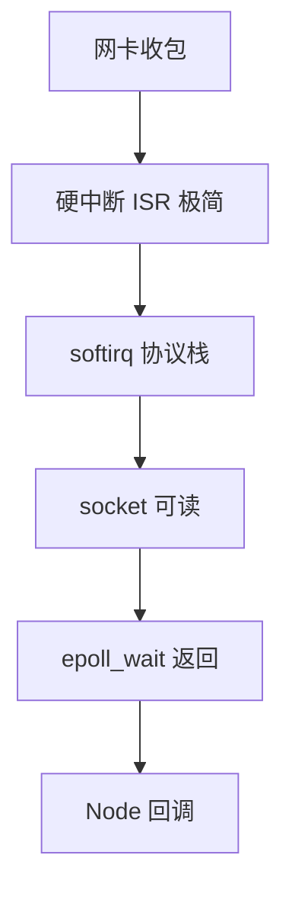

# 总线、中断与外设

CPU、内存、磁盘、网卡通过**总线**互联；外设以**中断**通知 CPU「有事发生」。这条路径是 syscall、网卡收包、键盘输入的硬件底座，也是理解「中断进内核」的起点。

---

## 总线结构

总线是共享的传输通道：地址、数据、控制信号分时复用或分线传输。带宽与拓扑决定 DMA 和多设备并发时的争用。



| 总线类型 | 作用 |
|----------|------|
| **地址总线** | 指明读写位置 |
| **数据总线** | 传输数据 |
| **控制总线** | 读/写、中断、仲裁信号 |

**PCIe**：点对点串行，带宽随 lane 数增长（×16 显卡、×4 NVMe）。GPU 与 NVMe 同抢 PCIe 带宽时，一方可能降速。

| 规格 | 单 lane 带宽（约） | ×16 总带宽 |
|------|-------------------|------------|
| PCIe 3.0 | ~1 GB/s | ~16 GB/s |
| PCIe 4.0 | ~2 GB/s | ~32 GB/s |
| PCIe 5.0 | ~4 GB/s | ~64 GB/s |

---

## 外设与控制器

外设不直接挂 CPU 上，经**设备控制器**翻译命令、缓冲数据、发起 DMA。

| 外设 | 控制器职责 |
|------|------------|
| **磁盘** | 解析命令、DMA 读写扇区 |
| **网卡 NIC** | 帧收发、checksum、部分 TSO/GRO offload |
| **GPU** | 并行渲染；与 CPU 共享 PCIe |
| **定时器** | 周期中断，OS 时间片与 `setTimeout` 精度 |

设备寄存器映射到 **I/O 端口** 或 **内存映射 I/O（MMIO）**；驱动在内核态读写这些寄存器，用户态程序只能 syscall 间接访问。

```plaintext
用户程序 open/read
  → syscall 陷入内核
    → 驱动写 MMIO 寄存器 / 提交 DMA 描述符
      → 设备 DMA 完成 → IRQ → ISR
```

---

## 中断机制

外设完成工作或需要服务时，拉高 **IRQ** 线；中断控制器汇总后 CPU 跳转到对应 **ISR**（中断服务例程）。



| 概念 | 说明 |
|------|------|
| **IRQ** | 硬件中断请求线 |
| **中断向量** | 查 IDT 得到 ISR 入口 |
| **可屏蔽** | 部分 IRQ 可暂时关闭 |
| **异常** | CPU 内部同步事件（缺页、除零） |

**软中断 / 底半部**：Linux 网卡 ISR 尽量短，把包处理推到 softirq、ksoftirqd，高 PPS 时 CPU 花在 **中断 + 协议栈** 上。

**易混点**：**异常**是同步的（指令执行触发）；**IRQ** 是异步的（外设触发）。两者都进内核，入口机制类似。

---

## 中断 vs 轮询

| | **中断** | **轮询 / NAPI** |
|---|----------|-----------------|
| CPU 占用 | 空闲时低 | 高负载时批处理更稳 |
| 延迟 | 有中断响应开销 | per-packet 成本可更低 |
| 场景 | 键盘、慢 I/O | 10G 网卡高流量 |

Node **epoll**：syscall 等 fd 就绪；就绪往往由网卡收包中断 + 内核协议栈处理触发，并非网卡直接叫醒 JS 线程。



---

## DMA 与总线仲裁

DMA 控制器经**总线**直接访问 RAM，CPU 仅编程起止地址与方向。DMA 与 CPU 同时访存时由**总线仲裁**协调，DMA 传输期间 CPU 通常可执行不冲突的指令（如算别的数据已在 Cache 里的逻辑）。

| 争用场景 | 影响 |
|----------|------|
| DMA 与 CPU 同访 RAM | 总线带宽分摊，两者都可能变慢 |
| 多设备同时 DMA | 仲裁排队 |
| GPU + NVMe 同 PCIe | 链路带宽成为瓶颈 |

---

## APIC 与多核中断

现代多核 CPU 用 **APIC**（高级可编程中断控制器）把 IRQ 路由到特定核心：

| 机制 | 作用 |
|------|------|
| **IRQ affinity** | 把网卡中断绑到某核，减 cache 迁移 |
| **RSS** | 网卡多队列，多核分担收包 |
| **RPS/RFS** | 软件层把包分发到处理 socket 的核 |

高 PPS API 网关：软中断 + 协议栈可能成为 CPU 热点，Profile 时看 `%softirq`。

---

## 与前端/Node 的衔接

| 现象 | 硬件/OS 链 |
|------|------------|
| 网卡收 HTTP 响应 | IRQ → 驱动 → TCP 栈 → socket 可读 → epoll 唤醒 libuv |
| `performance.now` | CPU 时间戳计数器，不一定每次 syscall |
| USB 键鼠 | 中断频率高但数据量小 |
| 服务器 RSS 多队列 | 多 CPU 分担中断，减单核瓶颈 |
| 高 PPS API 网关 | 软中断 + 协议栈可能成为 CPU 热点 |

浏览器 **WebUSB / WebSerial** 仍经 OS 驱动与权限模型，不能直接访问 MMIO。

---

## USB 与 PCIe 对比

| | USB | PCIe |
|---|-----|------|
| 拓扑 | 树形 Hub | 点对点 |
| 典型设备 | 键鼠、U 盘 | GPU、NVMe、网卡 |
| 延迟 | 较高 | 低 |
| 热插拔 | 原生支持 | 部分支持 |

前端开发常见 USB 调试 Android；生产服务器性能瓶颈 rarely 在 USB，而在 PCIe/NVMe 与网卡。

---

## 定时器中断与时间

OS **时钟中断**（如 100Hz/1000Hz）驱动：
- 时间片递减
- `setTimeout` / `setInterval` 精度上限
- `Date.now()` 与单调时钟的同步

```plaintext
硬件定时器 IRQ → 内核 tick → 更新 jiffies → 唤醒到期 timer
```

浏览器 `requestAnimationFrame` 与显示器 **VSync** 对齐，路径不同于 OS tick，但底层仍依赖硬件中断。

## MESI 与 Cache 一致性

多核共享内存时，Cache line 在核间迁移遵循 **MESI** 状态机；跨核写触发 invalidation，与 false sharing 现象直接相关。

| 状态 | 说明 |
|------|------|
| Modified | 本核独占且已修改 |
| Exclusive | 本核独占未改 |
| Shared | 多核只读 |
| Invalid | 无效，需重新载入 |

---

## 设备树与 ACPI

PC/服务器用 **ACPI** 描述硬件拓扑与电源；嵌入式常用 **设备树（DT）**。驱动加载后注册 IRQ handler，用户态通过 `/dev/*` 或 syscall 访问，与前端无直接关系，但解释「为何键盘输入会触发中断链」。

---

## MSI-X 与多队列网卡

现代网卡 **MSI-X** 可把不同队列中断绑到不同 CPU 核，减单核软中断瓶颈：

| 机制 | 作用 |
|------|------|
| RSS | 硬件哈希分流到多队列 |
| RPS/RFS | 软件把包分到处理 socket 的核 |
| IRQ affinity | 绑 IRQ 到指定核 |

高 PPS API 网关调优常涉及 `/proc/interrupts` 与 `softirq` 占比。

## 小结

**总线**连接 CPU、内存与外设；外设通过 **IRQ** 触发内核 **ISR**。DMA 经总线搬数据；高流量场景中断与轮询需权衡。

**易混点**：中断 ≠ syscall（syscall 是主动陷进内核）；epoll 就绪是内核态结论；DMA 期间 CPU 可跑别的指令，但争用总线时仍可能变慢；异常同步、IRQ 异步；软中断是内核底半部，不是用户态回调。

核对：DMA 传输时 CPU 能否执行别的指令？为何高 PPS 时软中断会成为瓶颈？异常与 IRQ 在同步/异步上有何区别？epoll 返回可读时，数据通常已经过哪些步骤？
