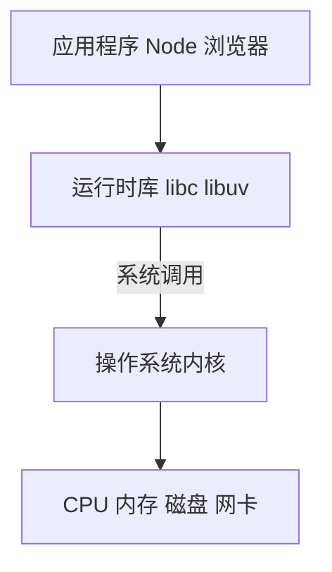
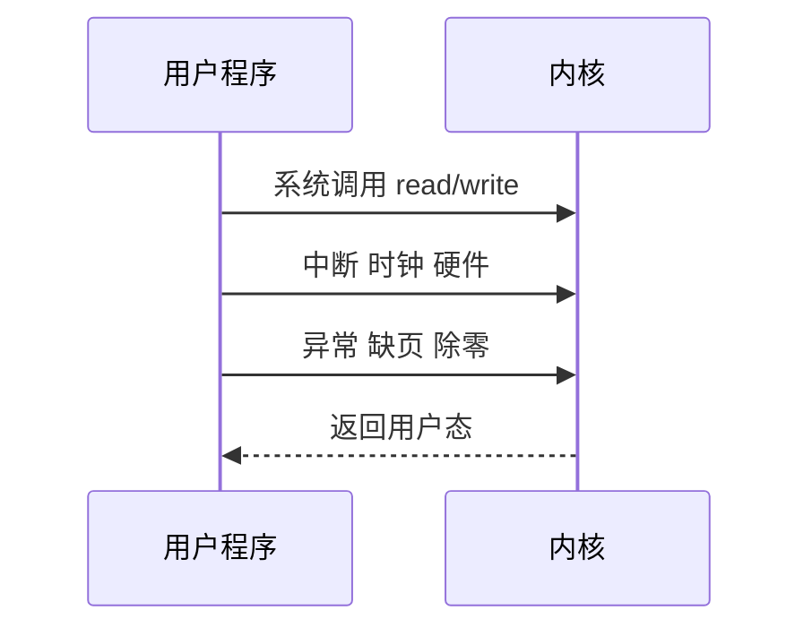

# OS 概述与系统调用

操作系统是**硬件与应用之间的中间层**：向进程提供 CPU、内存、文件、网络等抽象，并通过**系统调用**把特权操作收拢到内核。理解 OS 边界，才能解释 Node 为何单线程仍能高并发、浏览器为何多进程、容器与虚拟机差在哪。

---

## OS 在计算机系统中的位置



| 层次 | 职责 |
|------|------|
| **应用** | 业务逻辑、框架 |
| **运行时** | Node libuv、JVM、浏览器各进程 |
| **内核** | 调度、内存、文件、驱动、网络栈 |
| **硬件** | 实际执行与存储 |

用户态程序**不能直接**访问硬件或任意物理内存；需要内核代劳，入口即系统调用。

---

## 内核态与用户态

CPU 运行时分**特权级**：

| 模式 | 能做什么 | 典型代码 |
|------|----------|----------|
| **内核态** | 访问全部硬件、页表、中断 | 调度器、驱动 |
| **用户态** | 只能访问本进程被允许的内存 | Node、Chrome 渲染进程 |

从用户态进入内核态的常见路径：



**易混点**：系统调用 ≠ 函数调用。会触发**上下文切换**和特权级切换，有一定开销；高频路径宜批量读写、减少 syscall 次数。

---

## 系统调用是什么

系统调用是 OS 提供的**受控 API**，例如：

| 类别 | 典型 syscall | 作用 |
|------|--------------|------|
| 文件 | `open` `read` `write` `close` | 读写磁盘/管道 |
| 进程 | `fork` `exec` `exit` `wait` | 创建/结束进程 |
| 内存 | `mmap` `brk` | 映射文件、扩展堆 |
| 网络 | `socket` `connect` `send` `recv` | TCP/UDP |
| 同步 | `futex` 等 | 锁、等待 |

在 Linux 上，C 库（glibc）把 `printf`、`fopen` 等包装成 syscall；Node 的 `fs.readFile` 最终也会落到这些调用（经 libuv 线程池或 io_uring 等路径）。

**示意**（概念，非完整可编译代码）：

```c
#include <fcntl.h>
#include <unistd.h>

int fd = open("/etc/hosts", O_RDONLY);
char buf[256];
ssize_t n = read(fd, buf, sizeof(buf));
close(fd);
```

---

## trap 与上下文保存

系统调用在 x86 上常通过 **syscall** 指令或软中断 **int 0x80** 陷入内核：


内核需保存：程序计数器、栈指针、通用寄存器、部分标志位。返回时恢复，使进程感觉像「调了一个慢函数」。

---

## 系统调用开销与批量化

单次 syscall 典型成本 **数百纳秒～数微秒**（含 TLB、Cache 污染），远高于普通函数调用。

| 优化 | 做法 |
|------|------|
| 批量 read/write | 大 buffer，少次 syscall |
| `readv`/`writev` | 分散/聚集 I/O |
| io_uring | 批量提交/收割 |
| 内存映射 | `mmap` 大文件，按页缺页调入 |

```javascript
// Node：Sync API 每次阻塞等 syscall 完成
fs.readFileSync('huge.log');  // 主线程卡住

// 异步 + 流式，内核 wait 不占 JS 线程
fs.createReadStream('huge.log').pipe(res);
```

---

## 页表权限与隔离

每个进程有独立**虚拟地址空间**；页表项标记 r/w/x 权限。用户态访问内核地址或未映射页触发**缺页异常**，内核决定 kill 或换页。

| 保护 | 作用 |
|------|------|
| 进程隔离 | A 不能读 B 的堆 |
| W^X | 数据页不可执行，减 shellcode 面 |
| ASLR | 加载地址随机化 |

浏览器站点隔离、容器 namespace 都在此机制上叠加策略。

---

## 进程与 OS 的关系

OS 以**进程**为资源分配与隔离的基本单位：

| OS 为进程提供 | 说明 |
|---------------|------|
| 独立虚拟地址空间 | 进程 A 不能直接读写进程 B 的内存 |
| 文件描述符表 | fd 0/1/2 标准输入输出错误 |
| 环境变量、工作目录 | `process.env` 来源 |
| CPU 时间片 | 调度器轮流执行 |

前端开发者常见映射：

| 现象 | OS 层原因 |
|------|-----------|
| Node 单线程 | 一个主线程跑 JS；I/O 由内核 + libuv 异步完成 |
| Chrome 多 Tab 卡顿 | 某渲染进程 CPU 占满，同进程 Tab 共享 |
| `EADDRINUSE` | 端口被占用，内核拒绝 `bind` |
| 容器内 `pid=1` | 命名空间内看到的 init 进程 |

---

## 主流 OS 与前端场景

| OS | 常见场景 |
|----|----------|
| **Linux** | 服务器、Docker 宿主机、CI、WSL2 后端 |
| **macOS** | 本地开发、iOS 工具链 |
| **Windows** | 桌面开发、WSL、部分部署 |

服务器端几乎以 **Linux** 为主；本地开发三平台都有，但生产排障命令（`top`、`ss`、`strace`）以 Linux 为主。

---

## strace 排障思路

**strace** 跟踪进程 syscall，适合「卡在哪一步」：

```bash
strace -f -e trace=network,read,write -p $(pgrep -f node)
# 或
strace -c node app.js   # 汇总 syscall 次数与耗时
```

| 现象 | strace 可能看到 |
|------|-----------------|
| 连接慢 | 长时间停在 `connect` |
| 磁盘慢 | 大量 `read` 小块 |
| 端口冲突 | `bind` 返回 EADDRINUSE |

---

## 与前端/Node 的衔接


- **不要**在 JS 里做 CPU 密集死循环 — 占满时间片，阻塞事件循环。
- **I/O 密集**可交给异步 API — 等待数据时在内核中阻塞的是 libuv/内核，不占 JS 线程。
- 理解 syscall 有助于解释：为何 `fs.readFileSync` 会阻塞、为何大量小文件读写慢。

I/O 多路复用（epoll/kqueue）让单线程监听大量 socket；JS 事件循环在用户态调度回调，与 OS 线程调度是两层机制。

---

## 小结

OS 在内核态管理硬件，通过**系统调用**为用户态程序提供文件、进程、内存、网络能力。用户态/内核态分离保证隔离与安全，但每次 syscall 有成本。

**易混点**：系统调用 ≠ 普通函数调用；Node「单线程」≠ OS 只有一个线程（还有 libuv 线程池、GC 等）；trap 会保存完整 CPU 上下文；缺页处理发生在内核态。

核对：能否说清 `read()` 发生在用户态还是内核态？为何 Sync 读文件会卡住 JS 线程？strace 能观察到什么？
