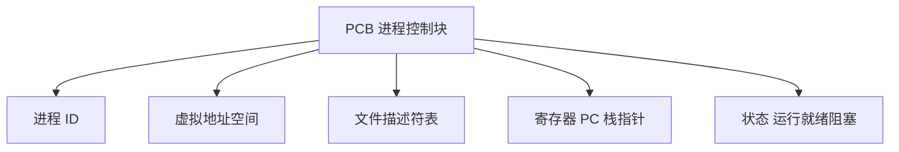
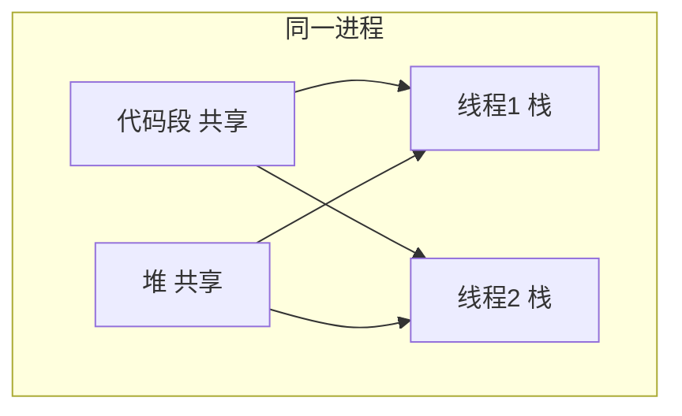
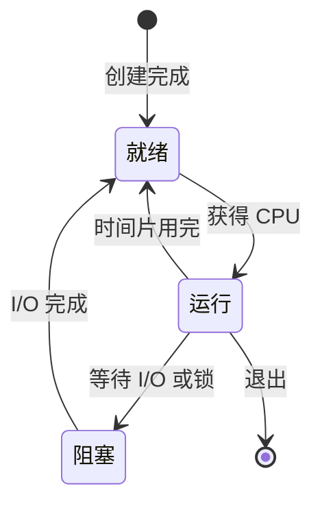
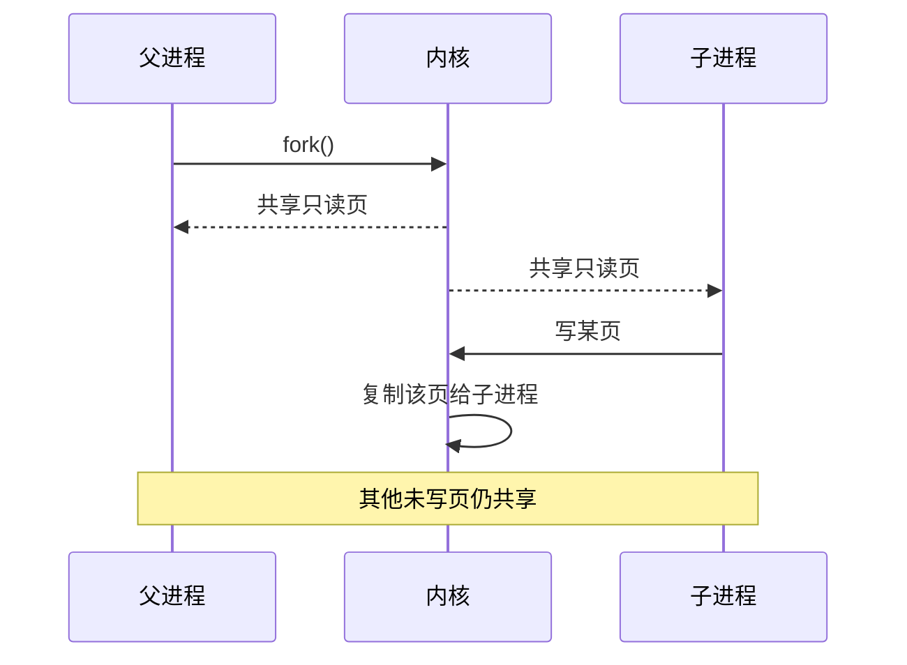
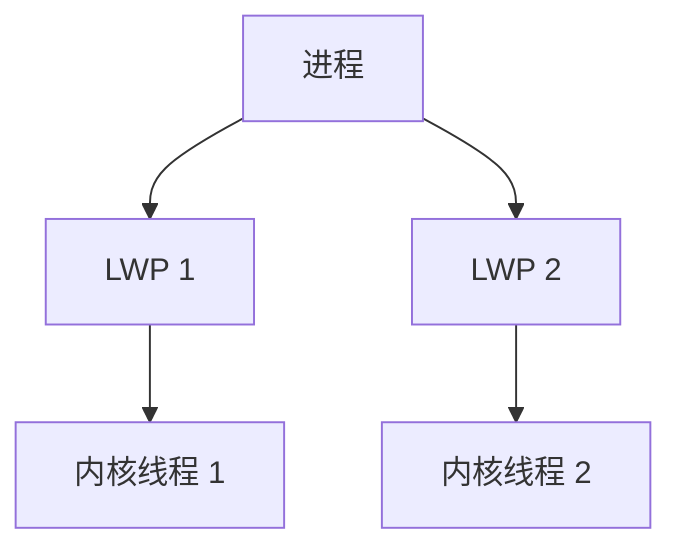

# 进程与线程

**进程**是 OS 分配资源（内存、文件、fd）的单位；**线程**是 CPU 调度的单位，同一进程内多线程共享地址空间。浏览器多进程、Node 单线程、Web Worker 都可以映射到这一层。

---

## 进程是什么

进程 = **正在运行的程序实例** + OS 维护的**进程控制块（PCB）**。fork 后子进程拿到独立 PCB，默认复制父进程地址空间（写时复制 COW）。



| PCB 中常见字段 | 含义 |
|----------------|------|
| PID | 进程唯一标识 |
| 状态 | 运行 / 就绪 / 阻塞 |
| 程序计数器 | 下一条指令地址 |
| 内存映射 | 代码段、堆、栈 |
| 打开的文件 | fd 列表 |
| 调度信息 | 优先级、时间片剩余 |

**fork**（Unix）创建子进程：子进程从 fork 返回处继续执行，返回值 0 表示子进程，>0 表示父进程拿到子 PID。Node `child_process.fork` 封装这一路径。

```javascript
import { fork } from 'node:child_process';

const child = fork('./worker.js');
child.send({ job: 'parse' });
child.on('message', (msg) => console.log(msg));
// 子进程独立地址空间，崩溃不拖垮父进程（除非未处理）
```

---

## 线程是什么

线程共享进程的**代码、全局变量、堆**；各自有**栈、寄存器、程序计数器**。调度器在线程粒度切换，切换成本低于跨进程。



| 对比 | 进程 | 线程 |
|------|------|------|
| 地址空间 | 独立 | 共享 |
| 创建开销 | 大（页表、fd 表） | 小 |
| 通信 | IPC（管道、socket） | 共享内存（需同步） |
| 崩溃影响 | 通常隔离 | 一线程致命错误可能拖垮进程 |
| 切换成本 | 高（换页表） | 较低 |

---

## 进程状态与切换



**上下文切换**：保存当前进程/线程的寄存器、栈指针、程序计数器，恢复另一个的上下文。切换本身消耗 CPU 周期；线程过多会导致切换风暴，有效算力下降。

阻塞态进程不占 CPU，调度器把核心让给就绪队列里的其他实体。

| 切换类型 | 额外开销 |
|----------|----------|
| 同进程线程切换 | 换寄存器/栈，页表不变 |
| 跨进程切换 | 换页表、TLB flush、Cache 污染 |

---

## 写时复制 COW

fork 后父子最初共享物理页，**首次写入**时才复制该页：



COW 让 fork 很快，但大量写入后内存占用接近两份。

---

## 与前端概念的映射

| 前端概念 | OS 对应 |
|----------|---------|
| Chrome 站点隔离 Tab | 多**进程**，崩溃与内存隔离 |
| Node.js 主线程跑 JS | 单**线程** + libuv 等辅助线程 |
| Web Worker | 浏览器里的独立线程（或等价执行上下文） |
| `child_process` | **fork** / spawn 子进程 |
| `async/await` | **用户态**协作式调度，非 OS 线程 |

**Node 单线程**指 **JavaScript 执行在一条线程上**；底层仍有：

| 组件 | 线程角色 |
|------|----------|
| libuv 线程池 | 部分 fs、crypto、DNS |
| V8 GC / JIT | 可能用辅助线程 |
| `worker_threads` | 显式多线程跑 JS |

```javascript
import { Worker, isMainThread, parentPort } from 'node:worker_threads';

if (isMainThread) {
  new Worker(new URL(import.meta.url));
} else {
  parentPort.postMessage(heavyResult());
}
```

---

## 进程间通信 IPC

多进程协作无法直接共享堆，需 IPC：

| 方式 | 特点 |
|------|------|
| 管道 pipe | 单向字节流，亲缘进程 |
| 命名管道 FIFO | 无亲缘关系可用 |
| 消息队列 | 结构化消息 |
| 共享内存 | 最快，需同步原语 |
| Socket | 本机或跨机器，Node 最常用 |

微服务、浏览器 renderer ↔ browser 进程之间多用 **Socket** 或等价消息通道。

---

## 线程 vs 协程

| | OS 线程 | 协程（JS async、Go goroutine 调度器） |
|---|---------|--------------------------------------|
| 调度 | 内核抢占 | 用户态协作 |
| 切换成本 | 较高 | 较低 |
| 多核并行 | 真并行（多核） | JS 协程仍单核执行 JS |
| 阻塞 I/O | 线程阻塞 | 注册回调，事件循环继续 |

JS 的 `async/await` **不创建 OS 线程**；等待 I/O 时让出执行权，同一线程去跑其他微任务。CPU 密集任务仍需 Worker 或子进程。

---

## 僵尸进程与孤儿进程

| 状态 | 含义 |
|------|------|
| **僵尸 zombie** | 子进程已退出，PCB 仍留（等父进程 `wait` 收退出码） |
| **孤儿 orphan** | 父进程先死，子进程被 init/systemd 收养 |

Node 长期 fork 不 `wait` 可能积累僵尸；生产环境要处理 `exit` 事件或信号。

---

## exec 与 spawn 区别

| | fork + exec | spawn |
|---|-------------|-------|
| 机制 | 复制后替换镜像 | 直接创建新进程 |
| 继承 | 继承 fd 表（可 CLOEXEC） | 可指定 stdio |
| Node | `fork` 后跑同一 JS | `spawn('npm', ['run', 'build'])` |

```javascript
import { spawn } from 'node:child_process';

const child = spawn('npm', ['run', 'build'], { stdio: 'inherit' });
child.on('exit', (code) => process.exit(code ?? 0));
```

`fork` 适合同一份 Node 脚本；`spawn` 适合调外部命令。

---

## 轻量级进程 LWP

部分系统把 **LWP** 作为用户可见的调度实体，映射到内核线程：



Java 线程 1:1 映射 OS 线程；Go goroutine M:N 映射，由运行时调度到少量 OS 线程。

---

## 小结

进程管资源和隔离，线程管 CPU 调度与共享内存。Node 是「单 JS 线程 + 异步 I/O」；浏览器趋向多进程隔离；Worker 是显式并行手段。

**易混点**：进程 ≠ 程序（同一程序可有多进程）；线程共享堆所以要有锁；协程 ≠ 线程；fork 后 COW 意味着读共享、写才复制页；阻塞态不占 CPU；僵尸进程不占内存但占 PID 槽位。

核对：Chrome 一个 Tab 一定一个进程吗？Node 里 `while(true){}` 为何卡死整个服务？阻塞态进程占不占 CPU？COW 在什么时候才真正复制物理页？
