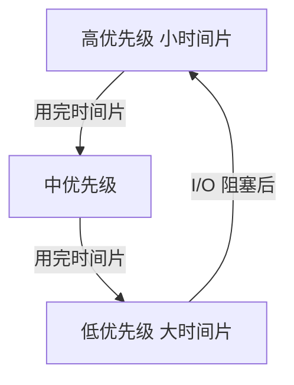

# CPU 调度算法

多道程序同时「就绪」时，OS **调度器**决定下一个占用 CPU 的进程/线程。调度目标：提高吞吐量、降低响应时间、避免饥饿。理解调度，有助于解释卡顿、优先级反转，以及为何 CPU 密集任务要隔离。

---

## 为什么需要调度

单核 CPU 同一时刻只运行一个线程；多核可同时运行多个。就绪线程数往往大于核心数，必须**排队 + 策略**。


调度发生在：**时间片用完**、**更高优先级就绪**、**当前线程阻塞**（I/O、锁）、**主动 yield** 等时机。阻塞线程离开 CPU，不浪费算力，这是 I/O 密集服务能高并发的基础。

---

## 常见调度算法

### 先来先服务 FCFS

按到达顺序执行，非抢占。

| 优点 | 缺点 |
|------|------|
| 简单公平 | 短任务被长任务拖慢（护航效应） |

**护航效应示例**：队列 P1(24ms) → P2(3ms) → P3(3ms)，FCFS 下 P2/P3 各等 24ms；若 SJF 则平均等待更短。

### 短作业优先 SJF

预估运行时间短的先跑。

| 优点 | 缺点 |
|------|------|
| 平均等待时间优 | 长任务可能饥饿；需预估时间 |

### 时间片轮转 RR

每个进程固定**时间片**（如 10ms），用完排到队尾，抢占式。

| 优点 | 缺点 |
|------|------|
| 响应好，适合交互 | 时间片过小切换多；过大则响应差 |

RR 适合交互式系统：每个任务定期获得 CPU，用户感到「同时」运行。

### 优先级调度

高优先级先运行；可能**饥饿**，需**老化**（等待越久优先级升）。

### 多级反馈队列 MLFQ

多条队列不同优先级和时间片；I/O 密集进程倾向高优先级队列，CPU 密集降权，现代桌面/服务器 OS 的近似思路。



---

## 调度指标

| 指标 | 含义 |
|------|------|
| **周转时间** | 提交到完成 |
| **等待时间** | 就绪队列中等待之和 |
| **响应时间** | 提交到首次响应 |
| **吞吐量** | 单位时间完成任务数 |

交互式应用（浏览器、IDE）重**响应时间**；批处理重**吞吐量**。两者有时冲突，批处理大时间片提高吞吐，却拉长交互响应。

```plaintext
周转时间 = 完成时间 - 到达时间
等待时间 = 周转时间 - 实际 CPU 执行时间
```

---

## 抢占 vs 非抢占

| 类型 | 行为 |
|------|------|
| **非抢占** | 进程主动放弃（阻塞、退出）才切换 |
| **抢占** | 时间片到、更高优先级到达，OS 强制切换 |

现代通用 OS（Linux、Windows、macOS）对普通线程多为**抢占 + 多级队列**。

---

## 实时调度（概念）

| 类型 | 特点 |
|------|------|
| **硬实时** | 错过 deadline 即失败（工业控制） |
| **软实时** | 尽量满足，偶尔超时可接受（音视频） |

Linux **SCHED_FIFO / SCHED_RR** 给高优先级实时线程；普通 Node 进程默认 **CFS**（完全公平调度，近似 MLFQ 思想）。

---

## 与前端/Node 的关系

| 场景 | 调度层表现 |
|------|------------|
| 主线程死循环 | 占满时间片，同进程 JS 逻辑无法推进 |
| 大量 Worker | 多线程竞争 CPU，上下文切换增多 |
| Chrome 前台 Tab | 渲染进程可能获更高调度权重（浏览器 + OS） |
| `nice` / `cgroups` | 容器/运维限制 CPU 份额 |

Node 无法在 JS 层直接设置 OS 调度策略；CPU 密集任务应放 **Worker** 或独立进程，并限制并发数。

```javascript
// 主线程 CPU 密集 — 占满时间片，定时器/网络回调排队
while (Date.now() - start < 5000) { /* spin */ }

// 缓解：Worker 或 setImmediate 分片
function chunkWork(deadline) {
  while (hasWork && performance.now() < deadline) doUnit();
  if (hasWork) setImmediate(() => chunkWork(performance.now() + 5));
}
```

---

## CFS 完全公平调度（Linux）

Linux 默认 **CFS** 用红黑树按 **vruntime** 选下一个线程：

| 概念 | 含义 |
|------|------|
| vruntime | 虚拟运行时间，跑得越久值越大 |
| nice | -20～19，值越大优先级越低 |
| cgroup cpu.max | 容器 CPU 配额 |


CFS 不是严格 RR，但交互任务因频繁阻塞 I/O，vruntime 涨得慢，下次更容易被选中，类似 MLFQ 效果。

---

## 上下文切换成本

| 开销来源 | 量级 |
|----------|------|
| 保存/恢复寄存器 | 数百 cycles |
| TLB flush（跨进程） | 数千 cycles 级 |
| Cache 污染 | 间接，后续 miss 增多 |

线程数 ≈ 核数 × (1～2) 常是 CPU 密集任务甜点；过多 Worker 反而切换风暴。

---

## 面试常问对比

| 算法 | 是否抢占 | 典型用途 |
|------|----------|----------|
| FCFS | 否 | 批处理简单场景 |
| RR | 是 | 分时交互 |
| 优先级 | 是 | 实时/混合负载 |
| MLFQ | 是 | 通用 OS 近似 |

---

## 实时调度与 deadline

**SCHED_DEADLINE** 等策略给任务显式 deadline；错过则视为失败。音视频采集、工业控制用；普通 Web 服务很少手动配置。

| 策略 | 适用 |
|------|------|
| CFS | 通用分时 |
| SCHED_FIFO | 实时，跑完才让 |
| SCHED_DEADLINE | 周期任务，有 deadline |

---

## 调度与交互

| 算法 | 特点 |
|------|------|
| FCFS | 简单，护航效应 |
| RR | 时间片，交互友好 |
| 多级反馈 | 默认/IO 密集区分 |

浏览器主线程长任务阻塞渲染 — 类似 CPU 被计算进程占满时间片。
## 时间片与交互

时间片过小 → 切换开销占比高；过大 → 交互响应差。Linux CFS 用虚拟运行时间 `vruntime` 近似公平。

```javascript
// 长任务让出 — 模拟协作式调度
async function chunkWork(items, fn, batch = 100) {
  for (let i = 0; i < items.length; i += batch) {
    items.slice(i, i + batch).forEach(fn);
    await new Promise((r) => setTimeout(r, 0));
  }
}
```

## 小结

CPU 调度在就绪队列中选下一个运行实体；RR 与 MLFQ 兼顾交互响应与整体吞吐。前端侧重点是：**别让 JS 主线程长时间占 CPU**，否则调度器救不了事件循环上的排队任务。

**易混点**：并发（逻辑上同时）≠ 并行（物理上同时多核）；时间片过短会导致切换开销大于计算；I/O 阻塞的进程不占 CPU；响应时间与周转时间不是一回事；CFS 是 Linux 默认，不是 FCFS。

核对：I/O 阻塞的进程为何通常不会浪费 CPU？为何 RR 适合交互式系统？MLFQ 如何把 I/O 密集任务拉回高优先级队列？主线程死循环为何连 `setTimeout` 也触发不了？
