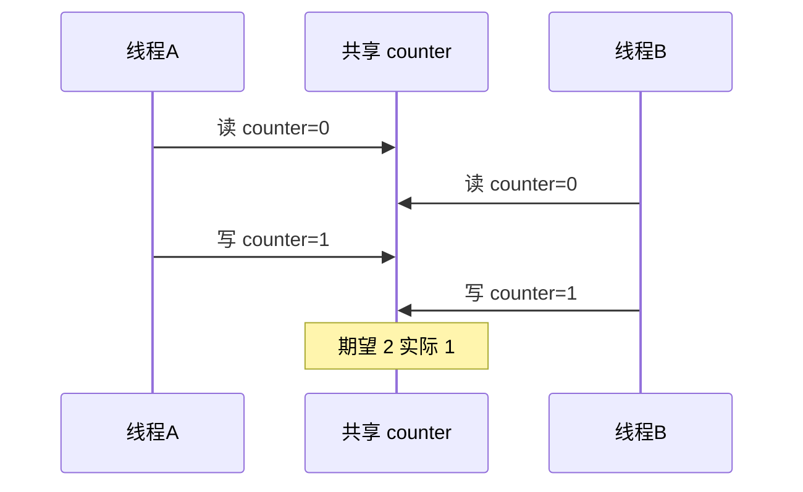
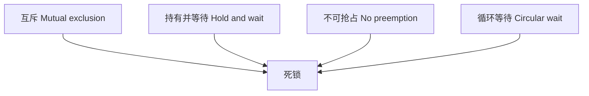

# 进程同步与死锁

多线程共享内存时，若不对**临界区**（读写同一变量的代码）加约束，会出现**竞态**。OS 提供锁、信号量等原语；使用不当则可能**死锁**。JS 主线程靠单线程避免数据竞态，但 Web Worker、Native、后端 Node 都会碰到线程级同步。

---

## 临界区与竞态

两个线程交错执行读-改-写，可能丢失更新。临界区需**互斥**：同一时刻最多一个线程进入。



临界区应尽量短，持锁期间不做 I/O 或耗时计算，否则其他线程长时间等待（锁竞争）。

---

## 同步原语

| 原语 | 作用 |
|------|------|
| **互斥锁 mutex** | 进临界区前 lock，出 unlock |
| **信号量 semaphore** | 计数型，控制 N 个同类资源 |
| **条件变量 condition** | 在锁保护下等待某条件成立 |
| **读写锁 rwlock** | 多读单写 |

**管程 monitor**：语言层封装 mutex + condition，如 Java `synchronized`。

| 原语 | 典型值 | 用途 |
|------|--------|------|
| mutex | 0/1 | 互斥 |
| 信号量 | N | 限流、池化 N 个连接 |
| 条件变量 | — | 生产者-消费者等待缓冲区状态 |

```plaintext
// 伪代码：mutex 保护临界区
lock(mutex);
counter++;
unlock(mutex);
```

---

## 死锁四个必要条件

四者**同时成立**才可能死锁：



| 条件 | 含义 |
|------|------|
| 互斥 | 资源一次只能一人用 |
| 持有并等待 | 占着 A 等 B |
| 不可抢占 | 不能强行抢资源 |
| 循环等待 | A 等 B，B 等 A… |

**破坏任一条件**可预防，例如：全局统一锁顺序（破坏循环等待）、一次性申请所有资源、带超时的 tryLock。

---

## 经典问题

### 生产者-消费者

缓冲区满时生产者等，空时消费者等，用**信号量**（空位计数、满位计数）或**条件变量**协调。


| 信号量 | 初值 | 含义 |
|--------|------|------|
| empty | N | 空槽位数 |
| full | 0 | 已填槽位数 |
| mutex | 1 | 互斥访问缓冲区 |

### 哲学家就餐

五人环形拿筷子，可能全员等待，说明锁粒度与拿锁顺序的重要性。固定顺序（先拿编号小的筷子）可破坏循环等待。

### 读者-写者

多读可并行，写独占，读写锁适用；写者饥饿时需公平策略。

---

## 与 JavaScript 的对比

| 场景 | JS 主线程 | Worker / Java 多线程 |
|------|-----------|----------------------|
| 共享变量竞态 | 单线程无数据竞态 | 有，需 Atomics、锁 |
| 死锁 | 少见（无阻塞锁） | 可能 |
| 解决思路 | 顺序、不可变、Promise 链 | mutex、锁顺序 |

JS **异步竞态**（非 OS 线程级，但现象类似）：

```javascript
let count = 0;

async function inc() {
  const v = count;
  await Promise.resolve(); // 让出，模拟交错
  count = v + 1;
}

await Promise.all([inc(), inc()]);
// count 可能为 1 而非 2
```

Worker 间默认 `postMessage` 不共享堆；`SharedArrayBuffer` 共享内存页，需 **Atomics** 与跨域隔离策略。

```javascript
const sab = new SharedArrayBuffer(4);
const view = new Int32Array(sab);
Atomics.add(view, 0, 1); // 原子加，避免 lost update
```

---

## 预防与检测

| 策略 | 做法 |
|------|------|
| 预防 | 固定锁顺序、超时锁、银行家算法 |
| 避免 | 分配前检测是否安全 |
| 检测 | 资源分配图有环 → 杀进程或回滚 |
| 鸵鸟 | 忽略，靠重启，某些系统实际做法 |

**活锁**：线程不断重试、改变状态，却无进展，与死锁（都不动）不同。

**优先级反转**：低优先级持锁，高优先级等锁，中优先级抢占低优先级 — 用优先级继承缓解。

---

## 可重入与线程安全

| 概念 | 含义 |
|------|------|
| 线程安全 | 多线程同时调用结果正确 |
| 可重入 | 执行中可被中断再入，无全局状态 |
| 可重入 ⊂ 线程安全 | 可重入更强 |

```javascript
// 非线程安全（Native 层）：static 缓冲
// char* strerror(int err) 返回静态区指针

// JS 主线程无此问题；Worker+SAB 要注意
```

标准库函数是否可重入要看文档；C 里 `strtok` 典型不可重入。

## 死锁四条件

| 条件 | 前端类比 |
|------|----------|
| 互斥 | 单线程锁资源 |
| 占有且等待 | await 持锁再请求 |
| 不可抢占 | 无强制释放 |
| 循环等待 | A 等 B，B 等 A |

避免：锁顺序一致、超时、tryLock、无锁结构。

---

## Atomics 与 SAB

```javascript
const sab = new SharedArrayBuffer(4);
const view = new Int32Array(sab);
Atomics.store(view, 0, 42);
Atomics.add(view, 0, 1); // 原子加
while (Atomics.load(view, 0) === 0) {
  Atomics.wait(view, 0, 0, 1000); // 最多等 1s
}
```

`Atomics.wait` 仅 Worker 可用；主线程用 `postMessage` 协作，不走 OS 级阻塞锁。

---

## 优先级反转（简述）

高优先级任务等低优先级任务持有的锁，而中优先级任务抢占低优先级 — 导致高优先级反而最后运行。**优先级继承**：持锁时临时提升优先级，释放后恢复。

---

## 小结

临界区需互斥；死锁需四条件同时满足。JS 主线程靠单线程避免数据竞态，Worker/SAB 与后端多线程仍需同步原语与锁顺序 discipline。

**易混点**：异步 bug ≠ 死锁；信号量可 >1，mutex 通常二元；活锁是忙却无进展；Atomics 解决的是内存可见性与原子性，不是替代所有锁；固定锁顺序破坏的是循环等待。

核对：能否举一种破坏「循环等待」的做法？SharedArrayBuffer 为何需要 Atomics？生产者-消费者用几个信号量？活锁与死锁区别？
