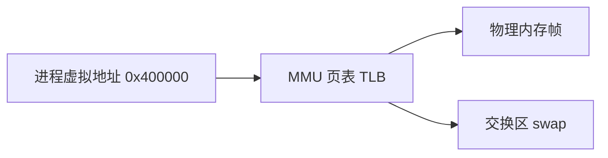
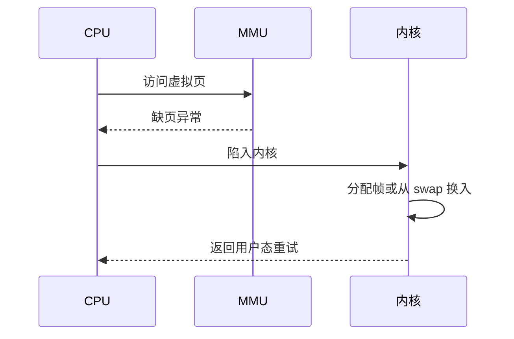

# 内存管理

每个进程看到的是**连续的虚拟地址空间**；OS 与 MMU 把它映射到物理内存或磁盘。**分页**是现代 OS 的主流方案。理解虚拟内存，才能解释 OOM、内存泄漏、Node `--max-old-space-size`、以及 32 位进程的内存上限。

---

## 虚拟地址 vs 物理地址

虚拟地址让进程以为拥有大片连续空间；MMU 查页表翻译成物理帧。TLB 缓存近期页表项，加速翻译。



| 概念 | 说明 |
|------|------|
| **虚拟地址** | 进程内指针看到的地址 |
| **物理地址** | 真实 RAM 位置 |
| **页表** | 虚拟页 → 物理页映射 |
| **TLB** | 页表缓存，miss 时查内存中的页表 |

**好处**：进程隔离、连续地址 illusion、按需分配（lazy allocation）、共享库页映射。

---

## 分页

虚拟内存切成固定大小**页**（常见 4KB），物理内存切成**帧**，大小相同。

| 术语 | 含义 |
|------|------|
| 页表项 PTE | 有效位、物理帧号、权限 r/w/x |
| 缺页中断 | 访问未映射或不在 RAM 的页，OS 调入 |
| 页面置换 | RAM 满时踢出一页到 swap |

**局部性**让分页可行：近期访问的页很可能再次访问。

缺页中断在内核态处理，CPU 触发异常，OS 分配帧或从 swap 换入，再返回用户态重试指令。



---

## 分段 vs 分页

| | 分段 | 分页 |
|---|------|------|
| 单位 | 逻辑段（代码/堆/栈） | 固定大小页 |
| 碎片 | 外部碎片 | 内部碎片（页内浪费） |
| 现代 OS | 常与分页组合或弱化 | **主流** |

Linux 等以分页为主，平坦内存模型简化段机制。

---

## 堆、栈与 brk/mmap

进程虚拟空间典型布局：

```plaintext
高地址
  栈 stack     ↓ 向下增长
  ...
  mmap 区      大块映射
  堆 heap      ↑ 向上增长 brk/sbrk
  BSS 未初始化全局
  Data 已初始化全局
  Text 代码    只读
低地址
```

| 机制 | 用途 |
|------|------|
| `brk` | 扩展堆顶 |
| `mmap` | 映射文件或匿名大块内存 |

V8 管理 JS 对象堆；大 Buffer 可能走 **mmap** 堆外内存，计入 RSS 但不一定在 `--max-old-space-size` 内。

---

## 页面置换算法

缺页且 RAM 满时选牺牲页：

| 算法 | 思路 |
|------|------|
| **OPT** | 淘汰最远将来才用的（理论最优，不可实现） |
| **FIFO** | 最先进入先出，可能 Belady 异常 |
| **LRU** | 最近最久未用，硬件近似或软件栈 |
| **Clock** | LRU 近似，环形扫描引用位 |

前端 **LRU 缓存**（虚拟列表、HTTP 缓存）与 LRU 思想同源：淘汰最久未访问项。

```javascript
// 简易 LRU（Map 保序）
class LRU {
  constructor(limit) {
    this.limit = limit;
    this.map = new Map();
  }
  get(k) {
    if (!this.map.has(k)) return undefined;
    const v = this.map.get(k);
    this.map.delete(k);
    this.map.set(k, v);
    return v;
  }
  set(k, v) {
    if (this.map.has(k)) this.map.delete(k);
    else if (this.map.size >= this.limit) {
      const first = this.map.keys().next().value;
      this.map.delete(first);
    }
    this.map.set(k, v);
  }
}
```

---

## 交换区 Swap

物理内存不足时，把冷页写到磁盘 swap，腾出帧。频繁换入换出导致**抖动（thrashing）**：CPU 大量时间等磁盘。

| 现象 | 可能原因 |
|------|----------|
| 机器变卡、风扇响 | swap thrashing |
| Node OOM | 堆超限或系统无可用内存 |
| 容器被杀 | 超过 cgroup memory limit |

---

## 与 Node / 浏览器

| 话题 | 说明 |
|------|------|
| V8 堆限制 | 64 位默认约 1.4～2GB，`--max-old-space-size` 调整 |
| 内存泄漏 | 对象仍被引用，GC 无法回收，RSS 持续升 |
| Chrome 每 Tab | 独立进程 → 独立虚拟空间 |
| SharedArrayBuffer | 共享物理页，需 COOP/COEP 隔离 |
| 32 位进程 | 用户空间常 ~2–3GB 上限 |

```bash
# 观察进程 RSS vs VSZ
ps aux | grep node
# RSS 驻留物理内存  VSZ 虚拟大小
```

---

## 大页 Huge Page

| 页大小 | 优势 | 代价 |
|--------|------|------|
| 4 KB | 细粒度，省内存 | TLB miss 多 |
| 2 MB / 1 GB | TLB 覆盖范围大 | 内部碎片 |

数据库、JVM 常启用大页；容器环境需宿主机预留 `hugetlb`。

```bash
# 查看大页配置（Linux）
grep Huge /proc/meminfo
```

---

## 内存压缩与 zswap

Linux **zswap** 在 swap 前压缩热页，减磁盘 I/O；仍不如直接有足够 RAM。Node 生产环境应监控 RSS 趋势，而不是等 OOM 才扩容。

## 虚拟内存

| 概念 | 作用 |
|------|------|
| 分页 | 固定大小页框 |
| TLB | 快表加速地址转换 |
| 缺页 | 按需加载 |
| swap | 磁盘换出 |

Chrome 单 Tab 内存涨 — 堆 + 映射文件 + GPU 纹理，超物理内存会 swap 卡顿。

---

## mmap 共享只读

多进程 mmap 同一只读文件时物理页共享；写时触发 COW：

| 标志 | 行为 |
|------|------|
| MAP_PRIVATE | 读共享，写复制 |
| MAP_SHARED | 写对其他进程可见 |

静态资源、V8 snapshot 在多 Tab 间可共享物理页，减 RSS。

---

## 小结

虚拟内存 + 分页提供隔离与大于物理 RAM 的地址空间 illusion；缺页与置换由 OS 完成。前端关注 V8 堆、进程隔离、容器 memory limit 与泄漏排查。

**易混点**：虚拟地址空间大 ≠ 物理 RAM 够用；堆增长 ≠ 立即占满物理内存（lazy）；swap 慢于 RAM 几个数量级；RSS 是物理驻留，VSZ 是虚拟大小；缺页处理在内核态完成。

核对：缺页中断发生在用户态还是内核态？为何 32 位进程常有 ~3GB 用户空间上限？RSS 与 virtual size 什么区别？swap thrashing 时 CPU 在等什么？
