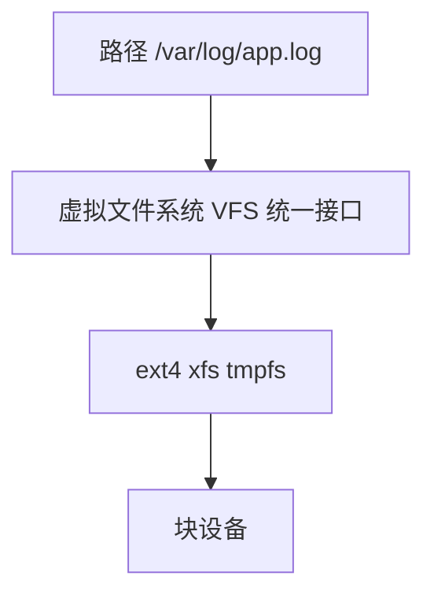

# 文件系统与 inode

文件系统是 OS 在磁盘上组织**文件与目录**的方式。Linux 广泛用 **ext4/xfs** 等；一切皆文件（socket、管道也是 fd）。理解 inode 与路径解析，有助于解释硬链接、磁盘满、`EMFILE`、以及 Node `fs` 的行为。

---

## 文件与目录抽象

用户通过路径访问；VFS 提供统一接口，底下可挂 ext4、xfs、tmpfs 等不同实现。



**VFS** 屏蔽差异，`open/read/write` syscall 统一入口。同一进程可同时打开不同文件系统上的文件，fd 表统一管理。

---

## inode 是什么

**inode**（index node）存储文件的**元数据**，不含文件名：

| inode 中常见字段 | 含义 |
|------------------|------|
| 模式 | 类型（文件/目录/链接）与权限 |
| 所有者 uid/gid | 归属 |
| 大小 | 字节数 |
| 时间戳 | atime/mtime/ctime |
| 链接计数 | 硬链接数 |
| 数据块指针 | 直接块、间接块指向磁盘位置 |

**目录**是「文件名 → inode 号」的映射表。

```plaintext
目录项:  app.log  -> inode 12345
inode 12345:  size=4096, nlink=1, blocks=[...], mode=-rw-r--r--
```

删文件 = 目录项删除 + inode 链接计数减一；计数归零才释放数据块。


---

## 硬链接 vs 软链接

| | 硬链接 | 软链接（符号链接） |
|---|--------|-------------------|
| 本质 | 同一 inode 多个目录项 | 特殊文件，内容为目标路径 |
| 跨分区 | 否 | 可以 |
| 删原文件 | 硬链接仍有效 | 链接悬空 broken |
| inode | 共享 | 独立 inode |

```bash
ln file hardlink
ln -s /path/to/file softlink
ls -i file hardlink   # 相同 inode 号
```

pnpm 用硬链接把 store 里同一文件链到各项目的 `node_modules`，省磁盘与 inode。

---

## 路径解析

绝对路径从 `/` 递归查目录项；相对路径从 **cwd**（当前工作目录）开始。

| 概念 | 说明 |
|------|------|
| `.` `..` | 当前目录、父目录 |
| `PATH` | 可执行文件搜索路径 |
| 挂载点 mount | 子树挂到其他设备 |

容器内 `/` 可能是 overlay 合并层（只读镜像 + 可写层）。

---

## 文件描述符 fd

进程通过 **整数 fd** 访问打开的文件：

| fd | 默认 |
|----|------|
| 0 | stdin |
| 1 | stdout |
| 2 | stderr |

打开新文件占用最小可用 fd；**ulimit -n** 限制最大打开数，高并发可能 `EMFILE`。

```javascript
import fs from 'fs';

const fd = fs.openSync('data.txt', 'r');
// 底层 syscall open，返回 fd
fs.closeSync(fd);
```

socket、pipe 在 Unix 上也是 fd，一切皆文件。

```javascript
import net from 'node:net';

const server = net.createServer();
server.listen(3000);
// 监听 socket 也是 fd，accept 后每个连接一个新 fd
```

---

## 常见文件系统特性

| 特性 | 说明 |
|------|------|
| 日志 journaling | 崩溃后快速恢复一致性 |
| 延迟分配 | 提高顺序写性能 |
| 扩展属性 xattr | 额外元数据 |

SSD 上随机读写与 HDD 差异大，但 **inode 耗尽** 与 **空间满** 仍是独立问题：`df -h` 看空间，`df -i` 看 inode。

| 命令 | 看什么 |
|------|--------|
| `df -h` | 磁盘空间 |
| `df -i` | inode 使用率 |
| `du -sh *` | 目录占用 |
| `lsof -p PID` | 进程打开的 fd |

---

## 目录树与权限

| 权限位 | 对文件 | 对目录 |
|--------|--------|--------|
| r | 读内容 | 列目录项 |
| w | 写内容 | 增删目录项 |
| x | 执行 | 进入（cd） |

路径解析每一级目录都需要 **x** 权限；缺 x 则 `Permission denied` 即使知道子路径。

---

## 与前端工程

| 场景 | 文件系统相关 |
|------|--------------|
| 上传大文件 | 流式写，避免一次读入内存 |
| 日志轮转 | logrotate 按大小/时间切文件 |
| `node_modules` 海量小文件 | inode 与 I/O 压力，pnpm 硬链接优化 |
| 静态资源部署 | 路径、权限、nginx alias 与 symlink |
| Watch 模式 | 大量文件 inotify 监听 |

```javascript
import fs from 'node:fs/promises';

// 递归创建目录 — 等价 mkdir -p
await fs.mkdir('dist/assets', { recursive: true });
```

---

## ext4 块组与 inode 分配

ext4 把磁盘划成 **block group**，每组有 inode 表与 bitmap：

```plaintext
磁盘
 ├─ block group 0  [inode bitmap | block bitmap | inode table | data blocks]
 ├─ block group 1
 └─ ...
```

海量小文件（如未优化的 `node_modules`）可能耗尽某组的 inode，即使 `df -h` 还有空间，此时 `df -i` 会报警。

---

## 文件锁 flock vs fcntl

| | flock | fcntl |
|---|-------|-------|
| 粒度 | 整个文件 | 字节范围 |
| 跨 NFS | 行为不一致 | 依赖实现 |
| Node | `fs-ext` 等封装 | 少见 |

多进程写同一日志文件需应用层协调或集中式日志服务。

## inode 与硬软链

| 类型 | inode | 删原文件 |
|------|-------|----------|
| 硬链 | 共享 | 计数减 |
| 软链 | 新 inode，存路径 | 链悬空 |

`node_modules` 海量小文件 — inode 耗尽与容量未满并存。

---

## stat 与权限位

```javascript
import fs from 'node:fs/promises';

const st = await fs.stat('package.json');
// st.mode 含类型+权限  st.ino  inode 号  st.nlink 硬链数
console.log(st.isFile(), st.size, st.mtimeMs);
```

`chmod` 改 mode；`chown` 改 uid/gid。容器内 root 映射到宿主机普通用户时，权限错误常表现为 EACCES。

---

## 小结

文件通过 inode 关联数据块；目录映射名字到 inode。进程用 fd 操作打开的文件；硬链接共享 inode，软链接存路径。

**易混点**：删文件是减 inode 引用计数；`df` 空间够仍可能 inode 满；一切皆文件包括 socket、epoll fd；软链接可跨分区，硬链接不行；目录也是文件，其「内容」是 name→inode 表。

核对：`ls -i` 看到的数字是什么？为何 pnpm 能省磁盘空间？硬链接能否跨文件系统？删硬链接会不会删数据块？
