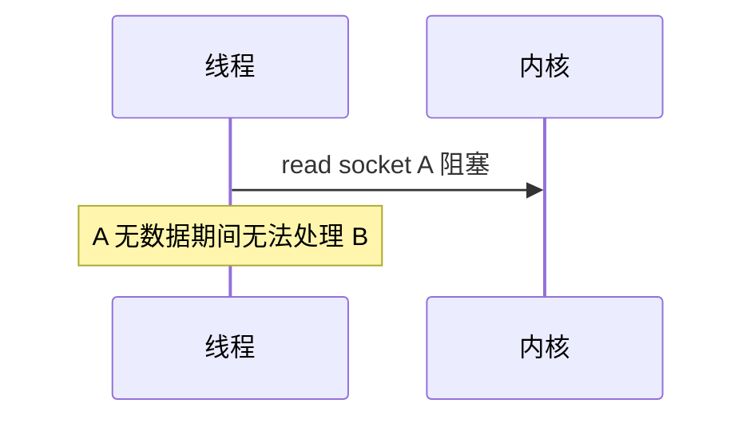
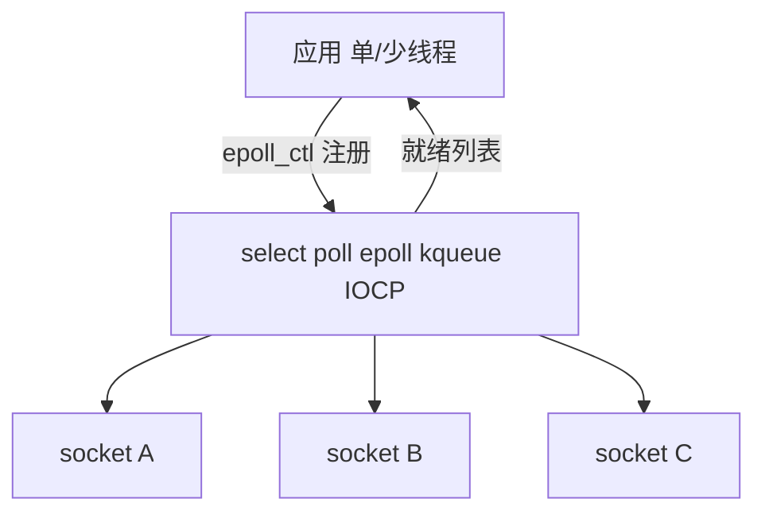
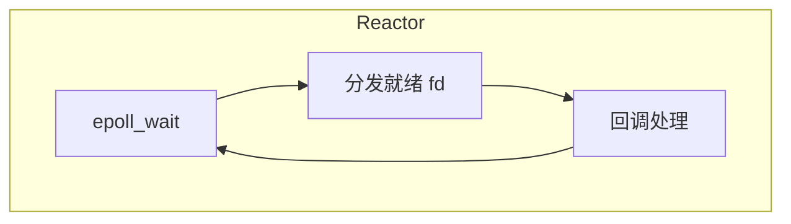

# I/O 多路复用

单线程要同时监视**成千上万个 socket** 是否可读/可写，不能为每个连接阻塞一个 OS 线程。**I/O 多路复用**在一个 syscall 里等待多个 fd 就绪，Node libuv、Nginx、Redis 事件循环的底层基石。

---

## 阻塞 I/O 的问题

一线程阻塞在 `read` 上时，无法处理同进程其他连接，C10K 问题由此而来。



一连接一线程：线程栈占内存（常 MB 级）、上下文切换开销大，上万连接不现实。

| 模型 | 1 万连接内存（粗估） |
|------|---------------------|
| 一连接一线程 | 1 万 × ~1MB 栈 ≈ 10GB+ |
| epoll + 单线程 | 连接状态 + fd 表，远小于上者 |

---

## 多路复用思路

应用把 fd 设为**非阻塞**，注册到多路复用器；一次 `wait` 返回就绪列表，再逐个读写。



循环：**注册** fd → **wait** → **处理就绪 fd** → 重复。Reactor 模式的骨架。

---

## select / poll / epoll 对比

| | select | poll | epoll Linux |
|---|--------|------|-------------|
| fd 上限 | 常 1024 | 无硬上限 | 无硬上限 |
| 就绪检测 | 轮询 bitmap O(n) | 轮询数组 O(n) | **就绪链表 O(1) 返回** |
| 重复注册 | 每次带入全集 | 每次带入 | epoll_ctl 注册一次 |
| 扩展性 | 差 | 中 | **好** |

**epoll** 适合大量长连接、多数时间 idle 的服务器，WebSocket、HTTP keep-alive。

macOS **kqueue**；Windows **IOCP**（Proactor 风格）；libuv 跨平台封装。

```c
// epoll 核心 API（示意）
int epfd = epoll_create1(0);
epoll_ctl(epfd, EPOLL_CTL_ADD, sockfd, &ev);
int n = epoll_wait(epfd, events, MAX, timeout);
for (int i = 0; i < n; i++) handle(events[i].data.fd);
```

---

## 边缘触发 vs 水平触发（epoll）

| 模式 | 行为 |
|------|------|
| LT 水平 | fd 仍就绪则每次 wait 都通知 |
| ET 边缘 | 状态变化时通知一次，需读到 EAGAIN |

ET 更少 syscall，但代码需循环读完缓冲区；LT 编程更简单，不易漏读。

```plaintext
LT：缓冲区有 100B，读 50B → 下次 wait 仍通知可读
ET：同上 → 不再通知，除非再收到新数据；须一次读尽
```

---

## 与 Node 事件循环


| 阶段 | 说明 |
|------|------|
| 网络 I/O | libuv 用 epoll 等，就绪后调 JS 回调 |
| 文件 I/O | 默认线程池（部分 fs 不走 epoll 直接读） |
| timers | 最小堆管理超时 |

Node **单线程**仍能接大量并发连接，等 I/O 时不占 JS 线程，阻塞发生在内核 wait 或 libuv 线程池。

---

## 同步 vs 异步 vs 多路复用

| 模型 | 说明 |
|------|------|
| 阻塞同步 | 一线程一等到底 |
| 多线程每连接 | 简单，扩展差 |
| **多路复用 + 非阻塞** | 单/少线程管多 fd — **Reactor** |
| Proactor IOCP | 完成时通知，内核参与更多 |

Node 是 **Reactor** 变体：libuv 负责 wait，JS 跑回调。



---

## 浏览器中的类似物

浏览器网络栈在网络进程/内核完成；渲染进程通过 IPC 拿数据。逻辑上仍是等 I/O 就绪再处理，但跨进程，细节不同于 Node 单进程 epoll。

---

## io_uring 与新一代异步 I/O

Linux **io_uring** 用共享 ring buffer 批量提交/收割 I/O，减 syscall 次数：


| 对比 epoll | io_uring |
|------------|----------|
| 就绪通知 | 可完成通知 |
| 读仍要 read syscall | 可内核直完成到 buffer |
| 成熟广泛 | Node/数据库逐步采用 |

---

## 背压与写就绪

监听 **EPOLLOUT**（写缓冲区可写）避免非阻塞 `write` 返回 EAGAIN 后丢数据：

```plaintext
socket 发送缓冲区满 → 不可写 → 注册 EPOLLOUT
缓冲区有空间 → 可写 → 继续 write → 若仍满继续监听
```

HTTP 服务器高并发时，慢客户端导致写缓冲区堆积，需应用层限流（背压）。

---

## 常见坑

| 坑 | 说明 |
|----|------|
| 未设非阻塞 | 多路复用 + 阻塞 read 仍卡死 |
| ET 漏读 | 缓冲区未读尽，后续无通知 |
| `fs.readFile` 占线程池 | 与 epoll 无关，仍阻塞线程池 worker |
| CPU 密集回调 | I/O 就绪了但 JS 忙，连接堆积 |

## select/poll/epoll

| 机制 | 特点 |
|------|------|
| select | fd 上限、O(n) 扫描 |
| poll | 无 1024 限 |
| epoll | 边缘/水平触发，O(就绪) |

Node libuv 在 Linux 用 epoll；macOS 用 kqueue — 抽象为统一事件循环。

---

## libuv 线程池

| 操作 | 路径 |
|------|------|
| TCP accept/read | epoll 主 loop |
| `fs.readFile` | 默认线程池 |
| `crypto.pbkdf2` | 线程池 |
| DNS 部分解析 | 线程池或 c-ares |

线程池默认 4 线程，可通过 `UV_THREADPOOL_SIZE` 调整；过大仍受 CPU 核数限制。

---

## 小结

I/O 多路复用让单线程监听多 fd；Linux 上 epoll 是高性能服务器标配。Node 高并发依赖 libuv + 非阻塞 socket，不是「一线程一连接」。

**易混点**：多路复用 ≠ Linux AIO；select 的 O(n) 扫描与 fd 上限；`fs.readFile` 常占 libuv 线程池而非 epoll 读盘；Reactor 是就绪通知，Proactor 是完成通知；非阻塞 fd 是前提。

核对：为何 epoll 比 select 更适合上万 WebSocket？`fs.readFile` 为何可能占线程池？LT 与 ET 编程差异？Node 网络 I/O 与文件 I/O 分别走哪条路径？
