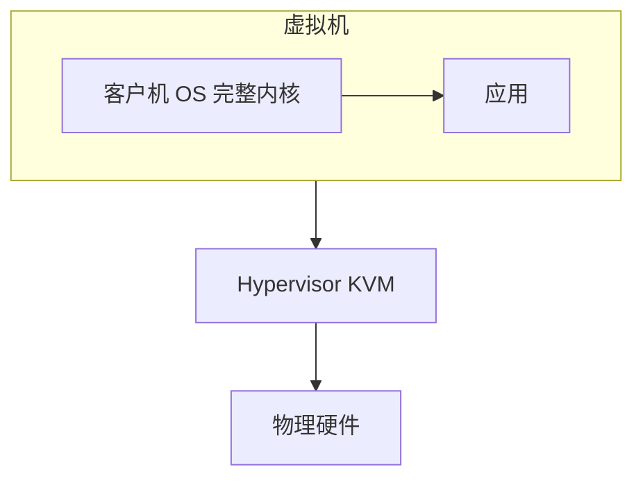
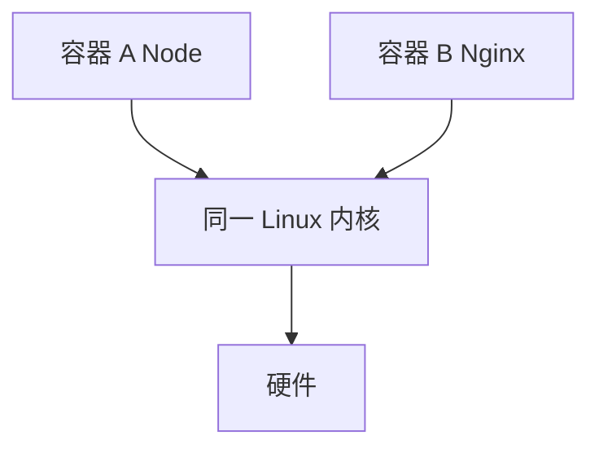
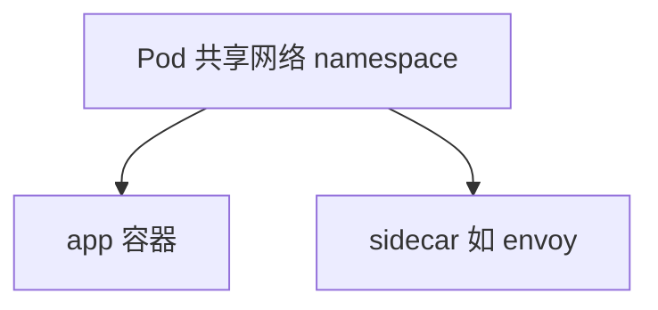

# 虚拟化与容器底层

**虚拟机**通过 Hypervisor 模拟整台机器；**容器**共享宿主机内核，用 **namespace** 隔离视图、**cgroup** 限制资源。Docker 是容器生态的封装，不是替代 OS。部署前端 SSR、Node API 时，容器是常态。

---

## 虚拟化层次

Hypervisor 把物理 CPU、内存、I/O 虚拟化给 Guest OS，Guest 以为自己独占机器。



| 类型 | 说明 |
|------|------|
| **Type 1** | Hypervisor 直接在硬件上（KVM、ESXi） |
| **Type 2** | 宿主机 OS 上跑 VM（VirtualBox） |

Guest OS **完整内核**，隔离强，开销大（内存、启动慢）。适合异构 OS、强隔离合规场景。

---

## 容器：共享内核

容器进程是宿主机上的**普通进程**，通过 namespace 看到隔离的 PID、网络、挂载视图。



容器内 `pid 1` 常是 node/nginx 进程，在宿主机 `ps` 里能看到，只是 PID 不同。

---

## namespace 隔离什么

| namespace | 隔离内容 |
|-----------|----------|
| PID | 进程 ID 空间 |
| NET | 网络设备、端口、路由 |
| MNT | 挂载点、根目录 |
| UTS | hostname |
| IPC | 消息队列等 |
| USER | uid/gid 映射 |

```bash
docker run -d -p 3000:3000 node:20 node app.js
# 创建一组 namespace 中的进程；端口映射改 NET namespace
```

容器内 `ps` 只见自己的进程树；与宿主机共享内核，内核漏洞影响面大于 VM。

```bash
# 宿主机上仍能看到容器进程（PID 不同）
ps aux | grep node
```

---

## cgroup 限制什么

**控制组**限制与统计资源：

| 资源 | 示例 |
|------|------|
| CPU | shares、quota、cpuset |
| 内存 | memory.max — 超限 OOM kill |
| IO | 读写带宽 weight |
| pids | 最大进程数 |

Kubernetes `resources.limits.memory` 写到 cgroup。Node 堆未到 `--max-old-space-size` 但容器被杀，常是 **cgroup memory** 含堆外 Buffer、native 模块。

内存 limit 宜留余量：堆上限 + 堆外 + 栈 + V8 开销 + 系统库。

| 组成 | 是否计入 cgroup memory |
|------|------------------------|
| V8 堆 | 是 |
| Buffer 堆外 | 是 |
| 线程栈 | 是 |
| 共享库 mmap | 部分 |

---

## 镜像与联合文件系统

容器**镜像**只读层 + 可写层 overlay：

```plaintext
overlay 可写层  container 内修改
    ↓
镜像层只读    node:20 基础镜像各层
```

**Copy-on-Write**：改文件时才拷贝到可写层。镜像分层复用，多次部署共享 base 层。

**volume** 挂载绕过镜像可写层，数据持久化在宿主机路径或云盘。

```dockerfile
# 多阶段构建 — 减小最终镜像
FROM node:20 AS build
WORKDIR /app
COPY . .
RUN npm ci && npm run build

FROM node:20-slim
WORKDIR /app
COPY --from=build /app/dist ./dist
USER node
CMD ["node", "dist/server.js"]
```

---

## 容器 vs 虚拟机

| | 虚拟机 | 容器 |
|---|--------|------|
| 内核 | 各 Guest 独立 | **共享宿主机** |
| 启动 | 分钟级 | 秒级 |
| 隔离 | 强 | 较弱（共享内核） |
| 密度 | 低 | 高 |
| 典型 | 异构 OS、强合规 | 微服务、CI、SSR |

---

## 与前端部署

| 场景 | 实践 |
|------|------|
| Next/Nuxt SSR | Docker 多阶段构建，slim 运行时镜像 |
| 静态 SPA | nginx 容器 |
| CI | 每次 job 干净容器 |
| 本地 | Docker Compose 联调 API + DB |

Dockerfile：**非 root 用户**、`.dockerignore`、**多阶段**减小镜像与攻击面。

```yaml
# docker-compose 示意
services:
  web:
    build: .
    ports: ["3000:3000"]
  db:
    image: postgres:16
    volumes: ["pgdata:/var/lib/postgresql/data"]
volumes:
  pgdata:
```

---

## seccomp 与能力 Capabilities

容器除 namespace/cgroup 外，还常用：

| 机制 | 作用 |
|------|------|
| **seccomp** | 限制 syscall 集合 |
| **capabilities** | 细粒度 root 权限（如 NET_BIND_SERVICE） |
| **AppArmor/SELinux** | 强制访问控制 |

```bash
docker run --cap-drop ALL --cap-add NET_BIND_SERVICE ...
```

最小权限：只给绑定 80/443 所需 cap，禁止 `mount`、`ptrace` 等。

---

## Pod 与容器关系

K8s **Pod** 是一组共享 NET namespace 的容器（常含 sidecar）：



前端 SSR Pod 常见：app + nginx sidecar 或 log collector。

---

## 健康检查与资源 limit

K8s **liveness/readiness** 探针决定 Pod 是否接收流量；`limits.memory` 写 cgroup，应大于 Node 堆 + 堆外：

| 组件 | 计入 cgroup |
|------|-------------|
| V8 堆 | 是 |
| Buffer 堆外 | 是 |
| 镜像只读层 | 否（映射） |

---

## 小结

虚拟机虚拟整台机器；容器用 namespace + cgroup 在同一内核上隔离进程与限资源。Docker/K8s 是编排与交付层，底层仍是 Linux 机制。

**易混点**：容器不是迷你 VM；Windows 容器与 Linux 容器内核不同；volume 持久化 ≠ 镜像层；cgroup OOM kill 与 Node heap OOM 是不同机制；容器进程在宿主机可见。

核对：容器进程在宿主机 `ps` 里能看到吗？内存 limit 应比 Node `--max-old-space-size` 大多少才安全？namespace 与 cgroup 分别管什么？
